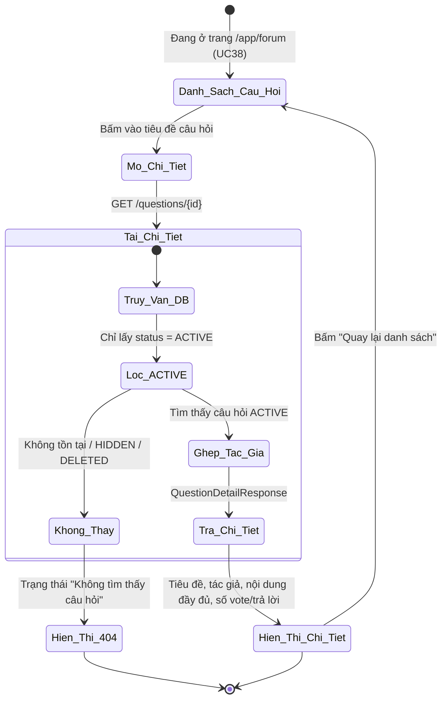
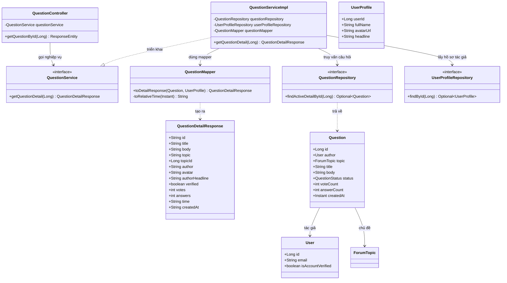
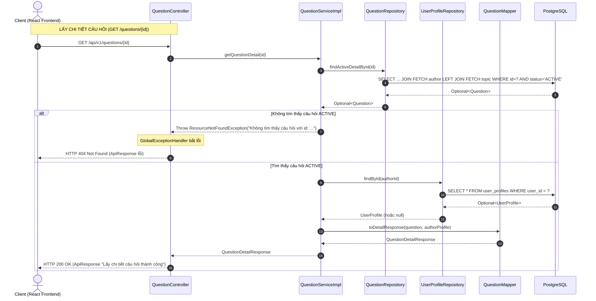

# ĐẶC TẢ YÊU CẦU & THIẾT KẾ CHI TIẾT: UC39 - XEM CHI TIẾT CÂU HỎI (VIEW QUESTION DETAIL)

## PHẦN 1: ĐẶC TẢ NGHIỆP VỤ (REPORT 3)

### 2.2.3 Business Workflow (Luồng nghiệp vụ)

#### Mô tả chi tiết luồng xử lý bằng chữ (Business Step Description):
* **Bước 1 - Khởi đầu**: Từ danh sách câu hỏi (UC38), người dùng (Guest, Student hoặc Alumni) bấm vào tiêu đề một câu hỏi. Frontend điều hướng tới `/app/forum/{id}` và gọi `GET /api/v1/questions/{id}` để lấy chi tiết câu hỏi.
* **Bước 2 - Truy vấn & lọc**: Backend truy vấn câu hỏi theo `id`, chỉ chấp nhận câu hỏi ở trạng thái `ACTIVE`. Nếu không tồn tại, hoặc đang ở trạng thái `HIDDEN`/`DELETED` → trả về HTTP 404 kèm thông điệp tiếng Việt.
* **Bước 3 - Ghép dữ liệu & trả kết quả**: Nếu tìm thấy, hệ thống ghép thêm hồ sơ tác giả (họ tên, avatar, headline) rồi trả về `QuestionDetailResponse` (nội dung đầy đủ, không cắt trích).
* **Bước 4 - Hiển thị**: Frontend hiển thị màn hình chi tiết: badge chủ đề, tiêu đề, thông tin tác giả, thời điểm đăng, toàn bộ nội dung câu hỏi (giữ nguyên xuống dòng), số vote và số câu trả lời (chỉ đọc). Người dùng có thể bấm "Quay lại danh sách câu hỏi". Nếu gặp lỗi hệ thống, hiển thị Card lỗi kèm nút "Thử lại"; nếu 404 hiển thị trạng thái "Không tìm thấy câu hỏi".

---

### 3.2 Module Diễn đàn Hỏi–Đáp (Q&A Forum)
Module 4 của hệ thống, cung cấp không gian hỏi–đáp cho cộng đồng cựu sinh viên và sinh viên. UC39 tiếp nối UC38: sau khi duyệt danh sách, người dùng mở một câu hỏi để đọc toàn bộ nội dung chi tiết trước khi trả lời (UC khác) hoặc bình chọn (UC khác).

#### 3.2.1 Xem chi tiết câu hỏi (View Question Detail)

**Function trigger**:
*   **Navigation path**: `/app/forum/{id}` — mở khi bấm vào tiêu đề một câu hỏi trong danh sách (UC38).
*   **Timing Frequency**: On demand (khi người dùng chọn một câu hỏi để xem chi tiết).

**Function description**:
*   **Actors/Roles**: Guest (khách vãng lai chưa đăng nhập), Student, Alumni. Chi tiết câu hỏi là nội dung công khai nên cả ba đều xem được.
*   **Purpose**: Cho phép người dùng đọc toàn bộ nội dung một câu hỏi cùng thông tin tác giả và các số liệu (vote, số câu trả lời) để hiểu đầy đủ vấn đề trước khi tương tác thêm.
*   **Interface**:
    *   **Liên kết quay lại**: "← Quay lại danh sách câu hỏi" ở đầu trang.
    *   **Cột vote**: Số lượt vote (chỉ đọc ở UC39 — bình chọn thuộc UC khác).
    *   **Badge chủ đề**: Hiển thị chủ đề câu hỏi (ẩn nếu chưa phân loại).
    *   **Tiêu đề**: Tiêu đề câu hỏi cỡ lớn.
    *   **Khối tác giả**: Avatar + tên tác giả + huy hiệu verified + dòng headline (nếu có) + thời điểm đăng (định dạng ngày giờ đầy đủ, tooltip).
    *   **Nội dung**: Toàn bộ nội dung câu hỏi, giữ nguyên xuống dòng của người dùng.
    *   **Chân trang**: Số vote (trên mobile) và số câu trả lời.
    *   **Trạng thái**: Skeleton (đang tải), trạng thái "Không tìm thấy câu hỏi" (404), Card lỗi + nút "Thử lại" (lỗi hệ thống).

**Data processing**:
1.  **Lấy chi tiết**: Client gọi `GET /api/v1/questions/{id}`. Interceptor Axios tự bóc `ApiResponse.data`.
2.  **Backend xử lý**: Truy vấn `questions` theo `id` (JOIN FETCH tác giả, LEFT JOIN FETCH chủ đề, lọc `status = ACTIVE`) → nếu rỗng ném `ResourceNotFoundException` (404) → truy vấn hồ sơ `user_profiles` của tác giả → map sang `QuestionDetailResponse` phẳng.
3.  **Client hiển thị**: Zod `parse` chuẩn hóa dữ liệu; nếu 404 hiển thị trạng thái "Không tìm thấy", nếu lỗi khác hiển thị Card lỗi + nút Thử lại, ngược lại render chi tiết.

**Screen layout**:
*   *Figure 1: Màn hình chi tiết câu hỏi (trạng thái có dữ liệu).*
*   *Figure 2: Trạng thái đang tải (skeleton) và trạng thái không tìm thấy (404).*

**Function details**:
*   **Data**:
    *   Tham số đầu vào: `id` (Long, bắt buộc, trên đường dẫn URL).
    *   Dữ liệu trả về (`QuestionDetailResponse`): `id` (String), `title` (String), `body` (String — nội dung đầy đủ), `topic` (String), `topicId` (Long, có thể null), `author` (String), `avatar` (String), `authorHeadline` (String), `verified` (boolean), `votes` (int), `answers` (int), `time` (String — thời gian tương đối), `createdAt` (String — ISO-8601 tuyệt đối).
*   **Validation**:
    *   `id`: phải là số nguyên (kiểu Long trên đường dẫn). Giá trị không phải số → Spring trả HTTP 400.
    *   Câu hỏi không tồn tại hoặc không ở trạng thái `ACTIVE` → HTTP 404.
*   **Business rules**: Xem mục 5.1 (BR-39-01 → BR-39-05).
*   **Error Handling**:
    *   HTTP 404 khi không tìm thấy câu hỏi ACTIVE (thông điệp tiếng Việt) — Frontend hiển thị trạng thái "Không tìm thấy câu hỏi".
    *   HTTP 400 khi `id` không đúng định dạng số.
    *   HTTP 500 (bắt tập trung ở `GlobalExceptionHandler`) cho lỗi hệ thống ngoài dự kiến — Frontend hiển thị Card lỗi + nút Thử lại.
*   **Normal case**: `id` hợp lệ, câu hỏi tồn tại và ACTIVE → HTTP 200 kèm chi tiết đầy đủ; Frontend hiển thị màn hình chi tiết.
*   **Abnormal case**:
    *   `id` không tồn tại / HIDDEN / DELETED → HTTP 404, Frontend hiển thị "Không tìm thấy câu hỏi".
    *   `id` sai định dạng → HTTP 400.

---

### 5. Requirement Appendix (Phụ lục Yêu cầu)

#### 5.1 Business Rules (Quy tắc Nghiệp vụ)

| ID | Định nghĩa Quy tắc (Rule Definition) |
| :--- | :--- |
| BR-39-01 | Chi tiết câu hỏi là nội dung công khai: Guest (chưa đăng nhập), Student và Alumni đều xem được. |
| BR-39-02 | Chỉ hiển thị chi tiết câu hỏi ở trạng thái `ACTIVE`; câu hỏi `HIDDEN` (bị Admin ẩn) và `DELETED` (đã xóa mềm) coi như không tồn tại → trả về HTTP 404. |
| BR-39-03 | Nội dung chi tiết trả về toàn bộ trường `body` (không cắt trích như danh sách UC38). |
| BR-39-04 | Thông tin tác giả (họ tên, avatar, headline) lấy từ `user_profiles`; nếu hồ sơ chưa được tạo thì fallback: tên = email, avatar/headline = rỗng. |
| BR-39-05 | UC39 chỉ HIỂN THỊ (đọc) chi tiết; các thao tác vote và trả lời câu hỏi thuộc phạm vi UC khác. |

#### 5.2 Common Requirements (Yêu cầu Chung)
*   Mọi thông điệp lỗi hiển thị cho người dùng bằng **Tiếng Việt**.
*   Khi tải dữ liệu dùng hiệu ứng xương (shimmer skeleton), không dùng spinner thô.
*   Ảnh đại diện tác giả dùng component `<Avatar>` (tự xử lý ảnh lỗi → chữ cái initials).
*   Nội dung câu hỏi giữ nguyên xuống dòng của người dùng (`whitespace-pre-wrap`) và chống tràn (`break-words`).

#### 5.3 Application Messages List (Danh sách Thông điệp Ứng dụng)

| # | Mã thông điệp | Loại thông điệp | Ngữ cảnh | Nội dung hiển thị |
| :--- | :--- | :--- | :--- | :--- |
| 1 | MSG-QD-01 | Toast/Response | Lấy chi tiết thành công | Lấy chi tiết câu hỏi thành công |
| 2 | MSG-QD-02 | Alert/Response 404 | Câu hỏi không tồn tại/không ACTIVE | Không tìm thấy câu hỏi với id: {id} |
| 3 | MSG-QD-03 | Trạng thái 404 (FE) | Người dùng mở câu hỏi đã bị ẩn/xóa | Câu hỏi này không tồn tại hoặc đã bị ẩn/xóa khỏi diễn đàn. |
| 4 | MSG-QD-04 | Card lỗi + nút Thử lại | Lỗi hệ thống khi tải chi tiết | Không tải được chi tiết câu hỏi. {message} |

---

## PHẦN 2: THIẾT KẾ CHI TIẾT (REPORT 4)

### 3. Detail Design (Thiết kế chi tiết)

#### 3.1 Chức năng Xem chi tiết câu hỏi (View Question Detail)

##### 3.1.1 Class Diagram (Sơ đồ Lớp)

###### Mô tả chi tiết cấu trúc các lớp (Class Design Description):
* **Lớp Controller (`QuestionController`)**: Bổ sung endpoint `GET /questions/{id}` (chi tiết câu hỏi). Mapping literal `/topics` được Spring ưu tiên khớp trước biến đường dẫn `{id}` nên không xung đột. Endpoint được khai báo công khai trong `Endpoints.PUBLIC_GET` (`/api/v1/questions/*`).
* **Lớp DTO (`QuestionDetailResponse`)**: DTO phẳng khớp 100% schema Zod `questionDetailSchema` phía Frontend. Khác `QuestionResponse` (danh sách): giữ nguyên `body` đầy đủ, thêm `topicId`, `authorHeadline`, `createdAt` (ISO tuyệt đối).
* **Lớp Service (`QuestionService`, `QuestionServiceImpl`)**: `getQuestionDetail` truy vấn câu hỏi ACTIVE theo id, ném `ResourceNotFoundException` (404) nếu không có, lấy hồ sơ tác giả rồi map. Tái sử dụng các repository/mapper sẵn có của UC38.
* **Lớp Mapper (`QuestionMapper`)**: Thêm `toDetailResponse` — ghép Question + User + UserProfile + ForumTopic, tính thời gian tương đối (`toRelativeTime`) và giữ nguyên nội dung đầy đủ.
* **Lớp Repository & Entity**: `QuestionRepository.findActiveDetailById` dùng JPQL JOIN FETCH tác giả + LEFT JOIN FETCH chủ đề, lọc `status = ACTIVE`, trả `Optional<Question>`. Tái sử dụng `Question`, `ForumTopic`, `User`, `UserProfile` — **không cần migration mới**.

##### 3.1.2 Sequence Diagram (Sơ đồ Tuần tự)

###### Mô tả chi tiết luồng xử lý bằng chữ (Sequence Flow Description):
1.  **Gửi Request**: Client gọi `GET /api/v1/questions/{id}`.
2.  **Truy vấn**: Service gọi `findActiveDetailById` (JOIN FETCH tác giả + LEFT JOIN FETCH chủ đề, chỉ lấy `ACTIVE`).
3.  **Luồng lỗi (không tìm thấy)**: Nếu `Optional` rỗng (không tồn tại hoặc HIDDEN/DELETED), Service ném `ResourceNotFoundException` → `GlobalExceptionHandler` trả HTTP 404.
4.  **Luồng thành công**: Service lấy hồ sơ `UserProfile` của tác giả (có thể null), map sang `QuestionDetailResponse` và trả HTTP 200 để Frontend dựng màn hình chi tiết.
