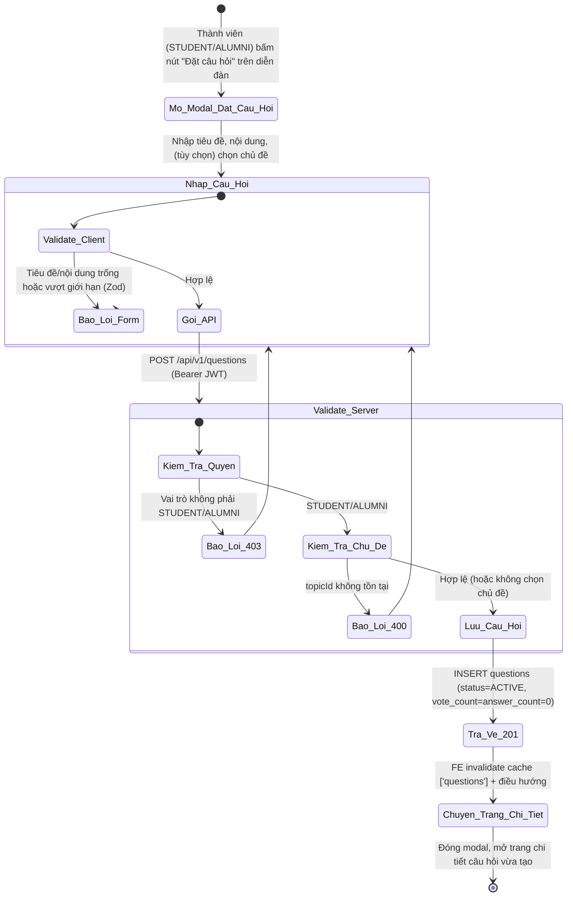
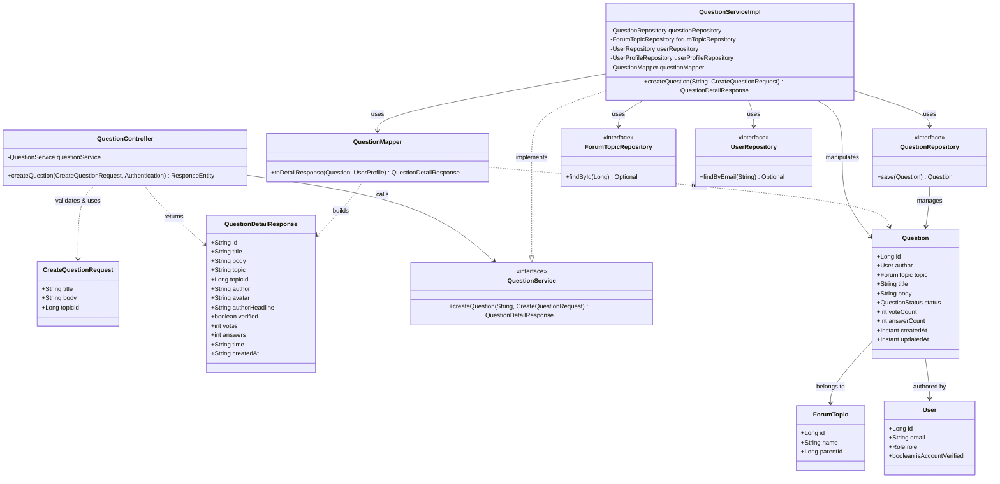
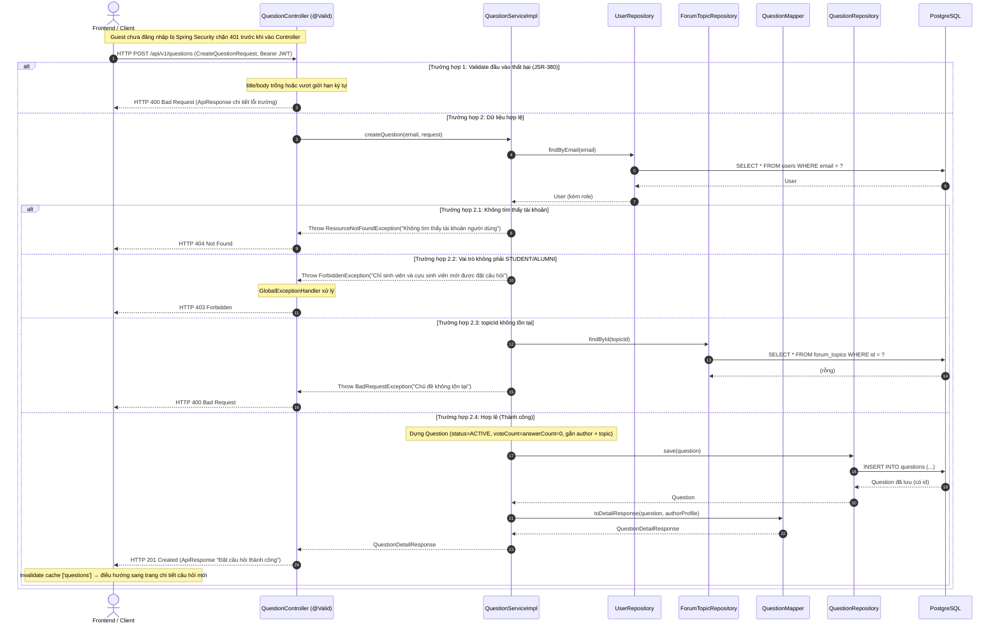

# ĐẶC TẢ YÊU CẦU & THIẾT KẾ CHI TIẾT: UC40 - ĐẶT CÂU HỎI TRÊN DIỄN ĐÀN Q&A (ASK A QUESTION)

## PHẦN 1: ĐẶC TẢ NGHIỆP VỤ (REPORT 3)

### 2.2.3 Business Workflow (Luồng nghiệp vụ)

#### Mô tả chi tiết luồng xử lý bằng chữ (Business Step Description):
* **Bước 1 - Khởi đầu**: Thành viên đã đăng nhập với vai trò Sinh viên (STUDENT) hoặc Cựu sinh viên (ALUMNI) đang ở trang diễn đàn Q&A (`/app/forum`). Chỉ họ mới thấy nút "Đặt câu hỏi". Bấm nút sẽ mở Modal đặt câu hỏi.
* **Bước 2 - Nhập liệu & Kiểm tra hợp lệ Client**: Người dùng nhập tiêu đề, nội dung và có thể chọn một chủ đề (picker phân cấp 2 cấp: chọn ngành lớn hoặc bung ra chọn chủ đề con). Client kiểm tra bằng Zod (`createQuestionSchema`): tiêu đề bắt buộc ≤ 250 ký tự, nội dung bắt buộc ≤ 10000 ký tự. Chủ đề là tùy chọn.
* **Bước 3 - Gửi & Kiểm tra phía Server**: Client gọi `POST /api/v1/questions` kèm Bearer JWT. Server (`QuestionServiceImpl.createQuestion`):
  * Nạp User theo email (từ JWT); không tồn tại → 404.
  * Kiểm tra quyền: nếu vai trò không phải STUDENT/ALUMNI → ném lỗi 403 (RBAC).
  * Nếu có `topicId`: kiểm tra chủ đề tồn tại trong bảng `forum_topics`; không tồn tại → lỗi 400.
  * Nếu hợp lệ, lưu câu hỏi mới vào bảng `questions` (status = ACTIVE, `vote_count = answer_count = 0`), trả về HTTP 201 kèm chi tiết câu hỏi vừa tạo.
* **Bước 4 - Kết thúc**: Frontend nhận 201, làm mới cache danh sách câu hỏi (`invalidateQueries(['questions'])`), đóng modal và điều hướng sang trang chi tiết câu hỏi vừa tạo (`/app/forum/{id}`) để người dùng xác nhận và chia sẻ. Guest chưa đăng nhập gọi API bị Spring Security chặn 401.

---

### 3.4 Module Diễn đàn Q&A: Câu hỏi & Chủ đề
Module 4 (Q&A Forum) phụ trách diễn đàn hỏi đáp: xem danh sách câu hỏi (UC38), xem chi tiết câu hỏi (UC39) và **đặt câu hỏi mới (UC40)**. Câu hỏi là đơn vị nội dung do thành viên đăng, có thể gắn với một chủ đề (hệ thống chủ đề 2 cấp: ngành lớn → chủ đề con) để lọc/phân loại.

#### 3.4.1 Đặt câu hỏi trên diễn đàn (Ask a question)

**Function trigger**:
*   **Navigation path**: `/app/forum` (diễn đàn Q&A) → bấm nút "Đặt câu hỏi" (góc trên phải) → mở Modal đặt câu hỏi.
*   **Timing Frequency**: On demand (bất cứ khi nào thành viên muốn hỏi cộng đồng).

**Function description**:
*   **Actors/Roles**: Sinh viên (STUDENT), Cựu sinh viên (ALUMNI). Guest và Admin không thấy nút "Đặt câu hỏi" (RBAC UI); Guest gọi API bị chặn 401, Admin bị chặn 403.
*   **Purpose**: Cho phép thành viên tạo và đăng một câu hỏi (tiêu đề + nội dung, tùy chọn gắn chủ đề) lên diễn đàn Q&A để nhận tư vấn/giải đáp từ cộng đồng cựu sinh viên.
*   **Interface**:
    *   **Nút "Đặt câu hỏi"** ở đầu trang diễn đàn — chỉ hiển thị cho STUDENT/ALUMNI.
    *   **Modal đặt câu hỏi** (render qua React Portal ra `<body>` để hiển thị chính giữa màn hình, khóa cuộn nền, đóng bằng Esc): ô nhập **Tiêu đề** (input); **picker Chủ đề (tùy chọn)** dạng phân cấp — bấm ngành lớn để chọn cả ngành, hoặc bung ra tick chọn một chủ đề con; ô nhập **Nội dung** (textarea); nút "Hủy" và nút "Đăng câu hỏi" (trạng thái "Đang đăng…").
    *   **Trạng thái**: Loading (nút "Đăng câu hỏi" khóa + spinner khi đang gửi); Error (banner đỏ hiển thị nguyên văn thông điệp lỗi nghiệp vụ từ Backend, ví dụ 403); Success (đóng modal, điều hướng sang trang chi tiết câu hỏi vừa tạo).

**Data processing**:
1.  Client kiểm tra dữ liệu qua Zod (`createQuestionSchema`): tiêu đề bắt buộc ≤ 250 ký tự, nội dung bắt buộc ≤ 10000 ký tự; `topicId` là số hoặc null.
2.  Client gọi `POST /api/v1/questions` (Bearer JWT tự đính qua interceptor) với `{ title, body, topicId? }`.
3.  Server (`QuestionServiceImpl.createQuestion`): nạp User theo email (từ JWT, 404 nếu không có); kiểm tra RBAC (STUDENT/ALUMNI, ngược lại 403); nếu có `topicId` thì kiểm tra chủ đề tồn tại (400 nếu không); dựng `Question` (status = ACTIVE, `voteCount = answerCount = 0`) và lưu vào bảng `questions`.
4.  Server nạp hồ sơ tác giả và map sang `QuestionDetailResponse`, trả HTTP 201.
5.  Client `invalidateQueries(['questions'])` → danh sách tự làm mới; đóng modal và `navigate('/app/forum/{id}')` sang trang chi tiết câu hỏi mới.

**Screen layout**:
*   *Figure 1: Nút "Đặt câu hỏi" trên trang diễn đàn Q&A — chỉ hiển thị cho Student/Alumni*
*   *Figure 2: Modal đặt câu hỏi (tiêu đề, picker chủ đề phân cấp, nội dung)*
*   *Figure 3: Trang chi tiết câu hỏi vừa tạo sau khi đăng thành công*

**Function details**:
*   **Data**:
    *   `title` (String, bắt buộc, tối đa 250 ký tự) — tiêu đề câu hỏi.
    *   `body` (String, bắt buộc, tối đa 10000 ký tự) — nội dung chi tiết câu hỏi.
    *   `topicId` (Long, tùy chọn) — ID chủ đề (ngành lớn hoặc chủ đề con); null nếu chưa phân loại.
    *   *Trả về (QuestionDetailResponse)*: `id, title, body, topic, topicId, author, avatar, authorHeadline, verified, votes, answers, time, createdAt`.
*   **Validation**:
    *   Phía Client (Zod): `title` bắt buộc ≤ 250; `body` bắt buộc ≤ 10000; `topicId` là số hoặc null.
    *   Phía Server: `@NotBlank` + `@Size(max=250)` cho `title`, `@NotBlank` + `@Size(max=10000)` cho `body` (JSR-380 trên `CreateQuestionRequest`); `topicId` được kiểm tra tồn tại ở tầng Service.
*   **Business rules**: BR-AQ-01 (RBAC: chỉ STUDENT/ALUMNI), BR-AQ-02 (tiêu đề bắt buộc ≤ 250), BR-AQ-03 (nội dung bắt buộc ≤ 10000), BR-AQ-04 (chủ đề tùy chọn, nếu có phải tồn tại), BR-AQ-05 (khởi tạo status=ACTIVE, đếm vote/trả lời = 0), BR-AQ-06 (câu hỏi gắn tác giả là người đang đăng nhập).
*   **Error Handling**:
    *   Tiêu đề trống → 400 (MSG-AQ-01). Tiêu đề quá dài → 400 (MSG-AQ-02).
    *   Nội dung trống → 400 (MSG-AQ-03). Nội dung quá dài → 400 (MSG-AQ-04).
    *   Chủ đề không tồn tại → 400 (MSG-AQ-05).
    *   Không phải STUDENT/ALUMNI → 403 (MSG-AQ-06). Guest chưa đăng nhập → 401 (MSG-AQ-07).
    *   Không tìm thấy tài khoản người dùng (token hợp lệ nhưng user bị xóa) → 404 (MSG-AQ-08).
*   **Normal case**: Thành viên nhập tiêu đề + nội dung hợp lệ (tùy chọn chọn chủ đề), bấm "Đăng câu hỏi"; hệ thống lưu câu hỏi, trả 201 "Đặt câu hỏi thành công"; modal đóng và điều hướng sang trang chi tiết câu hỏi vừa tạo.
*   **Abnormal case**: Vi phạm validation (tiêu đề/nội dung trống hoặc quá dài) → 400 kèm thông điệp; chủ đề không tồn tại → 400; Admin/vai trò khác → 403; Guest → 401.

---

### 5. Requirement Appendix (Phụ lục Yêu cầu)

#### 5.1 Business Rules (Quy tắc Nghiệp vụ)

| ID | Định nghĩa Quy tắc (Rule Definition) |
| :--- | :--- |
| BR-AQ-01 | Chỉ tài khoản đã đăng nhập với vai trò STUDENT hoặc ALUMNI mới được đặt câu hỏi. Guest bị chặn (401), Admin/vai trò khác bị từ chối (403). |
| BR-AQ-02 | Tiêu đề câu hỏi là bắt buộc và không vượt quá 250 ký tự. |
| BR-AQ-03 | Nội dung câu hỏi là bắt buộc và không vượt quá 10000 ký tự. |
| BR-AQ-04 | Chủ đề (topicId) là tùy chọn; nếu có, phải là một chủ đề đang tồn tại trong bảng `forum_topics` (ngành lớn hoặc chủ đề con), ngược lại trả 400. |
| BR-AQ-05 | Câu hỏi mới luôn khởi tạo với status = ACTIVE, vote_count = 0 và answer_count = 0. |
| BR-AQ-06 | Câu hỏi được gắn tác giả (author_id) là chính người dùng đang đăng nhập (lấy từ JWT), không nhận author từ Client. |

#### 5.2 Common Requirements (Yêu cầu Chung)
*   Mọi thông điệp lỗi hiển thị cho người dùng đều bằng **Tiếng Việt**, lấy nguyên văn từ Backend.
*   Nút "Đặt câu hỏi" chỉ hiển thị cho vai trò được phép (RBAC UI); Guest được mời đăng nhập.
*   Giao diện tuân thủ Warm Pastel Design System, responsive trên di động và máy tính.
*   Toàn bộ giao tiếp client–server mã hóa qua HTTPS/TLS; token Bearer tự đính bởi interceptor.
*   Dữ liệu danh sách câu hỏi được phân trang/cuộn vô hạn; sau khi đặt câu hỏi, cache danh sách được làm mới để câu hỏi mới xuất hiện.

#### 5.3 Application Messages List (Danh sách Thông điệp Ứng dụng)

| # | Mã thông điệp | Loại thông điệp | Ngữ cảnh | Nội dung hiển thị | HTTP |
| :--- | :--- | :--- | :--- | :--- | :--- |
| 1 | MSG-AQ-01 | Inline (dưới ô) | Tiêu đề để trống | Tiêu đề câu hỏi không được để trống | 400 |
| 2 | MSG-AQ-02 | Inline (dưới ô) | Tiêu đề vượt quá độ dài | Tiêu đề câu hỏi không được vượt quá 250 ký tự | 400 |
| 3 | MSG-AQ-03 | Inline (dưới ô) | Nội dung để trống | Nội dung câu hỏi không được để trống | 400 |
| 4 | MSG-AQ-04 | Inline (dưới ô) | Nội dung vượt quá độ dài | Nội dung câu hỏi không được vượt quá 10000 ký tự | 400 |
| 5 | MSG-AQ-05 | Banner (Alert error) | Chủ đề gắn không tồn tại | Chủ đề không tồn tại | 400 |
| 6 | MSG-AQ-06 | Banner (Alert error) | Vai trò không được phép đặt câu hỏi | Chỉ sinh viên và cựu sinh viên mới được đặt câu hỏi | 403 |
| 7 | MSG-AQ-07 | Chặn bởi Spring Security | Guest chưa đăng nhập | Bạn chưa đăng nhập hoặc phiên làm việc đã hết hạn. | 401 |
| 8 | MSG-AQ-08 | Banner (Alert error) | Token hợp lệ nhưng tài khoản không tồn tại | Không tìm thấy tài khoản người dùng | 404 |
| 9 | MSG-AQ-09 | API response (201) | Đặt câu hỏi thành công (FE điều hướng sang trang chi tiết) | Đặt câu hỏi thành công | 201 |

---

## PHẦN 2: THIẾT KẾ CHI TIẾT (REPORT 4)

### 3. Detail Design (Thiết kế chi tiết)

#### 3.1 Chức năng Đặt câu hỏi trên diễn đàn (Ask a question)

##### 3.1.1 Class Diagram (Sơ đồ Lớp)

###### Mô tả chi tiết cấu trúc các lớp (Class Design Description):
* **QuestionController**: Tiếp nhận `POST /api/v1/questions` (đã `@Valid`), lấy email tác giả từ `Authentication` (Spring Security nạp từ JWT), gọi `QuestionService.createQuestion` và trả về HTTP 201 kèm `QuestionDetailResponse` bọc trong `ApiResponse` ("Đặt câu hỏi thành công").
* **CreateQuestionRequest (DTO)**: Chứa 3 trường `title` (@NotBlank, @Size max 250), `body` (@NotBlank, @Size max 10000), `topicId` (tùy chọn); message validation bằng Tiếng Việt.
* **QuestionDetailResponse (DTO)**: Cấu trúc phẳng khớp schema Zod `questionDetailSchema` phía Frontend để điều hướng sang trang chi tiết ngay sau khi tạo.
* **QuestionService / QuestionServiceImpl**: Interface + lớp triển khai. `createQuestion` thực hiện: nạp User theo email (404 nếu không có), kiểm tra RBAC (STUDENT/ALUMNI, ngược lại ném `ForbiddenException`), kiểm tra `topicId` tồn tại nếu có (ném `BadRequestException` nếu không), lưu Question (ACTIVE, đếm = 0), map response.
* **QuestionMapper**: Lớp `@Component` ghép `Question` + `UserProfile` tác giả thành `QuestionDetailResponse` (tính thời gian tương đối, headline, avatar, huy hiệu verified, tên + id chủ đề).
* **QuestionRepository / ForumTopicRepository / UserRepository**: Spring Data JPA — `save(Question)`, `findById(topicId)`, `findByEmail` tương ứng bảng `questions`, `forum_topics`, `users`.
* **Question / ForumTopic / User (Entity)**: Ánh xạ bảng `questions`/`forum_topics`/`users`. `ForumTopic` có cột tự tham chiếu `parent_id` (hệ chủ đề 2 cấp). `Question` mặc định status=ACTIVE, đếm = 0.

##### 3.1.2 Sequence Diagram (Sơ đồ Tuần tự)

###### Mô tả chi tiết luồng xử lý bằng chữ (Sequence Flow Description):
1.  **Luồng thành công (Normal Case)**: Client gửi `POST /api/v1/questions` kèm Bearer JWT và DTO hợp lệ. Controller lấy email từ `Authentication`, gọi `QuestionServiceImpl.createQuestion`. Service nạp User, xác nhận vai trò STUDENT/ALUMNI, kiểm tra chủ đề (nếu có), dựng và lưu `Question` (ACTIVE, đếm = 0), nạp hồ sơ tác giả rồi map sang `QuestionDetailResponse`. Controller trả HTTP 201 "Đặt câu hỏi thành công". Frontend làm mới cache danh sách và điều hướng sang trang chi tiết câu hỏi mới.
2.  **Luồng lỗi Validation (400)**: Nếu `title`/`body` trống hoặc vượt giới hạn ký tự, JSR-380 phát hiện, ném `MethodArgumentNotValidException`; `GlobalExceptionHandler` trả HTTP 400 kèm chi tiết lỗi trường.
3.  **Luồng lỗi RBAC (403)**: Nếu vai trò không phải STUDENT/ALUMNI, Service ném `ForbiddenException`; GlobalExceptionHandler trả HTTP 403. Guest chưa đăng nhập bị Spring Security chặn 401 ngay trước Controller.
4.  **Luồng lỗi Business (400)**: Nếu `topicId` được gửi lên nhưng không tồn tại trong `forum_topics`, Service ném `BadRequestException`; GlobalExceptionHandler trả HTTP 400 "Chủ đề không tồn tại".
5.  **Luồng lỗi Không tìm thấy tài khoản (404)**: Nếu token hợp lệ nhưng email không còn ứng với user nào, Service ném `ResourceNotFoundException`; GlobalExceptionHandler trả HTTP 404.
