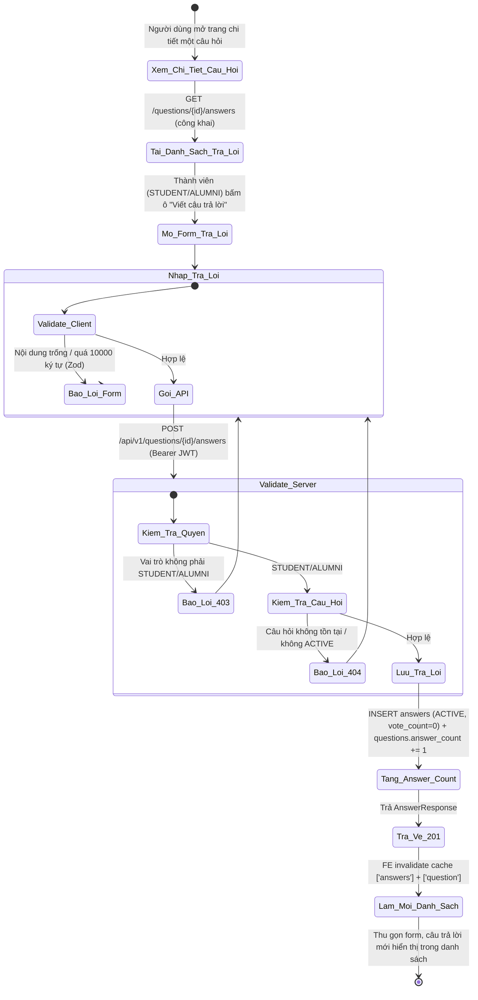
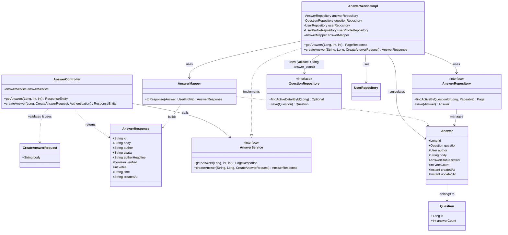
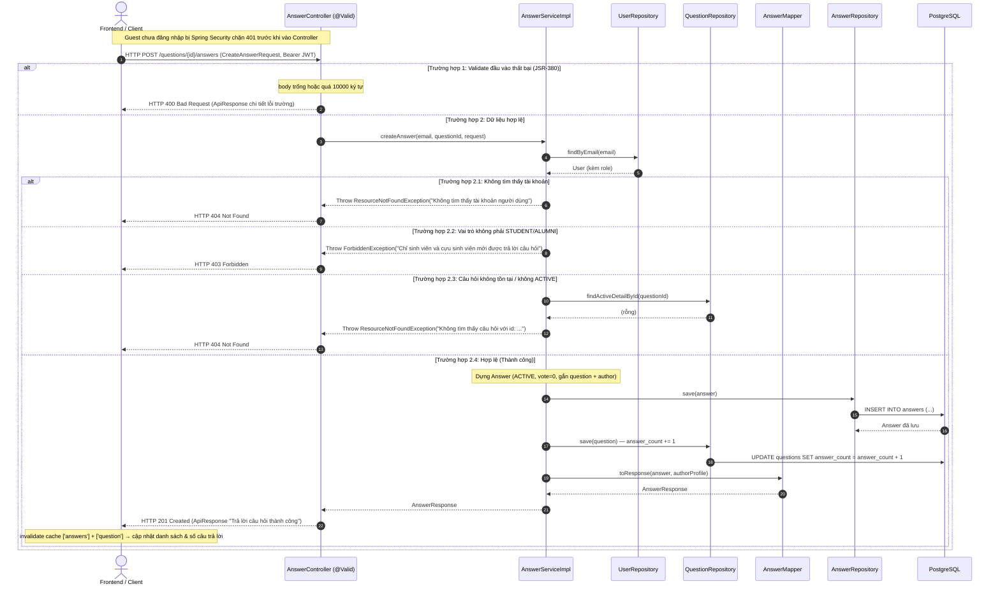

# ĐẶC TẢ YÊU CẦU & THIẾT KẾ CHI TIẾT: UC41 - TRẢ LỜI CÂU HỎI TRÊN DIỄN ĐÀN Q&A (ANSWER A QUESTION)

## PHẦN 1: ĐẶC TẢ NGHIỆP VỤ (REPORT 3)

### 2.2.3 Business Workflow (Luồng nghiệp vụ)

#### Mô tả chi tiết luồng xử lý bằng chữ (Business Step Description):
* **Bước 1 - Xem câu hỏi & câu trả lời**: Bất kỳ ai (Guest/Student/Alumni) mở trang chi tiết một câu hỏi ACTIVE đều xem được danh sách câu trả lời (`GET /questions/{id}/answers`, công khai).
* **Bước 2 - Mở form & Nhập liệu**: Thành viên đã đăng nhập vai trò STUDENT/ALUMNI thấy ô "Viết câu trả lời"; bấm vào để mở form. Client kiểm tra bằng Zod (`createAnswerSchema`): nội dung bắt buộc ≤ 10000 ký tự.
* **Bước 3 - Gửi & Kiểm tra phía Server**: Client gọi `POST /questions/{id}/answers` kèm Bearer JWT. Server (`AnswerServiceImpl.createAnswer`):
  * Nạp User theo email (JWT); không tồn tại → 404.
  * Kiểm tra quyền: vai trò không phải STUDENT/ALUMNI → 403 (RBAC).
  * Kiểm tra câu hỏi tồn tại và ACTIVE; ẩn/xóa/không tồn tại → 404.
  * Lưu câu trả lời mới (status = ACTIVE, `vote_count = 0`) và **tăng `answer_count` của câu hỏi lên 1** (trong cùng transaction).
* **Bước 4 - Kết thúc**: Server trả HTTP 201 kèm câu trả lời vừa tạo. Frontend làm mới cache danh sách câu trả lời (`invalidateQueries(['answers'])`) và chi tiết câu hỏi (`['question']` — cập nhật số câu trả lời), thu gọn form; câu trả lời mới xuất hiện trong danh sách. Guest gọi API POST bị Spring Security chặn 401.

---

### 3.4 Module Diễn đàn Q&A: Câu trả lời
Module 4 (Q&A Forum) gồm: xem danh sách câu hỏi (UC38), xem chi tiết (UC39), đặt câu hỏi (UC40) và **trả lời câu hỏi (UC41)**. Câu trả lời gắn với một câu hỏi và một tác giả; hiển thị dưới câu hỏi theo thứ tự thời gian.

#### 3.4.1 Trả lời câu hỏi trên diễn đàn (Answer a question)

**Function trigger**:
*   **Navigation path**: `/app/forum/{id}` (chi tiết câu hỏi) → khu vực "Câu trả lời" → bấm ô "Viết câu trả lời của bạn…" để mở form.
*   **Timing Frequency**: On demand (khi thành viên muốn giải đáp một câu hỏi).

**Function description**:
*   **Actors/Roles**: Sinh viên (STUDENT), Cựu sinh viên (ALUMNI) — trả lời. Guest/Admin không có form trả lời (RBAC UI); Guest gọi API POST bị chặn 401, Admin bị chặn 403. Xem danh sách câu trả lời thì ai cũng được (công khai).
*   **Purpose**: Cho phép thành viên đăng câu trả lời cho một câu hỏi ACTIVE, xây dựng kho tri thức hỏi–đáp cho cộng đồng.
*   **Interface**:
    *   **Khu vực "Câu trả lời"** nằm CHUNG card với câu hỏi (như bài viết + bình luận): tiêu đề "Câu trả lời" + huy hiệu số câu trả lời thực tế.
    *   **Ô soạn thu gọn** (chỉ STUDENT/ALUMNI): avatar + "Viết câu trả lời của bạn…"; bấm vào bung form (textarea + đếm ký tự + nút Hủy/Gửi). Gửi thành công hoặc Hủy thì thu lại.
    *   **Danh sách câu trả lời**: mỗi câu trả lời dạng bong bóng (avatar + tên + headline + thời gian + nội dung), phân trang "Tải thêm".
    *   **Trạng thái**: loading (skeleton) / rỗng ("Chưa có câu trả lời nào…") / lỗi (Thử lại) / thành công; nút "Gửi" khóa khi đang gửi hoặc trống.

**Data processing**:
1.  Client tải danh sách câu trả lời qua `GET /questions/{id}/answers?page&size` (công khai).
2.  Client kiểm tra dữ liệu qua Zod (`createAnswerSchema`): nội dung bắt buộc ≤ 10000 ký tự.
3.  Client gọi `POST /questions/{id}/answers` (Bearer JWT tự đính) với `{ body }`.
4.  Server (`AnswerServiceImpl.createAnswer`, @Transactional): nạp User (404), RBAC (403), kiểm tra câu hỏi ACTIVE (404), lưu `Answer` (ACTIVE, vote=0), tăng `questions.answer_count`.
5.  Server map sang `AnswerResponse`, trả HTTP 201.
6.  Client `invalidateQueries(['answers'])` + `['question']` → danh sách & số câu trả lời tự cập nhật; form thu gọn.

**Screen layout**:
*   *Figure 1: Khu vực câu trả lời trong card chi tiết câu hỏi (ô soạn thu gọn + danh sách)*
*   *Figure 2: Form trả lời khi mở rộng (textarea + đếm ký tự + Hủy/Gửi)*
*   *Figure 3: Bong bóng câu trả lời sau khi gửi thành công*

**Function details**:
*   **Data**:
    *   `body` (String, bắt buộc, tối đa 10000 ký tự) — nội dung câu trả lời.
    *   *Trả về (AnswerResponse)*: `id, body, author, avatar, authorHeadline, verified, votes, time, createdAt`.
*   **Validation**:
    *   Phía Client (Zod): `body` bắt buộc ≤ 10000.
    *   Phía Server: `@NotBlank` + `@Size(max=10000)` cho `body` (JSR-380 trên `CreateAnswerRequest`).
*   **Business rules**: BR-AN-01 (RBAC: chỉ STUDENT/ALUMNI), BR-AN-02 (nội dung bắt buộc ≤ 10000), BR-AN-03 (câu hỏi phải tồn tại & ACTIVE), BR-AN-04 (khởi tạo ACTIVE, vote=0), BR-AN-05 (tăng answer_count của câu hỏi), BR-AN-06 (tác giả câu trả lời là người đang đăng nhập).
*   **Error Handling**:
    *   Nội dung trống → 400 (MSG-AN-01). Nội dung quá dài → 400 (MSG-AN-02).
    *   Câu hỏi không tồn tại/không ACTIVE → 404 (MSG-AN-03).
    *   Không phải STUDENT/ALUMNI → 403 (MSG-AN-04). Guest chưa đăng nhập → 401 (MSG-AN-05).
    *   Token hợp lệ nhưng không tìm thấy user → 404 (MSG-AN-06).
*   **Normal case**: Thành viên nhập nội dung hợp lệ, bấm "Gửi câu trả lời"; hệ thống lưu, trả 201 "Trả lời câu hỏi thành công"; form thu gọn, câu trả lời mới hiện trong danh sách, số câu trả lời tăng.
*   **Abnormal case**: Nội dung trống/quá dài → 400; câu hỏi không tồn tại/ẩn → 404; Admin/vai trò khác → 403; Guest → 401.

---

### 5. Requirement Appendix (Phụ lục Yêu cầu)

#### 5.1 Business Rules (Quy tắc Nghiệp vụ)

| ID | Định nghĩa Quy tắc (Rule Definition) |
| :--- | :--- |
| BR-AN-01 | Chỉ tài khoản đã đăng nhập với vai trò STUDENT hoặc ALUMNI mới được trả lời. Guest bị chặn (401), Admin/vai trò khác bị từ chối (403). |
| BR-AN-02 | Nội dung câu trả lời là bắt buộc và không vượt quá 10000 ký tự. |
| BR-AN-03 | Chỉ được trả lời câu hỏi đang tồn tại và ở trạng thái ACTIVE; câu hỏi ẩn/xóa/không tồn tại trả 404. |
| BR-AN-04 | Câu trả lời mới luôn khởi tạo với status = ACTIVE và vote_count = 0. |
| BR-AN-05 | Khi tạo câu trả lời thành công, số câu trả lời (answer_count) của câu hỏi tăng 1 (denormalized, trong cùng transaction). |
| BR-AN-06 | Câu trả lời được gắn tác giả (author_id) là chính người dùng đang đăng nhập (lấy từ JWT), không nhận author từ Client. |

#### 5.2 Common Requirements (Yêu cầu Chung)
*   Mọi thông điệp lỗi hiển thị cho người dùng đều bằng **Tiếng Việt**, lấy nguyên văn từ Backend.
*   Ô soạn câu trả lời chỉ hiển thị cho vai trò được phép (RBAC UI); Guest được mời đăng nhập.
*   Giao diện tuân thủ Warm Pastel Design System, responsive; câu hỏi và câu trả lời trình bày chung một card (bài viết + bình luận).
*   Toàn bộ giao tiếp client–server mã hóa qua HTTPS/TLS; token Bearer tự đính bởi interceptor.

#### 5.3 Application Messages List (Danh sách Thông điệp Ứng dụng)

| # | Mã thông điệp | Loại thông điệp | Ngữ cảnh | Nội dung hiển thị | HTTP |
| :--- | :--- | :--- | :--- | :--- | :--- |
| 1 | MSG-AN-01 | Inline (dưới ô) | Nội dung để trống | Nội dung câu trả lời không được để trống | 400 |
| 2 | MSG-AN-02 | Inline (dưới ô) | Nội dung vượt quá độ dài | Nội dung câu trả lời không được vượt quá 10000 ký tự | 400 |
| 3 | MSG-AN-03 | Banner (Alert error) | Câu hỏi không tồn tại/không ACTIVE | Không tìm thấy câu hỏi với id: {id} | 404 |
| 4 | MSG-AN-04 | Banner (Alert error) | Vai trò không được phép trả lời | Chỉ sinh viên và cựu sinh viên mới được trả lời câu hỏi | 403 |
| 5 | MSG-AN-05 | Chặn bởi Spring Security | Guest chưa đăng nhập | Bạn chưa đăng nhập hoặc phiên làm việc đã hết hạn. | 401 |
| 6 | MSG-AN-06 | Banner (Alert error) | Token hợp lệ nhưng tài khoản không tồn tại | Không tìm thấy tài khoản người dùng | 404 |
| 7 | MSG-AN-07 | API response (201) | Trả lời thành công (FE thu gọn form + hiện câu trả lời) | Trả lời câu hỏi thành công | 201 |

---

## PHẦN 2: THIẾT KẾ CHI TIẾT (REPORT 4)

### 3. Detail Design (Thiết kế chi tiết)

#### 3.1 Chức năng Trả lời câu hỏi (Answer a question)

##### 3.1.1 Class Diagram (Sơ đồ Lớp)

###### Mô tả chi tiết cấu trúc các lớp (Class Design Description):
* **AnswerController**: Map `/api/v1/questions/{questionId}/answers`. `GET` (công khai) trả trang câu trả lời; `POST` (đã `@Valid`, lấy email từ `Authentication`) tạo câu trả lời, trả HTTP 201 kèm `AnswerResponse`.
* **CreateAnswerRequest (DTO)**: Trường `body` (@NotBlank, @Size max 10000); message validation Tiếng Việt.
* **AnswerResponse (DTO)**: Cấu trúc phẳng khớp schema Zod `answerSchema` phía Frontend.
* **AnswerService / AnswerServiceImpl**: `getAnswers` (xác thực câu hỏi ACTIVE → truy vấn câu trả lời ACTIVE, batch hồ sơ tác giả, map). `createAnswer` (@Transactional): nạp User (404), RBAC (403), xác thực câu hỏi ACTIVE (404), lưu Answer, tăng `answer_count`, map response.
* **AnswerMapper**: `@Component` ghép `Answer` + `UserProfile` tác giả thành `AnswerResponse` (thời gian tương đối, tên/avatar/headline/verified).
* **AnswerRepository / QuestionRepository / UserRepository**: Spring Data JPA — `findActiveByQuestionId`, `save(Answer)`; `findActiveDetailById`, `save(Question)`; `findByEmail`.
* **Answer / Question (Entity)**: Ánh xạ bảng `answers`/`questions`. `Answer` mặc định status=ACTIVE, vote=0.

##### 3.1.2 Sequence Diagram (Sơ đồ Tuần tự — luồng tạo câu trả lời)

###### Mô tả chi tiết luồng xử lý bằng chữ (Sequence Flow Description):
1.  **Luồng thành công (Normal Case)**: Client gửi `POST /questions/{id}/answers` kèm Bearer JWT và DTO hợp lệ. Controller gọi `AnswerServiceImpl.createAnswer`. Service nạp User, xác nhận STUDENT/ALUMNI, xác nhận câu hỏi ACTIVE, dựng và lưu `Answer` (ACTIVE, vote=0), tăng `answer_count`, map `AnswerResponse`. Controller trả HTTP 201 "Trả lời câu hỏi thành công". Frontend làm mới cache và thu gọn form.
2.  **Luồng lỗi Validation (400)**: `body` trống hoặc vượt 10000 ký tự → `MethodArgumentNotValidException` → GlobalExceptionHandler trả 400.
3.  **Luồng lỗi RBAC (403)**: Vai trò không phải STUDENT/ALUMNI → `ForbiddenException` → 403. Guest bị Spring Security chặn 401 trước Controller.
4.  **Luồng lỗi Không tìm thấy (404)**: Không tìm thấy user, hoặc câu hỏi không tồn tại/không ACTIVE → `ResourceNotFoundException` → 404.
