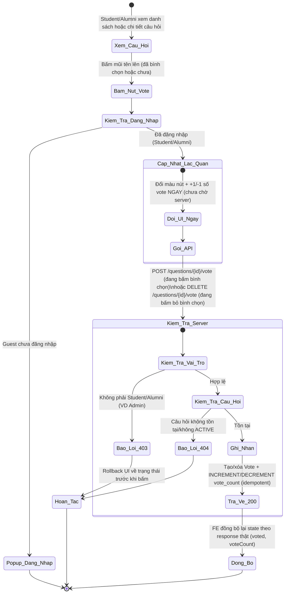
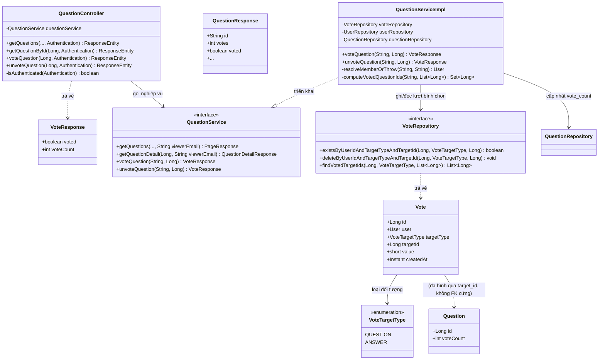
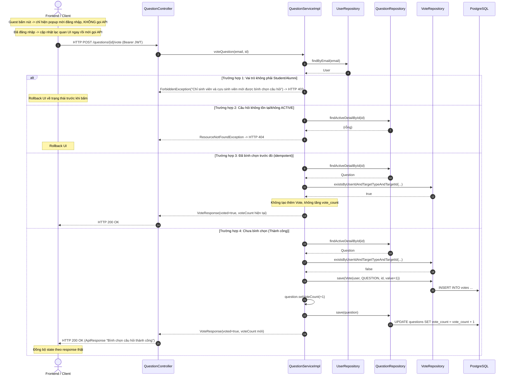
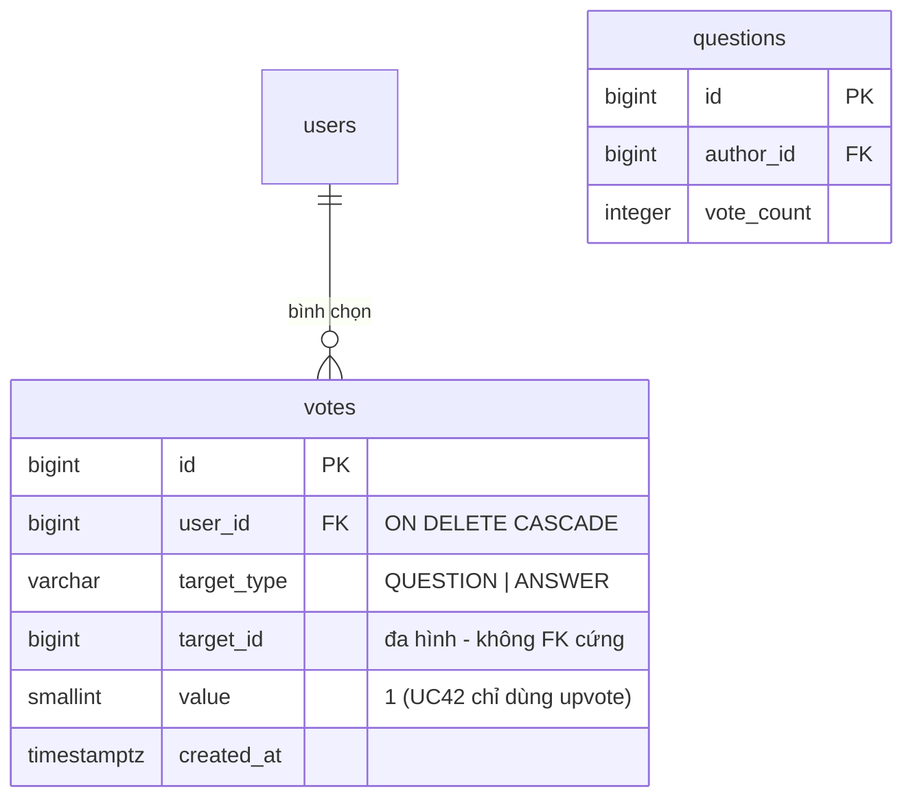

# ĐẶC TẢ YÊU CẦU & THIẾT KẾ CHI TIẾT: UC42 - BÌNH CHỌN CÂU HỎI TRÊN DIỄN ĐÀN Q&A (VOTE ON A QUESTION)

## PHẦN 1: ĐẶC TẢ NGHIỆP VỤ (REPORT 3)

### 2.2.3 Business Workflow (Luồng nghiệp vụ)

#### Mô tả chi tiết luồng xử lý bằng chữ (Business Step Description):
* **Bước 1 - Khởi đầu**: Người dùng đang xem danh sách câu hỏi (`/app/forum`) hoặc chi tiết một câu hỏi (`/app/forum/{id}`), thấy nút mũi tên lên (bình chọn) kèm số vote hiện tại.
* **Bước 2 - Bấm nút bình chọn**: Nếu là **Guest** (chưa đăng nhập) → hiện popup mời đăng nhập (kiểu Facebook, dùng chung `useLoginPrompt`/`LoginPromptModal` toàn app), KHÔNG gọi API. Nếu đã đăng nhập (Student/Alumni) → Frontend **cập nhật lạc quan** (optimistic update): đổi màu nút + tăng/giảm số vote hiển thị ngay lập tức, không chờ phản hồi server.
* **Bước 3 - Gọi & Kiểm tra phía Server**: Client gọi `POST /questions/{id}/vote` (khi đang bình chọn) hoặc `DELETE /questions/{id}/vote` (khi đang bỏ bình chọn), kèm Bearer JWT. Server (`QuestionServiceImpl.voteQuestion`/`unvoteQuestion`, `@Transactional`):
  * Xác thực user + vai trò Student/Alumni (403 nếu khác, VD Admin).
  * Xác nhận câu hỏi tồn tại và ACTIVE (404 nếu không).
  * **Idempotent**: bình chọn khi đã bình chọn rồi → không tạo thêm bản ghi/không tăng thêm vote_count; bỏ bình chọn khi chưa từng bình chọn → không lỗi, không đổi gì.
  * Ghi/xóa bản ghi trong bảng `votes` (composite unique theo user + target_type + target_id) và cập nhật `questions.vote_count` (đếm dồn/denormalized) đồng thời trong 1 transaction.
* **Bước 4 - Kết thúc**: Server trả HTTP 200 kèm `{ voted, voteCount }` thực tế. Frontend đồng bộ lại state theo response (phòng trường hợp có sai lệch, VD 2 tab cùng bấm). Nếu lỗi (403/404/mạng) → **hoàn tác (rollback)** UI về trạng thái trước khi bấm, không hiển thị toast lỗi (cùng UX với UC17 - Like a post).

---

### 3.6 Module Diễn đàn Q&A: Bình chọn câu hỏi
Module 4 (Q&A Forum) gồm: xem danh sách (UC38), xem chi tiết (UC39), đặt câu hỏi (UC40), trả lời (UC41), **bình chọn câu hỏi (UC42)**, tìm kiếm (UC44), lọc theo thể loại (UC45), chỉnh sửa (UC46) và xóa (UC47) câu hỏi. UC42 hiện thực hóa nút mũi tên lên vốn đã hiển thị tĩnh (chỉ đọc) từ UC38, biến nó thành hành động bình chọn thật — kiến trúc **mirror 1:1 UC17 (Like a post)**: cùng bảng đa hình (`votes` thay vì `post_likes`), cùng pattern Service (`resolveMemberOrThrow`, đếm dồn, batch tính cờ theo lô), cùng pattern Frontend (state cục bộ + optimistic update + rollback).

#### 3.6.1 Bình chọn câu hỏi (Vote on a question)

**Function trigger**:
*   **Navigation path**: `/app/forum` (danh sách) hoặc `/app/forum/{id}` (chi tiết) → nút mũi tên lên cạnh số vote.
*   **Timing Frequency**: On demand — mỗi khi người dùng bấm nút bình chọn/bỏ bình chọn.

**Function description**:
*   **Actors/Roles**: Sinh viên (STUDENT), Cựu sinh viên (ALUMNI) đã đăng nhập. Guest thấy nút và số vote (chỉ đọc) nhưng bấm vào sẽ hiện popup mời đăng nhập thay vì gọi API. Admin (nếu cố tình gọi API trực tiếp) bị 403 — không phải actor của UC này.
*   **Purpose**: Cho phép cộng đồng đánh giá mức độ hữu ích/chất lượng của câu hỏi, hỗ trợ sắp xếp "Nhiều bình chọn" (`sort=votes`, đã có sẵn từ UC38) đưa câu hỏi tốt lên đầu.
*   **Interface**:
    *   **Nút bình chọn**: icon mũi tên lên (`ChevronUp`) trong ô vuông bo góc, cạnh số vote — xuất hiện ở CẢ card danh sách (UC38) VÀ trang chi tiết (UC39, cột trái trên desktop / hàng riêng trên mobile).
    *   **Trạng thái đã bình chọn**: nút đổi nền/màu chữ sang tông thương hiệu (brand) để phân biệt trực quan với trạng thái chưa bình chọn.
    *   **Guest**: bấm vào hiện popup "Đăng nhập để bình chọn câu hỏi." (dùng chung modal mời đăng nhập toàn app).

**Data processing**:
1.  Client gọi `POST /questions/{id}/vote` (bình chọn) hoặc `DELETE /questions/{id}/vote` (bỏ bình chọn), không có request body.
2.  Server (`QuestionServiceImpl`): `resolveMemberOrThrow` xác thực + vai trò (404/403) → xác nhận câu hỏi ACTIVE (404) → nếu CHƯA có `Vote` (khi POST) thì tạo mới (value=1) + `voteCount++`; nếu ĐÃ có `Vote` (khi DELETE) thì xóa + `voteCount--` (không âm) — cả hai đều idempotent, gọi lặp lại không đổi kết quả thêm.
3.  Server trả `VoteResponse { voted, voteCount }` bọc trong `ApiResponse`.
4.  Client đồng bộ lại state cục bộ (`voted`, `votes`) theo response thật; khi danh sách/chi tiết được tải lại (`GET /questions`, `GET /questions/{id}`) đều trả kèm cờ `voted` tính sẵn theo người xem hiện tại (batch, tránh N+1) để hiển thị đúng trạng thái nút ngay từ đầu.

**Screen layout**:
*   *Figure 1: Nút bình chọn trên card danh sách — trạng thái chưa/đã bình chọn.*
*   *Figure 2: Nút bình chọn trên trang chi tiết (desktop cột trái, mobile hàng riêng).*

**Function details**:
*   **Data**:
    *   Tham số đầu vào: `id` (Long, path variable) — không có request body.
    *   Trả về (`VoteResponse`): `voted` (boolean), `voteCount` (int).
    *   `QuestionResponse`/`QuestionDetailResponse` (UC38/UC39) bổ sung trường `voted` (boolean) — true nếu người xem hiện tại đã bình chọn, luôn false với Guest.
*   **Validation**: Không có validate dữ liệu đầu vào (không body/query) — chỉ kiểm tra vai trò + tồn tại câu hỏi ở tầng nghiệp vụ.
*   **Business rules**: Xem mục 5.1 (BR-VQ-01 → BR-VQ-06).
*   **Error Handling**:
    *   Guest chưa đăng nhập → 401, chặn bởi Spring Security trước Controller (MSG-VQ-03) — Frontend chặn sớm hơn bằng popup, không thực sự gọi API.
    *   Không phải Student/Alumni (VD Admin) → 403 (MSG-VQ-01).
    *   Câu hỏi không tồn tại/không ACTIVE → 404 (MSG-VQ-02).
*   **Normal case**: Student/Alumni bấm bình chọn/bỏ bình chọn câu hỏi hợp lệ → HTTP 200, UI cập nhật đúng ngay lập tức (optimistic) rồi đồng bộ theo response thật.
*   **Abnormal case**: Guest bấm → popup mời đăng nhập, không gọi API; lỗi 403/404/mạng → UI tự rollback về trạng thái trước khi bấm.

---

### 5. Requirement Appendix (Phụ lục Yêu cầu)

#### 5.1 Business Rules (Quy tắc Nghiệp vụ)

| ID | Định nghĩa Quy tắc (Rule Definition) |
| :--- | :--- |
| BR-VQ-01 | Chỉ **Student/Alumni đã đăng nhập** mới được bình chọn; Guest bị chặn 401 (FE chặn sớm bằng popup mời đăng nhập), vai trò khác (VD Admin) bị từ chối 403. |
| BR-VQ-02 | Mỗi người dùng chỉ bình chọn được **1 lần** cho mỗi câu hỏi — ràng buộc UNIQUE `(user_id, target_type, target_id)` ở DB. Bình chọn khi đã bình chọn (idempotent) không tạo thêm bản ghi, không tăng thêm `vote_count`. |
| BR-VQ-03 | Bỏ bình chọn khi chưa từng bình chọn (idempotent) không lỗi, không đổi `vote_count`. |
| BR-VQ-04 | Chỉ bình chọn được câu hỏi đang tồn tại và ở trạng thái ACTIVE; câu hỏi ẩn/xóa/không tồn tại trả 404. |
| BR-VQ-05 | UC42 hiện chỉ hỗ trợ **upvote** (value = 1), khớp UI 1 nút mũi tên duy nhất — không có downvote/value = -1 dù cột `value` và CHECK constraint đã hỗ trợ sẵn ở DB cho khả năng mở rộng sau này. |
| BR-VQ-06 | Bảng `votes` dùng chung (đa hình qua `target_type`) cho cả câu hỏi và câu trả lời — UC42 chỉ triển khai nghiệp vụ cho `target_type = 'QUESTION'`; bình chọn câu trả lời (`ANSWER`) để dành cho UC khác trong tương lai, không thuộc phạm vi UC42. |

#### 5.2 Common Requirements (Yêu cầu Chung)
*   Mọi thông điệp lỗi hiển thị cho người dùng bằng **Tiếng Việt**.
*   Cập nhật lạc quan (optimistic UI) + rollback khi lỗi — không có toast lỗi hiển thị, cùng UX pattern với UC17 (Like a post) để nhất quán trải nghiệm tương tác toàn app.
*   `vote_count` trên `questions` là đếm dồn (denormalized) — nguồn sự thật để hiển thị nhanh; bảng `votes` là nguồn sự thật để tính idempotent + cờ `voted` theo người xem.
*   Không thay đổi cấu trúc bảng `questions` (cột `vote_count` đã có sẵn từ UC38) — chỉ thêm bảng `votes` mới (migration V7).

#### 5.3 Application Messages List (Danh sách Thông điệp Ứng dụng)

| # | Mã thông điệp | Loại thông điệp | Ngữ cảnh | Nội dung hiển thị | HTTP |
| :--- | :--- | :--- | :--- | :--- | :--- |
| 1 | MSG-VQ-01 | Rollback UI (không toast) | Vai trò không phải Student/Alumni | Chỉ sinh viên và cựu sinh viên mới được bình chọn câu hỏi | 403 |
| 2 | MSG-VQ-02 | Rollback UI (không toast) | Câu hỏi không tồn tại/không ACTIVE | Không tìm thấy câu hỏi với id: {id} | 404 |
| 3 | MSG-VQ-03 | Popup mời đăng nhập (chặn trước khi gọi API) | Guest chưa đăng nhập | Đăng nhập để bình chọn câu hỏi. | 401 |
| 4 | MSG-VQ-04 | API response (200) | Bình chọn thành công | Bình chọn câu hỏi thành công | 200 |
| 5 | MSG-VQ-05 | API response (200) | Bỏ bình chọn thành công | Bỏ bình chọn câu hỏi thành công | 200 |

---

## PHẦN 2: THIẾT KẾ CHI TIẾT (REPORT 4)

### 3. Detail Design (Thiết kế chi tiết)

#### 3.1 Chức năng Bình chọn câu hỏi (Vote on a question)

##### 3.1.1 Class Diagram (Sơ đồ Lớp)

###### Mô tả chi tiết cấu trúc các lớp (Class Design Description):
* **Lớp Controller (`QuestionController`)**: Bổ sung `POST /api/v1/questions/{id}/vote` và `DELETE /api/v1/questions/{id}/vote` (yêu cầu JWT — không nằm `PUBLIC_GET`). `getQuestions`/`getQuestionById` (đã có từ UC38/UC39) bổ sung tham số `Authentication` để tính `viewerEmail` (null nếu Guest, dùng chung helper `isAuthenticated` mirror từ `PostController`) — truyền xuống Service để tính cờ `voted`.
* **Lớp DTO (`VoteResponse`)**: Mirror 1:1 `LikeResponse` (UC17) — `voted` (boolean) + `voteCount` (int), giúp Frontend cập nhật ngay không cần tải lại câu hỏi. `QuestionResponse`/`QuestionDetailResponse` bổ sung trường `voted`.
* **Lớp Service (`QuestionService`, `QuestionServiceImpl`)**: `voteQuestion`/`unvoteQuestion` mirror `likePost`/`unlikePost` (UC17) — dùng chung helper mới `resolveMemberOrThrow` (xác thực + vai trò). Helper mới `computeVotedQuestionIds` (mirror `computeLikedPostIds`) tính theo lô (batch) tránh N+1 khi hiển thị danh sách/chi tiết.
* **Lớp Repository (`VoteRepository`)**: Interface JPA mirror `PostLikeRepository` — `existsBy…`/`deleteBy…` dùng cho toggle, `findVotedTargetIds` (custom `@Query`) dùng cho batch tính cờ `voted`.
* **Lớp Entity (`Vote`, `VoteTargetType`)**: `Vote` ánh xạ bảng `votes` mới (migration **V7**) — thiết kế **đa hình**: `targetId` là `Long` thô (KHÔNG `@ManyToOne` tới `Question`) vì có thể trỏ tới câu hỏi HOẶC câu trả lời tùy `targetType`; `user` vẫn `@ManyToOne` vì luôn là FK cứng tới `users`. `VoteTargetType` enum {QUESTION, ANSWER} — UC42 chỉ dùng QUESTION.

##### 3.1.2 Sequence Diagram (Sơ đồ Tuần tự)

###### Mô tả chi tiết luồng xử lý bằng chữ (Sequence Flow Description):
1.  **Luồng thành công (Normal Case)**: Client gửi `POST /questions/{id}/vote` kèm Bearer JWT. Service xác thực + vai trò, xác nhận câu hỏi ACTIVE, kiểm tra CHƯA bình chọn → tạo `Vote` + tăng `vote_count` trong 1 transaction. Trả HTTP 200 kèm trạng thái mới. `DELETE` cùng đường dẫn thực hiện luồng ngược lại (xóa `Vote` + giảm `vote_count`, không âm).
2.  **Luồng idempotent**: Gọi `POST` khi đã bình chọn, hoặc `DELETE` khi chưa từng bình chọn → không đổi dữ liệu, vẫn trả HTTP 200 với trạng thái hiện tại (không lỗi, không phải luồng bất thường).
3.  **Luồng lỗi Vai trò (403)**: Vai trò không phải Student/Alumni (VD Admin cố tình gọi API) → `ForbiddenException` → 403. Guest bị Spring Security chặn 401 trước Controller (và bị FE chặn sớm hơn bằng popup, không thực sự gửi request).
4.  **Luồng lỗi Không tìm thấy (404)**: Câu hỏi không tồn tại hoặc không ACTIVE (HIDDEN/DELETED) → `ResourceNotFoundException` → 404.

##### 3.1.3 Thiết kế Cơ sở dữ liệu (bảng mới `votes` — Migration V7)

* Bảng `votes` copy nguyên định nghĩa từ blueprint thiết kế gốc (`E:\Database Alumnect.sql`) — đa hình dùng chung cho câu hỏi (`QUESTION`) và câu trả lời (`ANSWER`, chưa triển khai nghiệp vụ). Ràng buộc `UNIQUE (user_id, target_type, target_id)` đảm bảo mỗi người chỉ bình chọn 1 lần/đối tượng; `CHECK (value IN (-1, 1))` cho phép mở rộng downvote sau này dù UC42 chỉ dùng `value = 1`. Index `(target_type, target_id)` phục vụ tính cờ `voted` theo lô khi hiển thị danh sách.
* Không đổi cấu trúc bảng `questions` — cột `vote_count` đã có sẵn từ V1 (UC38), chỉ được cập nhật giá trị đồng thời khi ghi/xóa `votes`.
