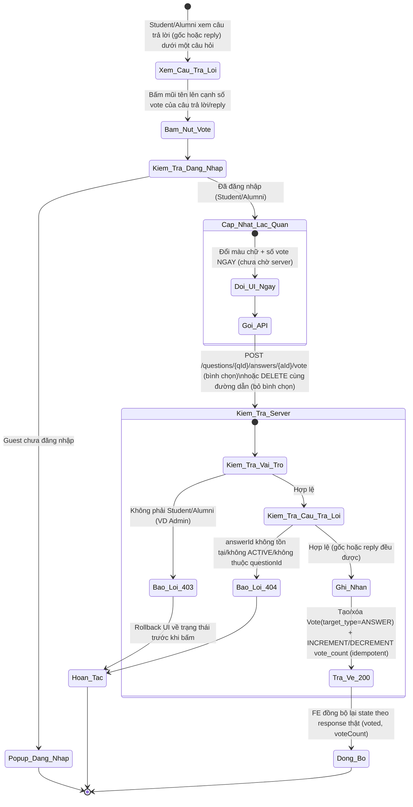
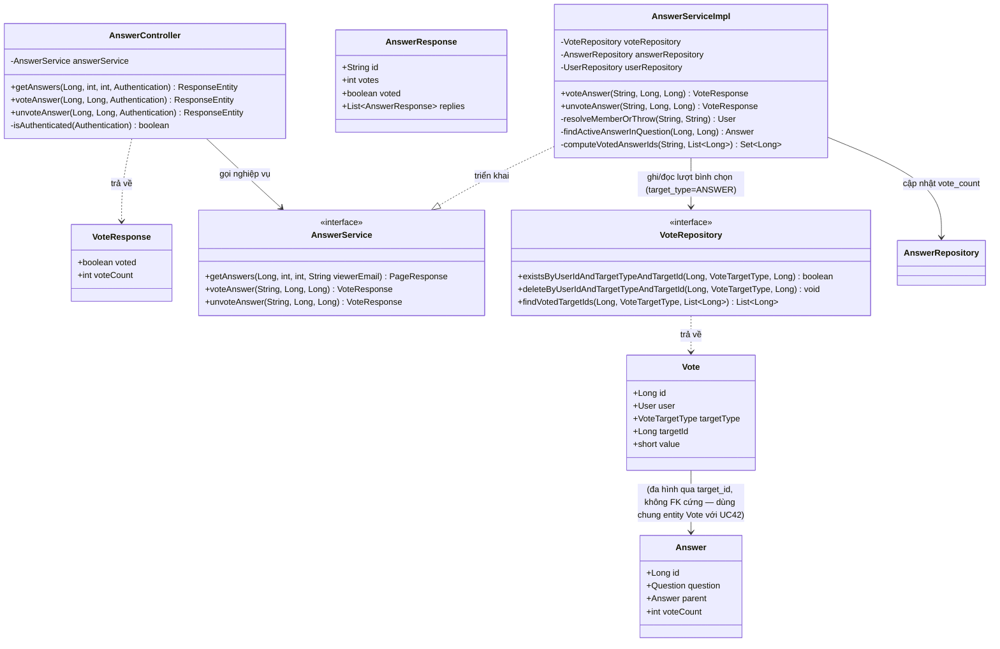
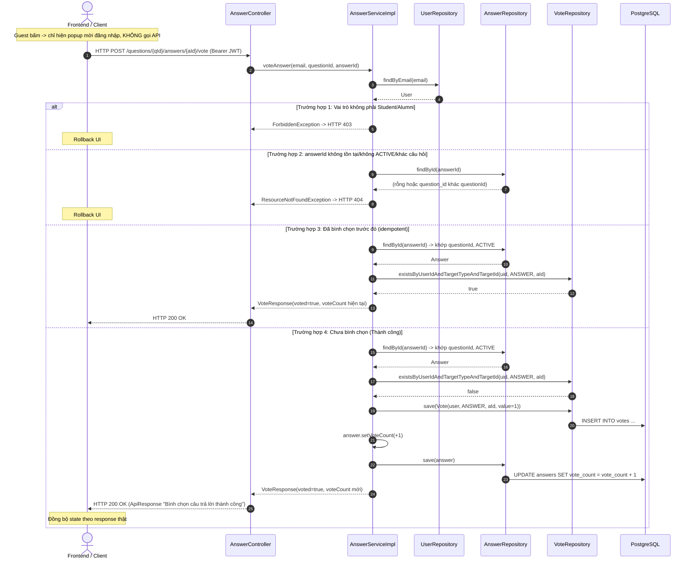

# ĐẶC TẢ YÊU CẦU & THIẾT KẾ CHI TIẾT: UC43 - BÌNH CHỌN CÂU TRẢ LỜI TRÊN DIỄN ĐÀN Q&A (VOTE ON AN ANSWER)

## PHẦN 1: ĐẶC TẢ NGHIỆP VỤ (REPORT 3)

### 2.2.3 Business Workflow (Luồng nghiệp vụ)

#### Mô tả chi tiết luồng xử lý bằng chữ (Business Step Description):
* **Bước 1 - Khởi đầu**: Người dùng đang xem chi tiết một câu hỏi (`/app/forum/{id}`), thấy khu vực câu trả lời — mỗi câu trả lời GỐC và mỗi REPLY đều có nút bình chọn riêng (mũi tên lên + số vote) trong hàng hành động (cạnh "Trả lời"/"Chỉnh sửa").
* **Bước 2 - Bấm nút bình chọn**: Nếu là **Guest** → hiện popup mời đăng nhập, KHÔNG gọi API. Nếu đã đăng nhập (Student/Alumni) → Frontend **cập nhật lạc quan**: đổi màu chữ + tăng/giảm số vote hiển thị ngay, không chờ phản hồi server.
* **Bước 3 - Gọi & Kiểm tra phía Server**: Client gọi `POST /questions/{questionId}/answers/{answerId}/vote` (bình chọn) hoặc `DELETE` cùng đường dẫn (bỏ bình chọn), kèm Bearer JWT. Server (`AnswerServiceImpl.voteAnswer`/`unvoteAnswer`, `@Transactional`):
  * Xác thực user + vai trò Student/Alumni (403 nếu khác).
  * Tìm câu trả lời ACTIVE theo `answerId`, xác nhận thuộc đúng `questionId` trên đường dẫn (404 nếu không tồn tại/không ACTIVE/thuộc câu hỏi khác) — áp dụng như nhau cho **cả câu trả lời gốc lẫn reply** (reply cũng là bản ghi `Answer` bình thường, chỉ khác có `parent_id`).
  * **Idempotent** 2 chiều giống UC42.
  * Ghi/xóa bản ghi `votes` với `target_type = 'ANSWER'`, `target_id = answerId`, cập nhật `answers.vote_count` đồng thời trong 1 transaction.
* **Bước 4 - Kết thúc**: Server trả HTTP 200 kèm `{ voted, voteCount }`. Frontend đồng bộ lại state theo response thật; lỗi → rollback UI (không toast), cùng UX với UC42.

---

### 3.7 Module Diễn đàn Q&A: Bình chọn câu trả lời
Module 4 (Q&A Forum). UC43 là **phần còn lại** của thiết kế đa hình bảng `votes` (đã tạo ở UC42 — migration V7, `target_type IN ('QUESTION','ANSWER')`) — không cần migration mới, chỉ mở khóa nghiệp vụ cho nhánh `ANSWER`. Kiến trúc mirror gần như 1:1 UC42, chỉ khác đối tượng bình chọn là `Answer` thay vì `Question`, và phải hoạt động cho **cả 2 cấp** (câu trả lời gốc + reply, mô hình 2 cấp có sẵn từ UC41).

#### 3.7.1 Bình chọn câu trả lời (Vote on an answer)

**Function trigger**:
*   **Navigation path**: `/app/forum/{id}` (chi tiết câu hỏi) → khu vực "Câu trả lời" → nút mũi tên lên cạnh mỗi câu trả lời/reply.
*   **Timing Frequency**: On demand — mỗi khi người dùng bấm bình chọn/bỏ bình chọn một câu trả lời hoặc reply.

**Function description**:
*   **Actors/Roles**: Sinh viên (STUDENT), Cựu sinh viên (ALUMNI) đã đăng nhập. Guest thấy số vote (chỉ đọc) nhưng bấm vào hiện popup mời đăng nhập. Admin bị 403 nếu cố gọi API trực tiếp.
*   **Purpose**: Cho phép cộng đồng đánh giá câu trả lời hữu ích nhất, giúp người đọc nhanh nhận ra câu trả lời chất lượng (đặc biệt hữu ích khi một câu hỏi có nhiều câu trả lời/reply).
*   **Interface**:
    *   **Nút bình chọn**: icon mũi tên lên nhỏ (`ChevronUp`) + số vote, đặt trong hàng hành động dưới mỗi bong bóng câu trả lời (kiểu bình luận Facebook) — cạnh "Trả lời"/"Chỉnh sửa"/"Đã chỉnh sửa". Áp dụng đồng nhất cho câu trả lời gốc VÀ reply lồng bên trong.
    *   **Trạng thái đã bình chọn**: chữ đổi sang màu thương hiệu (brand) để phân biệt.

**Data processing**:
1.  Client gọi `POST/DELETE /questions/{questionId}/answers/{answerId}/vote`, không có request body.
2.  Server: `resolveMemberOrThrow` (403/404 user) → `findActiveAnswerInQuestion` (404 nếu answer không tồn tại/không ACTIVE/không thuộc đúng câu hỏi) → ghi/xóa `Vote(target_type=ANSWER)` + cập nhật `vote_count` (idempotent).
3.  Server trả `VoteResponse { voted, voteCount }` (DTO dùng chung với UC42, không tạo DTO mới).
4.  Client đồng bộ state cục bộ theo response thật. `GET /questions/{id}/answers` (UC41) trả kèm cờ `voted` tính sẵn theo lô cho **cả câu trả lời gốc lẫn reply** trong cùng 1 trang — tránh N+1 query.

**Screen layout**:
*   *Figure 1: Nút bình chọn trên câu trả lời gốc và reply — cùng vị trí trong hàng hành động.*

**Function details**:
*   **Data**:
    *   Tham số đầu vào: `questionId`, `answerId` (Long, path variable) — không có request body.
    *   Trả về: `VoteResponse { voted, voteCount }` — tái sử dụng DTO của UC42.
    *   `AnswerResponse` (UC41) bổ sung trường `voted` (boolean) — áp dụng cho cả câu trả lời gốc và từng phần tử trong `replies[]`.
*   **Validation**: Không có validate dữ liệu đầu vào — chỉ kiểm tra vai trò + tồn tại/đúng câu hỏi ở tầng nghiệp vụ.
*   **Business rules**: Xem mục 5.1 (BR-VA-01 → BR-VA-06).
*   **Error Handling**:
    *   Guest chưa đăng nhập → 401 (chặn sớm bởi FE bằng popup, không thực sự gọi API).
    *   Không phải Student/Alumni → 403 (MSG-VA-01).
    *   `answerId` không tồn tại/không ACTIVE/không thuộc `questionId` trên đường dẫn → 404 (MSG-VA-02) — dùng chung cách kiểm tra với UC48 (Edit an answer) để tránh bình chọn nhầm chéo câu hỏi.
*   **Normal case**: Student/Alumni bình chọn/bỏ bình chọn câu trả lời hoặc reply hợp lệ → HTTP 200, UI cập nhật optimistic rồi đồng bộ theo response thật.
*   **Abnormal case**: Guest bấm → popup đăng nhập; lỗi 403/404/mạng → rollback UI.

---

### 5. Requirement Appendix (Phụ lục Yêu cầu)

#### 5.1 Business Rules (Quy tắc Nghiệp vụ)

| ID | Định nghĩa Quy tắc (Rule Definition) |
| :--- | :--- |
| BR-VA-01 | Chỉ **Student/Alumni đã đăng nhập** mới được bình chọn; Guest bị chặn 401 (FE chặn sớm bằng popup), vai trò khác (VD Admin) bị từ chối 403. |
| BR-VA-02 | Mỗi người dùng chỉ bình chọn được **1 lần** cho mỗi câu trả lời/reply — ràng buộc UNIQUE `(user_id, target_type='ANSWER', target_id)` ở DB (bảng `votes` dùng chung với UC42). Bình chọn khi đã bình chọn (idempotent) không tạo thêm bản ghi. |
| BR-VA-03 | Bỏ bình chọn khi chưa từng bình chọn (idempotent) không lỗi, không đổi `vote_count`. |
| BR-VA-04 | Áp dụng đồng nhất cho **cả câu trả lời gốc lẫn reply** (mô hình 2 cấp từ UC41) — reply cũng là một `Answer` với `vote_count` riêng, bình chọn độc lập với câu trả lời gốc chứa nó. |
| BR-VA-05 | `answerId` phải thuộc đúng `questionId` trên đường dẫn và đang ACTIVE; sai câu hỏi/đã ẩn/xóa/không tồn tại đều trả 404 như nhau (không lộ thông tin tồn tại ở câu hỏi khác). |
| BR-VA-06 | UC43 chỉ hỗ trợ **upvote** (value = 1), khớp UI 1 nút mũi tên duy nhất — giống UC42, không có downvote. |

#### 5.2 Common Requirements (Yêu cầu Chung)
*   Mọi thông điệp lỗi hiển thị cho người dùng bằng **Tiếng Việt**.
*   Cập nhật lạc quan (optimistic UI) + rollback khi lỗi, không toast lỗi — nhất quán UX với UC42/UC17.
*   `vote_count` trên `answers` là đếm dồn (denormalized, đã có sẵn từ UC41) — nguồn sự thật để hiển thị nhanh; bảng `votes` (đã tạo từ UC42) là nguồn sự thật để tính idempotent + cờ `voted`.
*   **Không tạo migration mới** — tái sử dụng 100% bảng `votes` (V7) đã tạo ở UC42, chỉ mở khóa nghiệp vụ nhánh `target_type = 'ANSWER'` vốn đã có sẵn trong CHECK constraint.

#### 5.3 Application Messages List (Danh sách Thông điệp Ứng dụng)

| # | Mã thông điệp | Loại thông điệp | Ngữ cảnh | Nội dung hiển thị | HTTP |
| :--- | :--- | :--- | :--- | :--- | :--- |
| 1 | MSG-VA-01 | Rollback UI (không toast) | Vai trò không phải Student/Alumni | Chỉ sinh viên và cựu sinh viên mới được bình chọn câu trả lời | 403 |
| 2 | MSG-VA-02 | Rollback UI (không toast) | Câu trả lời không tồn tại/không ACTIVE/khác câu hỏi | Không tìm thấy câu trả lời với id: {id} | 404 |
| 3 | MSG-VA-03 | Popup mời đăng nhập (chặn trước khi gọi API) | Guest chưa đăng nhập | Đăng nhập để bình chọn câu trả lời. | 401 |
| 4 | MSG-VA-04 | API response (200) | Bình chọn thành công | Bình chọn câu trả lời thành công | 200 |
| 5 | MSG-VA-05 | API response (200) | Bỏ bình chọn thành công | Bỏ bình chọn câu trả lời thành công | 200 |

---

## PHẦN 2: THIẾT KẾ CHI TIẾT (REPORT 4)

### 3. Detail Design (Thiết kế chi tiết)

#### 3.1 Chức năng Bình chọn câu trả lời (Vote on an answer)

##### 3.1.1 Class Diagram (Sơ đồ Lớp)

###### Mô tả chi tiết cấu trúc các lớp (Class Design Description):
* **Lớp Controller (`AnswerController`)**: Bổ sung `POST/DELETE /api/v1/questions/{questionId}/answers/{answerId}/vote` (yêu cầu JWT). `getAnswers` (đã có từ UC41) bổ sung `Authentication` để tính `viewerEmail` — mirror hoàn toàn cách `QuestionController` làm ở UC42, thêm helper `isAuthenticated` riêng (controller khác class nên copy helper, không import chéo).
* **Lớp DTO**: **Tái sử dụng nguyên `VoteResponse`** đã tạo ở UC42 (không tạo DTO mới) — vì cấu trúc `{voted, voteCount}` giống hệt nhau cho cả câu hỏi và câu trả lời. `AnswerResponse` bổ sung trường `voted`, áp dụng cho cả object gốc và từng phần tử `replies[]`.
* **Lớp Service (`AnswerService`, `AnswerServiceImpl`)**: `voteAnswer`/`unvoteAnswer` mirror `voteQuestion`/`unvoteQuestion` (UC42), dùng `VoteTargetType.ANSWER` thay vì `QUESTION`. 3 helper mới: `resolveMemberOrThrow` (mirror UC42, copy riêng cho class này — không share giữa 2 Service), `findActiveAnswerInQuestion` (gộp logic tìm + validate answer thuộc đúng câu hỏi, tương tự đoạn code đã có sẵn trong `updateAnswer` của UC48 nhưng tách thành helper để dùng chung cho vote/unvote), `computeVotedAnswerIds` (mirror `computeVotedQuestionIds`, batch theo lô cho CẢ câu trả lời gốc lẫn reply trong `getAnswers`).
* **Lớp Repository/Entity (`VoteRepository`, `Vote`)**: **Tái sử dụng 100%** từ UC42 — không sửa, không thêm method mới, chỉ gọi với tham số `VoteTargetType.ANSWER` thay vì `QUESTION`. Đây chính là lý do bảng `votes` được thiết kế đa hình ngay từ đầu.

##### 3.1.2 Sequence Diagram (Sơ đồ Tuần tự)

###### Mô tả chi tiết luồng xử lý bằng chữ (Sequence Flow Description):
1.  **Luồng thành công (Normal Case)**: Client gửi `POST /questions/{qId}/answers/{aId}/vote`. Service xác thực + vai trò, tìm câu trả lời ACTIVE đúng câu hỏi, kiểm tra CHƯA bình chọn → tạo `Vote(target_type=ANSWER)` + tăng `vote_count` trong 1 transaction. `DELETE` thực hiện luồng ngược lại.
2.  **Luồng idempotent**: Gọi `POST` khi đã bình chọn, hoặc `DELETE` khi chưa từng bình chọn → không đổi dữ liệu, vẫn HTTP 200.
3.  **Luồng lỗi Vai trò (403)**: Vai trò không phải Student/Alumni → `ForbiddenException`.
4.  **Luồng lỗi Không tìm thấy (404)**: `answerId` không tồn tại, không ACTIVE, hoặc thuộc `questionId` khác trên đường dẫn → `ResourceNotFoundException` — dùng chung logic kiểm tra với UC48 để đảm bảo nhất quán, tránh bình chọn/sửa nhầm chéo câu hỏi.
