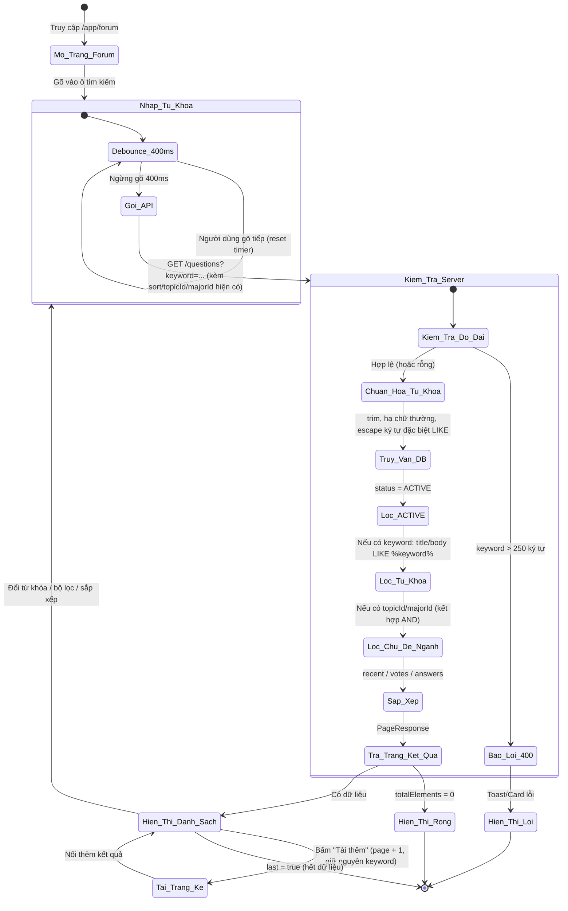
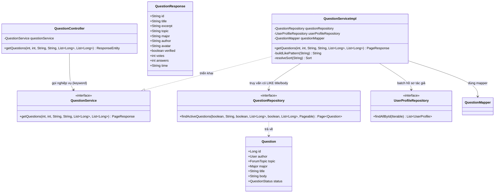

# ĐẶC TẢ YÊU CẦU & THIẾT KẾ CHI TIẾT: UC44 - TÌM KIẾM CÂU HỎI TRÊN DIỄN ĐÀN Q&A (SEARCH QUESTIONS)

## PHẦN 1: ĐẶC TẢ NGHIỆP VỤ (REPORT 3)

### 2.2.3 Business Workflow (Luồng nghiệp vụ)



#### Mô tả chi tiết luồng xử lý bằng chữ (Business Step Description):
* **Bước 1 - Khởi đầu**: Người dùng (Guest, Student hoặc Alumni) đang ở trang diễn đàn `/app/forum`, gõ từ khóa vào ô tìm kiếm phía trên bộ lọc chủ đề/ngành.
* **Bước 2 - Debounce phía Client**: Frontend KHÔNG gọi API ngay mỗi lần gõ; chờ người dùng ngừng gõ 400ms mới phát request `GET /questions` kèm tham số `keyword` (cùng `page=0`, `sort`, `topicId`, `majorId` hiện tại) — tránh spam request khi gõ nhanh.
* **Bước 3 - Kiểm tra & chuẩn hóa phía Server**: Backend trim `keyword`; nếu vượt quá 250 ký tự → HTTP 400. Nếu rỗng/blank → coi như không tìm kiếm (trả về như UC38 bình thường). Nếu hợp lệ, hạ chữ thường và escape các ký tự đặc biệt của LIKE (`%`, `_`, `\`) để tránh người dùng vô tình/cố ý dùng ký tự wildcard.
* **Bước 4 - Truy vấn & lọc**: Chỉ tìm trong câu hỏi `ACTIVE`. So khớp KHÔNG phân biệt hoa/thường trên **tiêu đề HOẶC nội dung** (`title` OR `body`). Điều kiện từ khóa kết hợp **AND** với bộ lọc chủ đề/ngành đang bật (nếu có) — độc lập với nhau. Sắp xếp theo tiêu chí đã chọn như UC38.
* **Bước 5 - Trả kết quả & hiển thị**: Backend trả `PageResponse` như UC38. Frontend hiển thị danh sách khớp, hoặc trạng thái rỗng có ngữ cảnh ("Không tìm thấy câu hỏi khớp '{keyword}'") kèm nút "Xóa tìm kiếm". Đổi từ khóa/bộ lọc/sắp xếp sẽ tải lại từ trang 0; bấm "Tải thêm" giữ nguyên `keyword` hiện tại cho tới khi `last = true`.

---

### 3.2 Module Diễn đàn Hỏi–Đáp (Q&A Forum)
Module 4 của hệ thống. UC44 mở rộng UC38 (View question list) bằng khả năng tìm kiếm toàn văn đơn giản trên tiêu đề và nội dung câu hỏi, giúp người dùng nhanh chóng tìm lại câu hỏi/thảo luận đã có trước khi đặt câu hỏi trùng lặp.

#### 3.2.1 Tìm kiếm câu hỏi (Search Questions)

**Function trigger**:
*   **Navigation path**: `/app/forum` (tab "Q&A Forum") → ô tìm kiếm phía trên bộ lọc chủ đề/ngành.
*   **Timing Frequency**: On demand — mỗi khi người dùng gõ và ngừng gõ 400ms (debounce), hoặc khi bấm "Tải thêm câu hỏi" với từ khóa đang áp dụng.

**Function description**:
*   **Actors/Roles**: Guest (khách vãng lai chưa đăng nhập), Student, Alumni. Tìm kiếm câu hỏi công khai nên cả ba đều dùng được, không yêu cầu đăng nhập.
*   **Purpose**: Cho phép người dùng tìm nhanh câu hỏi đã có trên diễn đàn theo từ khóa xuất hiện trong tiêu đề hoặc nội dung, kết hợp được với bộ lọc chủ đề/ngành và tiêu chí sắp xếp sẵn có (UC38).
*   **Interface**:
    *   **Ô tìm kiếm**: nằm ngay dưới tiêu đề trang, phía trên bộ lọc chủ đề/ngành. Icon kính lúp bên trái, placeholder "Tìm kiếm câu hỏi theo tiêu đề hoặc nội dung…", nút "x" xóa nhanh khi có nội dung.
    *   **Kết hợp bộ lọc**: từ khóa hoạt động độc lập và kết hợp được với bộ lọc chủ đề/ngành và tiêu chí sắp xếp hiện có của UC38.
    *   **Trạng thái rỗng có ngữ cảnh**: khi không có kết quả và đang có từ khóa, hiển thị "Không tìm thấy câu hỏi khớp '{keyword}'" + nút "Xóa tìm kiếm" (khác thông điệp mặc định "Chưa có câu hỏi nào" khi không tìm kiếm).
    *   **Nút "Xóa lọc"**: xuất hiện khi có từ khóa VÀ/HOẶC bộ lọc/sắp xếp đang áp dụng; bấm vào xóa tất cả (kể cả từ khóa).

**Data processing**:
1.  **Debounce phía Client**: Ô nhập cập nhật state ngay để gõ mượt; một state thứ hai chỉ cập nhật sau 400ms không gõ tiếp (giống cơ chế debounce dùng ở Alumni Map — UC53/54/55), tránh gọi API liên tục.
2.  **Gọi API**: Client gọi `GET /api/v1/questions?page={n}&size={m}&sort={s}&keyword={k}[&topicId=...][&majorId=...]`. Bỏ tham số `keyword` khi rỗng.
3.  **Backend xử lý**: Kiểm tra độ dài `keyword` (≤ 250) → trim, hạ chữ thường, escape ký tự đặc biệt LIKE, bọc `%...%` → truy vấn `questions` (JOIN FETCH tác giả, LEFT JOIN FETCH chủ đề/ngành, lọc `status = ACTIVE` AND (không tìm kiếm OR title/body khớp) AND điều kiện chủ đề/ngành nếu có) → batch hồ sơ tác giả (tránh N+1) → map sang `QuestionResponse` → bọc `PageResponse`.
4.  **Client hiển thị**: Giống UC38 (Zod `safeParse`, gộp trang, suy `hasMore`); khi rỗng và đang có `keyword` thì hiển thị thông điệp/nút theo ngữ cảnh tìm kiếm.

**Screen layout**:
*   *Figure 1: Ô tìm kiếm trên trang danh sách câu hỏi, phía trên bộ lọc chủ đề/ngành.*
*   *Figure 2: Trạng thái rỗng khi tìm kiếm không có kết quả.*

**Function details**:
*   **Data**:
    *   Tham số đầu vào mới: `keyword` (String, tùy chọn, ≤ 250 ký tự) — cùng bộ tham số `page/size/sort/topicId/majorId` đã có ở UC38.
    *   Dữ liệu trả về: tái sử dụng nguyên `QuestionResponse` của UC38 (không đổi cấu trúc).
*   **Validation**:
    *   `keyword`: tùy chọn; nếu có, độ dài ≤ 250 ký tự (khớp giới hạn `title`), ngược lại HTTP 400.
    *   Không giới hạn độ dài tối thiểu — 1 ký tự vẫn tìm được (tìm theo substring).
*   **Business rules**: Xem mục 5.1 (BR-SQ-01 → BR-SQ-06).
*   **Error Handling**:
    *   HTTP 400 khi `keyword` vượt quá 250 ký tự (thông điệp tiếng Việt).
    *   HTTP 500 (bắt tập trung ở `GlobalExceptionHandler`) cho lỗi hệ thống ngoài dự kiến.
*   **Normal case**: Từ khóa hợp lệ, có câu hỏi khớp → HTTP 200 kèm trang kết quả đã lọc/sắp xếp; Frontend hiển thị danh sách.
*   **Abnormal case**:
    *   Từ khóa quá dài → HTTP 400, Frontend hiển thị lỗi.
    *   Không có câu hỏi khớp từ khóa (và/hoặc bộ lọc) → HTTP 200 với `content` rỗng, Frontend hiển thị trạng thái rỗng theo ngữ cảnh tìm kiếm.

---

### 5. Requirement Appendix (Phụ lục Yêu cầu)

#### 5.1 Business Rules (Quy tắc Nghiệp vụ)

| ID | Định nghĩa Quy tắc (Rule Definition) |
| :--- | :--- |
| BR-SQ-01 | Tìm kiếm là nội dung công khai: Guest (chưa đăng nhập), Student và Alumni đều dùng được, không cần đăng nhập. |
| BR-SQ-02 | Chỉ tìm trong câu hỏi ở trạng thái `ACTIVE`; câu hỏi `HIDDEN`/`DELETED` không xuất hiện trong kết quả (kế thừa BR-38-02). |
| BR-SQ-03 | So khớp KHÔNG phân biệt hoa/thường (case-insensitive), dạng substring (chứa từ khóa ở bất kỳ vị trí nào), trên **tiêu đề HOẶC nội dung** câu hỏi. |
| BR-SQ-04 | `keyword` tối đa 250 ký tự (khớp giới hạn độ dài `title`); vượt quá → HTTP 400. Rỗng/blank được coi như không tìm kiếm (trả kết quả như UC38). |
| BR-SQ-05 | Điều kiện từ khóa kết hợp **AND** với bộ lọc chủ đề (`topicId`) và ngành (`majorId`) nếu đang bật — ba điều kiện độc lập nhau (giống quan hệ topic/major ở BR-38-05). |
| BR-SQ-06 | Kết quả tìm kiếm vẫn được phân trang và áp dụng đúng 3 tiêu chí sắp xếp sẵn có (`recent`/`votes`/`answers`) như UC38 — không có tiêu chí sắp xếp riêng cho tìm kiếm (VD không sắp theo độ liên quan). |

#### 5.2 Common Requirements (Yêu cầu Chung)
*   Mọi thông điệp lỗi hiển thị cho người dùng bằng **Tiếng Việt**.
*   Gọi API tìm kiếm được **debounce 400ms** phía Client để tránh spam request khi người dùng gõ nhanh.
*   Danh sách kết quả vẫn phân trang (không tải toàn bộ), dùng lại `PageResponse` như UC38.
*   Không thay đổi cấu trúc dữ liệu (`questions.title`, `questions.body` đã có sẵn) — không cần migration mới cho UC này.

#### 5.3 Application Messages List (Danh sách Thông điệp Ứng dụng)

| # | Mã thông điệp | Loại thông điệp | Ngữ cảnh | Nội dung hiển thị | HTTP |
| :--- | :--- | :--- | :--- | :--- | :--- |
| 1 | MSG-SQ-01 | Toast/Response | Tìm kiếm/lấy danh sách thành công | Lấy danh sách câu hỏi thành công | 200 |
| 2 | MSG-SQ-02 | Alert/Response 400 | Từ khóa vượt quá 250 ký tự | Từ khóa tìm kiếm không được vượt quá 250 ký tự | 400 |
| 3 | MSG-SQ-03 | Trạng thái rỗng | Không có câu hỏi khớp từ khóa | Không tìm thấy câu hỏi khớp "{keyword}". Thử từ khóa khác, hoặc xóa tìm kiếm để xem toàn bộ câu hỏi. | 200 |
| 4 | MSG-SQ-04 | Card lỗi + nút Thử lại | Lỗi hệ thống khi tìm kiếm | Không tải được danh sách câu hỏi. {message} | 500 |

---

## PHẦN 2: THIẾT KẾ CHI TIẾT (REPORT 4)

### 3. Detail Design (Thiết kế chi tiết)

#### 3.1 Chức năng Tìm kiếm câu hỏi (Search Questions)

##### 3.1.1 Class Diagram (Sơ đồ Lớp)



###### Mô tả chi tiết cấu trúc các lớp (Class Design Description):
* **Lớp Controller (`QuestionController`)**: `GET /questions` (đã có từ UC38) bổ sung tham số `keyword` (String, tùy chọn) — không thêm endpoint mới, không đổi RBAC (vẫn công khai, nằm trong `Endpoints.PUBLIC_GET`).
* **Lớp DTO (`QuestionResponse`)**: Tái sử dụng nguyên vẹn từ UC38 — UC44 không đổi cấu trúc dữ liệu trả về.
* **Lớp Service (`QuestionService`, `QuestionServiceImpl`)**: `getQuestions` nhận thêm `keyword`; validate độ dài (≤ 250 ký tự) → `BadRequestException` nếu vi phạm; hàm mới `buildLikePattern` chuẩn hóa từ khóa thành mẫu LIKE an toàn (chữ thường + escape `\`, `%`, `_` + bọc `%...%`).
* **Lớp Repository (`QuestionRepository`)**: `findActiveQuestions` bổ sung cặp tham số `filterByKeyword`/`keyword`; điều kiện `LOWER(q.title) LIKE :keyword ESCAPE '\' OR LOWER(q.body) LIKE :keyword ESCAPE '\'` được AND với điều kiện `status = ACTIVE` và các điều kiện chủ đề/ngành sẵn có — cùng một câu JPQL dùng chung cho UC38 và UC44.
* **Lớp Entity (`Question`)**: Không đổi — tìm kiếm trực tiếp trên hai cột sẵn có `title`/`body`, không cần migration mới.

##### 3.1.2 Sequence Diagram (Sơ đồ Tuần tự)

```mermaid
sequenceDiagram
    autonumber
    actor Client as Client (React Frontend)
    participant Ctrl as QuestionController
    participant Service as QuestionServiceImpl
    participant QRepo as QuestionRepository
    participant PRepo as UserProfileRepository
    participant Mapper as QuestionMapper
    participant DB as PostgreSQL

    Note over Client: Người dùng gõ từ khóa; Client debounce 400ms trước khi gọi API
    Client->>Ctrl: GET /api/v1/questions?page&size&sort&keyword&topicId&majorId

    Ctrl->>Service: getQuestions(page, size, sort, keyword, topicIds, majorIds)

    alt Luồng lỗi: keyword > 250 ký tự
        Service-->>Ctrl: Throw BadRequestException("Từ khóa tìm kiếm không được vượt quá 250 ký tự")
        Note over Ctrl: GlobalExceptionHandler bắt lỗi
        Ctrl-->>Client: HTTP 400 Bad Request (ApiResponse lỗi)
    else Luồng thành công: keyword hợp lệ (hoặc rỗng)
        Service->>Service: trim + hạ chữ thường + escape ký tự đặc biệt -> buildLikePattern(keyword)
        Service->>Service: resolveSort(sort) -> Sort
        Service->>QRepo: findActiveQuestions(filterByKeyword, likePattern, filterByTopic, topicIds, filterByMajor, majorIds, PageRequest)
        QRepo->>DB: SELECT ... WHERE status='ACTIVE' AND (LOWER(title) LIKE ? ESCAPE '\' OR LOWER(body) LIKE ? ESCAPE '\') AND ...
        DB-->>QRepo: Trang Question khớp điều kiện (kèm author + topic + major)
        QRepo-->>Service: Page<Question>
        Service->>PRepo: findAllById(authorIds) (batch, tránh N+1)
        PRepo-->>Service: List<UserProfile>
        loop Mỗi câu hỏi trong trang
            Service->>Mapper: toResponse(question, authorProfile, images)
            Mapper-->>Service: QuestionResponse
        end
        Service-->>Ctrl: PageResponse<QuestionResponse>
        Ctrl-->>Client: HTTP 200 OK (ApiResponse "Lấy danh sách câu hỏi thành công")
        Note over Client: content rỗng -> hiển thị "Không tìm thấy câu hỏi khớp '{keyword}'"
    end
```

###### Mô tả chi tiết luồng xử lý bằng chữ (Sequence Flow Description):
1.  **Gửi Request**: Client debounce 400ms sau lần gõ cuối, rồi gọi `GET /api/v1/questions` kèm `keyword` (cùng `page/size/sort/topicId/majorId` hiện tại).
2.  **Luồng lỗi (400)**: Nếu `keyword` (sau trim) dài hơn 250 ký tự, Service ném `BadRequestException` → `GlobalExceptionHandler` trả HTTP 400.
3.  **Luồng thành công**: Service chuẩn hóa `keyword` thành mẫu LIKE an toàn (`buildLikePattern`), gọi `findActiveQuestions` với cờ `filterByKeyword` — khi `keyword` rỗng, cờ này = false nên điều kiện LIKE bị vô hiệu hóa và hành vi giống hệt UC38. Kết quả được batch nạp hồ sơ tác giả, map sang `QuestionResponse`, đóng gói `PageResponse` và trả HTTP 200. Nếu không có câu hỏi khớp, Frontend hiển thị trạng thái rỗng có ngữ cảnh tìm kiếm (MSG-SQ-03).
