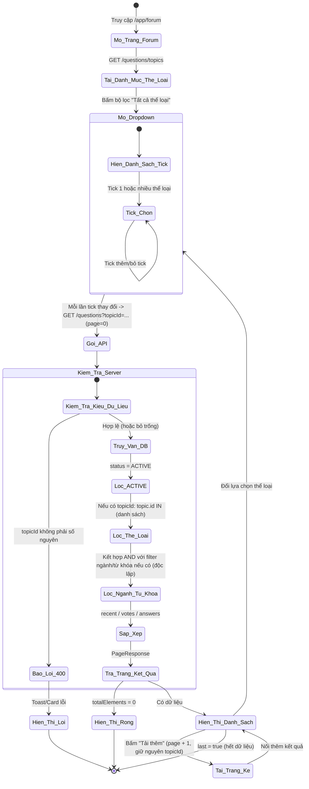
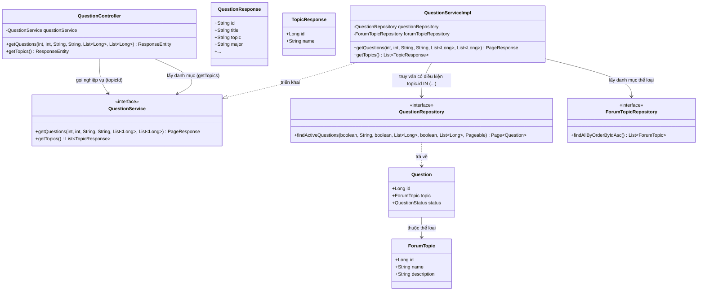
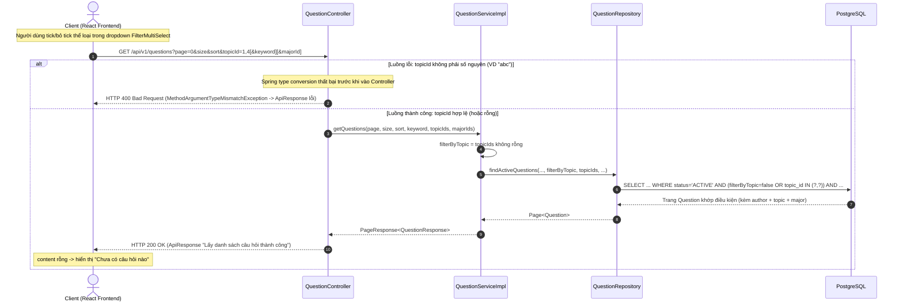

# ĐẶC TẢ YÊU CẦU & THIẾT KẾ CHI TIẾT: UC45 - LỌC CÂU HỎI THEO THỂ LOẠI (FILTER QUESTIONS BY TOPIC)

## PHẦN 1: ĐẶC TẢ NGHIỆP VỤ (REPORT 3)

### 2.2.3 Business Workflow (Luồng nghiệp vụ)

#### Mô tả chi tiết luồng xử lý bằng chữ (Business Step Description):
* **Bước 1 - Khởi đầu**: Người dùng (Guest, Student hoặc Alumni) ở trang `/app/forum`. Frontend gọi `GET /api/v1/questions/topics` để lấy danh mục thể loại (Career, Interview, Education, Salary, General...) đổ vào bộ lọc dạng dropdown tick-chọn nhiều (`FilterMultiSelect`).
* **Bước 2 - Tick chọn thể loại**: Người dùng bấm mở dropdown "Tất cả thể loại", tick chọn một hoặc nhiều thể loại quan tâm. Mỗi lần thay đổi lựa chọn, Client gọi lại `GET /questions` từ trang 0 kèm `topicId=<id1>,<id2>,...` (danh sách ID cách nhau dấu phẩy).
* **Bước 3 - Kiểm tra & truy vấn phía Server**: Nếu `topicId` không parse được thành số nguyên (VD `topicId=abc`) → HTTP 400 (bắt bởi `GlobalExceptionHandler` qua `MethodArgumentTypeMismatchException`, không phải logic riêng của UC45). Nếu hợp lệ (hoặc bỏ trống — không lọc), hệ thống chỉ lấy câu hỏi `ACTIVE`, lọc thêm theo `topic.id IN (topicId đã chọn)` — một câu hỏi khớp nếu thuộc **BẤT KỲ** thể loại nào trong danh sách tick. Điều kiện thể loại kết hợp **AND** độc lập với bộ lọc ngành (UC-khác) và từ khóa tìm kiếm (UC44) nếu đang bật đồng thời.
* **Bước 4 - Trả kết quả & hiển thị**: Backend trả `PageResponse` như UC38. Frontend hiển thị danh sách đã lọc, hoặc trạng thái rỗng ("Chưa có câu hỏi nào" + gợi ý đổi thể loại) nếu không có câu hỏi khớp. Nút "Xóa lọc" xuất hiện khi có ít nhất 1 thể loại đang được chọn, bấm vào xóa toàn bộ lựa chọn (cả thể loại/ngành/sắp xếp/từ khóa). Đổi lựa chọn thể loại luôn tải lại từ trang 0; bấm "Tải thêm" giữ nguyên `topicId` hiện tại cho tới khi `last = true`.

---

### 3.2 Module Diễn đàn Hỏi–Đáp (Q&A Forum)
Module 4 của hệ thống. UC45 là một phần bộ lọc của UC38 (View question list) — cho phép người dùng thu hẹp danh sách câu hỏi theo (các) thể loại thảo luận quan tâm (Career, Interview, Education, Salary, General...), giúp duyệt nội dung nhanh và đúng chủ đề hơn.

#### 3.2.1 Lọc câu hỏi theo thể loại (Filter Questions by Topic)

**Function trigger**:
*   **Navigation path**: `/app/forum` (tab "Q&A Forum") → dropdown bộ lọc "Tất cả thể loại" ngay dưới ô tìm kiếm.
*   **Timing Frequency**: On demand — mỗi khi người dùng tick/bỏ tick một thể loại trong dropdown.

**Function description**:
*   **Actors/Roles**: Guest (khách vãng lai chưa đăng nhập), Student, Alumni. Lọc câu hỏi công khai nên cả ba đều dùng được, không yêu cầu đăng nhập, không có gate quyền theo vai trò (UI hiển thị giống nhau cho mọi actor).
*   **Purpose**: Cho phép người dùng thu hẹp danh sách câu hỏi diễn đàn theo một hoặc nhiều thể loại quan tâm, kết hợp được với bộ lọc ngành và từ khóa tìm kiếm (UC44) sẵn có.
*   **Interface**:
    *   **Nút bộ lọc "Tất cả thể loại"**: dạng pill bo tròn, icon lưới (`LayoutGrid`), nằm ngay bên trái bộ lọc ngành. Khi có lựa chọn, đổi nhãn thành "Đã chọn N thể loại".
    *   **Dropdown tick-chọn nhiều**: mở ra danh sách thể loại kèm icon riêng từng loại (`TopicIcon`), có dòng "Tất cả thể loại" để xóa nhanh lựa chọn của riêng bộ lọc này; tick vào từng dòng để chọn/bỏ chọn (không giới hạn số lượng).
    *   **Nút "Xóa lọc"**: chỉ hiện khi có ít nhất 1 điều kiện đang áp dụng (thể loại/ngành/sắp xếp/từ khóa); bấm xóa toàn bộ.
    *   **Badge thể loại trên card câu hỏi**: mỗi câu hỏi hiển thị badge tên thể loại (màu violet) nếu đã được phân loại, giúp người dùng xác nhận kết quả lọc đúng.

**Data processing**:
1.  **Lấy danh mục**: Client gọi `GET /api/v1/questions/topics` một lần khi vào trang, đổ vào dropdown.
2.  **Gọi API lọc**: Client gọi `GET /api/v1/questions?page=0&size=10&sort={s}&topicId={id1},{id2}[&keyword=...][&majorId=...]`. Bỏ tham số `topicId` khi không có thể loại nào được tick.
3.  **Backend xử lý**: `QuestionServiceImpl.getQuestions` nhận `topicIds`, bật cờ `filterByTopic = true` nếu danh sách không rỗng → `QuestionRepository.findActiveQuestions` áp điều kiện `t.id IN :topicIds` (LEFT JOIN nên câu hỏi chưa phân loại vẫn bị loại đúng khi có lọc) kết hợp AND với điều kiện `status = ACTIVE` và các điều kiện khác (ngành/từ khóa) đang bật — cùng một câu JPQL dùng chung cho UC38/UC44/UC45.
4.  **Client hiển thị**: Giống UC38 (Zod `safeParse`, gộp trang, suy `hasMore`); danh sách chỉ còn câu hỏi thuộc thể loại đã chọn.

**Screen layout**:
*   *Figure 1: Dropdown bộ lọc thể loại (tick nhiều) trên trang danh sách câu hỏi.*
*   *Figure 2: Danh sách đã lọc theo thể loại — badge thể loại trên từng card khớp lựa chọn.*

**Function details**:
*   **Data**:
    *   Tham số đầu vào: `topicId` (List&lt;Long&gt;, tùy chọn, dạng CSV) — tái sử dụng nguyên tham số đã có từ UC38.
    *   Danh mục thể loại (`TopicResponse`): `id` (Long), `name` (String) — từ `GET /questions/topics`.
    *   Dữ liệu trả về: tái sử dụng nguyên `QuestionResponse` của UC38 (không đổi cấu trúc).
*   **Validation**:
    *   `topicId`: tùy chọn; mỗi phần tử phải parse được thành số nguyên (Long), sai kiểu → HTTP 400 (Spring type conversion, không phải validate nghiệp vụ riêng).
    *   `topicId` không tồn tại trong `forum_topics` → không lỗi, chỉ trả kết quả rỗng (nhất quán với hành vi UC38 gốc).
*   **Business rules**: Xem mục 5.1 (BR-FT-01 → BR-FT-05).
*   **Error Handling**:
    *   HTTP 400 khi `topicId` không phải số nguyên hợp lệ.
    *   HTTP 500 (bắt tập trung ở `GlobalExceptionHandler`) cho lỗi hệ thống ngoài dự kiến.
*   **Normal case**: Chọn 1 hoặc nhiều thể loại hợp lệ → HTTP 200 kèm trang câu hỏi đã lọc/sắp xếp; Frontend hiển thị danh sách đúng thể loại.
*   **Abnormal case**:
    *   `topicId` sai kiểu → HTTP 400, Frontend hiển thị lỗi qua Card lỗi + nút Thử lại.
    *   Không có câu hỏi nào thuộc thể loại đã chọn → HTTP 200 với `content` rỗng, Frontend hiển thị trạng thái rỗng ("Chưa có câu hỏi nào" + nút "Xóa bộ lọc").

---

### 5. Requirement Appendix (Phụ lục Yêu cầu)

#### 5.1 Business Rules (Quy tắc Nghiệp vụ)

| ID | Định nghĩa Quy tắc (Rule Definition) |
| :--- | :--- |
| BR-FT-01 | Lọc theo thể loại là nội dung công khai: Guest (chưa đăng nhập), Student và Alumni đều dùng được, không cần đăng nhập, không phân biệt vai trò. |
| BR-FT-02 | Có thể chọn **NHIỀU** thể loại cùng lúc (tick-chọn); một câu hỏi khớp nếu thuộc **BẤT KỲ** thể loại nào trong danh sách đã chọn (quan hệ OR giữa các thể loại được chọn). |
| BR-FT-03 | Chỉ lọc trong câu hỏi ở trạng thái `ACTIVE`; câu hỏi `HIDDEN`/`DELETED` không xuất hiện (kế thừa BR-38-02). |
| BR-FT-04 | Điều kiện thể loại kết hợp **AND** độc lập với bộ lọc ngành (`majorId`) và từ khóa tìm kiếm (`keyword`, UC44) nếu đang bật đồng thời — ba điều kiện độc lập nhau (khớp BR-38-05, BR-SQ-05). |
| BR-FT-05 | Kết quả lọc vẫn được phân trang và áp dụng đúng 3 tiêu chí sắp xếp sẵn có (`recent`/`votes`/`answers`) như UC38 — không có tiêu chí sắp xếp riêng cho lọc theo thể loại. |

#### 5.2 Common Requirements (Yêu cầu Chung)
*   Mọi thông điệp lỗi hiển thị cho người dùng bằng **Tiếng Việt**.
*   Đổi lựa chọn thể loại tải lại danh sách từ trang 0, dùng `PageResponse` như UC38.
*   Không thay đổi cấu trúc dữ liệu (`questions.topic_id`, `forum_topics` đã có sẵn từ UC38) — không cần migration mới cho UC này.

#### 5.3 Application Messages List (Danh sách Thông điệp Ứng dụng)

| # | Mã thông điệp | Loại thông điệp | Ngữ cảnh | Nội dung hiển thị | HTTP |
| :--- | :--- | :--- | :--- | :--- | :--- |
| 1 | MSG-FT-01 | Toast/Response | Lọc/lấy danh sách thành công | Lấy danh sách câu hỏi thành công | 200 |
| 2 | MSG-FT-02 | Alert/Response 400 | `topicId` không phải số nguyên hợp lệ | Tham số 'topicId' không hợp lệ | 400 |
| 3 | MSG-FT-03 | Trạng thái rỗng | Không có câu hỏi thuộc thể loại đã chọn | Chưa có câu hỏi nào. Thử đổi chủ đề khác, hoặc là người đầu tiên đặt câu hỏi. | 200 |
| 4 | MSG-FT-04 | Card lỗi + nút Thử lại | Lỗi hệ thống khi lọc | Không tải được danh sách câu hỏi. {message} | 500 |

---

## PHẦN 2: THIẾT KẾ CHI TIẾT (REPORT 4)

### 3. Detail Design (Thiết kế chi tiết)

#### 3.1 Chức năng Lọc câu hỏi theo thể loại (Filter Questions by Topic)

##### 3.1.1 Class Diagram (Sơ đồ Lớp)

###### Mô tả chi tiết cấu trúc các lớp (Class Design Description):
* **Lớp Controller (`QuestionController`)**: `GET /questions` (đã có từ UC38) nhận tham số `topicId` (List&lt;Long&gt;, tùy chọn, dạng CSV `topicId=1,4,7`); `GET /questions/topics` trả danh mục để Frontend đổ vào dropdown. Không thêm endpoint mới, không đổi RBAC (vẫn công khai, `Endpoints.PUBLIC_GET`).
* **Lớp DTO (`QuestionResponse`, `TopicResponse`)**: Tái sử dụng nguyên vẹn từ UC38 — UC45 không đổi cấu trúc dữ liệu trả về.
* **Lớp Service (`QuestionService`, `QuestionServiceImpl`)**: `getQuestions` tính cờ `filterByTopic = topicIds != null && !topicIds.isEmpty()`; khi false truyền danh sách giữ chỗ `[-1]` để tránh mệnh đề `IN ()` không hợp lệ trong JPQL — cờ vô hiệu hóa điều kiện lọc.
* **Lớp Repository (`QuestionRepository`)**: `findActiveQuestions` có điều kiện `(:filterByTopic = false OR t.id IN :topicIds)` AND với `status = ACTIVE` và các điều kiện ngành/từ khóa — cùng một câu JPQL dùng chung cho UC38/UC44/UC45, `LEFT JOIN FETCH q.topic t` nên không loại câu hỏi chưa phân loại khi KHÔNG lọc.
* **Lớp Entity (`Question`, `ForumTopic`)**: Không đổi — quan hệ `@ManyToOne` sẵn có từ UC38 (`question.topic_id -> forum_topics.id`), không cần migration mới.

##### 3.1.2 Sequence Diagram (Sơ đồ Tuần tự)

###### Mô tả chi tiết luồng xử lý bằng chữ (Sequence Flow Description):
1.  **Gửi Request**: Client gọi `GET /api/v1/questions` kèm `topicId` mỗi khi người dùng thay đổi lựa chọn trong dropdown (cùng `page=0/size/sort/keyword/majorId` hiện tại).
2.  **Luồng lỗi (400)**: Nếu một phần tử của `topicId` không parse được thành số nguyên, Spring ném `MethodArgumentTypeMismatchException` **trước khi vào Controller** → `GlobalExceptionHandler` trả HTTP 400 (cơ chế chung, không phải logic riêng của UC45).
3.  **Luồng thành công**: Service tính cờ `filterByTopic`, gọi `findActiveQuestions` với `topicIds` — khi rỗng, cờ = false nên điều kiện `IN` bị vô hiệu hóa và hành vi giống hệt UC38 không lọc. Kết quả map sang `QuestionResponse`, đóng gói `PageResponse` và trả HTTP 200. Nếu không có câu hỏi thuộc thể loại đã chọn, Frontend hiển thị trạng thái rỗng (MSG-FT-03).

### 4. Kết quả kiểm thử thực tế (Manual QA)
Đã verify trực tiếp bằng cách gọi API thật trên dữ liệu hiện có (14 câu hỏi test), không chỉnh sửa code (chức năng đã hoạt động đúng từ UC38):

| Kịch bản | Kết quả |
| :--- | :--- |
| Không lọc (`topicId` bỏ trống) | 14/14 câu hỏi |
| `topicId=1` (Career) | 7/7 câu hỏi đều có `topic = "Career"` |
| `topicId=1,2` (Career hoặc Interview) | 9/9 câu hỏi (quan hệ OR đúng — BR-FT-02) |
| `topicId=99999` (thể loại không tồn tại) | 0 câu hỏi, HTTP 200 (không lỗi — đúng BR-38 kế thừa) |
| `topicId=abc` (sai kiểu dữ liệu) | HTTP 400 `"Tham số 'topicId' không hợp lệ"` |
| Test tay trên UI thật | Tick "Career" trong dropdown → danh sách chỉ còn card có badge "CAREER"; bấm "Xóa lọc" → khôi phục toàn bộ danh sách |
