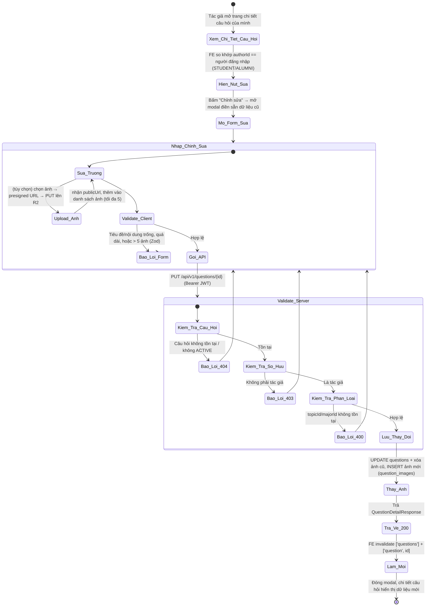
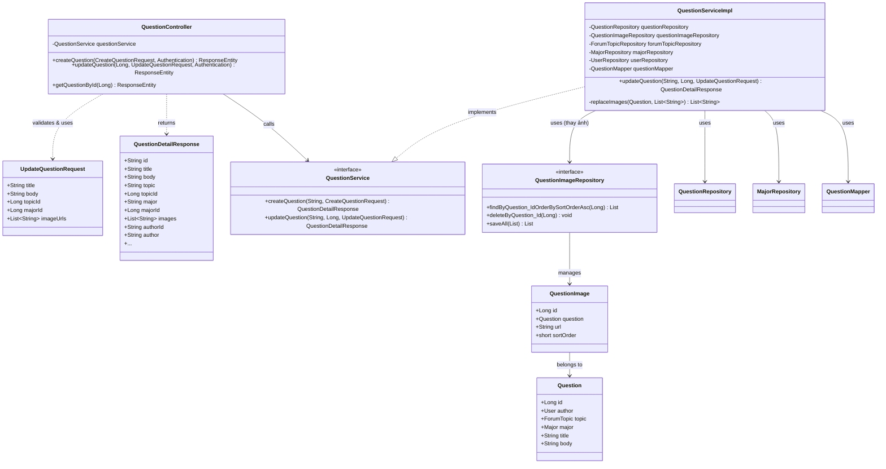
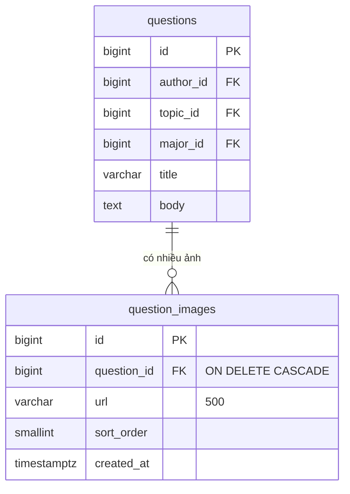

# ĐẶC TẢ YÊU CẦU & THIẾT KẾ CHI TIẾT: UC46 - CHỈNH SỬA CÂU HỎI TRÊN DIỄN ĐÀN Q&A (EDIT A QUESTION)

## PHẦN 1: ĐẶC TẢ NGHIỆP VỤ (REPORT 3)

### 2.2.3 Business Workflow (Luồng nghiệp vụ)



#### Mô tả chi tiết luồng xử lý bằng chữ (Business Step Description):
* **Bước 1 - Hiển thị nút Chỉnh sửa**: Trên trang chi tiết câu hỏi (`/app/forum/{id}`), Frontend so khớp `authorId` (do API trả về) với người đang đăng nhập; chỉ **chính tác giả** (STUDENT/ALUMNI) mới thấy nút "Chỉnh sửa".
* **Bước 2 - Mở form & Nhập liệu**: Bấm "Chỉnh sửa" mở lại modal đặt câu hỏi ở chế độ SỬA, điền sẵn tiêu đề, nội dung, thể loại, ngành và các ảnh hiện có. Người dùng sửa các trường, thêm/xóa ảnh (mỗi ảnh chọn lên được upload ngay qua presigned URL, tối đa 5 ảnh). Client kiểm tra bằng Zod: tiêu đề ≤ 250, nội dung ≤ 10000, ảnh ≤ 5.
* **Bước 3 - Gửi & Kiểm tra phía Server**: Client gọi `PUT /questions/{id}` kèm Bearer JWT. Server (`QuestionServiceImpl.updateQuestion`, @Transactional):
  * Nạp User theo email (JWT); không tồn tại → 404.
  * Nạp câu hỏi ACTIVE theo id; không tồn tại/không ACTIVE → 404.
  * **Kiểm tra quyền sở hữu**: `question.author.id` khác người đăng nhập → 403.
  * Nếu có `topicId`/`majorId` thì phải tồn tại; ngược lại → 400.
  * Cập nhật tiêu đề/nội dung/thể loại/ngành; **thay toàn bộ ảnh** (xóa ảnh cũ, lưu bộ ảnh mới theo thứ tự).
* **Bước 4 - Kết thúc**: Server trả HTTP 200 kèm chi tiết câu hỏi đã cập nhật. Frontend làm mới cache danh sách (`['questions']`) và chi tiết (`['question', id]`), đóng modal; trang chi tiết hiển thị dữ liệu mới. Guest gọi API PUT bị Spring Security chặn 401.

---

### 3.4 Module Diễn đàn Q&A: Chỉnh sửa câu hỏi
Module 4 (Q&A Forum) gồm: xem danh sách (UC38), xem chi tiết (UC39), đặt câu hỏi (UC40), trả lời (UC41) và **chỉnh sửa câu hỏi (UC46)**. UC46 mở rộng luồng đặt câu hỏi để hỗ trợ **đính kèm nhiều ảnh** (bảng `question_images`) và cho phép **chính tác giả** sửa lại câu hỏi của mình.

#### 3.4.1 Chỉnh sửa câu hỏi trên diễn đàn (Edit a question)

**Function trigger**:
*   **Navigation path**: `/app/forum/{id}` (chi tiết câu hỏi) → nút "Chỉnh sửa" (chỉ tác giả) → mở modal chỉnh sửa.
*   **Timing Frequency**: On demand (khi tác giả muốn sửa lại câu hỏi đã đăng).

**Function description**:
*   **Actors/Roles**: Sinh viên (STUDENT), Cựu sinh viên (ALUMNI) — nhưng **chỉ tác giả** của câu hỏi. Người khác (kể cả STUDENT/ALUMNI khác) không thấy nút Sửa và bị API từ chối 403; Guest bị chặn 401.
*   **Purpose**: Cho phép tác giả cập nhật tiêu đề, nội dung, thể loại, ngành và ảnh đính kèm của câu hỏi để nội dung chính xác/đầy đủ hơn.
*   **Interface**:
    *   **Nút "Chỉnh sửa"** (icon bút chì) nằm ở hàng thông tin tác giả trên card chi tiết — chỉ hiện với tác giả.
    *   **Modal chỉnh sửa** (dùng lại `AskQuestionModal` ở chế độ sửa): tiêu đề "Chỉnh sửa câu hỏi", điền sẵn dữ liệu; 2 dropdown Thể loại + Ngành; ô nội dung; **khu vực ảnh** (xem trước dạng lưới, nút "Thêm ảnh", xóa từng ảnh, badge N/5, spinner khi đang upload); nút "Lưu thay đổi".
    *   **Hiển thị ảnh** trên trang chi tiết: lưới ảnh có thể bấm mở ảnh gốc; trên card danh sách: thumbnail ảnh đầu (+N nếu nhiều).
    *   **Trạng thái**: nút "Lưu" khóa khi đang lưu hoặc đang upload ảnh; lỗi nghiệp vụ hiển thị banner đỏ; lỗi upload hiển thị inline.

**Data processing**:
1.  Với mỗi ảnh chọn lên: Client gọi `GET /files/presigned-url?...&folder=questions` rồi `PUT` file thẳng lên R2, nhận `publicUrl` thêm vào `imageUrls`.
2.  Client kiểm tra dữ liệu qua Zod (`createQuestionSchema`): tiêu đề ≤ 250 (bắt buộc), nội dung ≤ 10000 (bắt buộc), `imageUrls` ≤ 5.
3.  Client gọi `PUT /questions/{id}` (Bearer JWT) với `{ title, body, topicId, majorId, imageUrls }`.
4.  Server (`QuestionServiceImpl.updateQuestion`, @Transactional): nạp User (404), nạp câu hỏi ACTIVE (404), kiểm tra sở hữu (403), kiểm tra topic/major (400), cập nhật trường, **thay toàn bộ ảnh** (xóa + lưu lại).
5.  Server map sang `QuestionDetailResponse` (kèm `images`, `authorId`), trả HTTP 200.
6.  Client `invalidateQueries(['questions'])` + `['question', id]` → danh sách & chi tiết tự cập nhật; đóng modal.

**Screen layout**:
*   *Figure 1: Nút "Chỉnh sửa" trên card chi tiết (chỉ tác giả)*
*   *Figure 2: Modal chỉnh sửa điền sẵn dữ liệu + khu vực ảnh (thêm/xóa)*
*   *Figure 3: Trang chi tiết sau khi lưu — hiển thị nội dung & lưới ảnh mới*

**Function details**:
*   **Data**:
    *   `title` (String, bắt buộc, ≤ 250), `body` (String, bắt buộc, ≤ 10000), `topicId` (Long, tùy chọn), `majorId` (Long, tùy chọn), `imageUrls` (List&lt;String&gt;, tùy chọn, ≤ 5).
    *   *Trả về (QuestionDetailResponse)*: `id, title, body, topic, topicId, major, majorId, images, authorId, author, avatar, authorHeadline, verified, votes, answers, time, createdAt`.
*   **Validation**:
    *   Phía Client (Zod): tiêu đề/nội dung bắt buộc & giới hạn độ dài; `imageUrls` ≤ 5.
    *   Phía Server: `@NotBlank` + `@Size` cho `title`/`body`, `@Size(max=5)` cho `imageUrls` (JSR-380 trên `UpdateQuestionRequest`); kiểm tra tồn tại topic/major & quyền sở hữu ở tầng Service.
*   **Business rules**: BR-ED-01 (chỉ tác giả sửa), BR-ED-02 (câu hỏi phải ACTIVE), BR-ED-03 (tiêu đề ≤ 250, nội dung ≤ 10000, bắt buộc), BR-ED-04 (topic/major nếu có phải tồn tại), BR-ED-05 (tối đa 5 ảnh; thay toàn bộ khi sửa), BR-ED-06 (RBAC: chỉ STUDENT/ALUMNI đăng nhập), BR-ED-07 (ảnh upload qua presigned URL, chỉ lưu URL công khai).
*   **Error Handling**:
    *   Tiêu đề/nội dung trống → 400 (MSG-ED-01/03). Quá dài → 400 (MSG-ED-02/04). Quá 5 ảnh → 400 (MSG-ED-05).
    *   Câu hỏi không tồn tại/không ACTIVE → 404 (MSG-ED-06).
    *   Không phải tác giả → 403 (MSG-ED-07). Guest chưa đăng nhập → 401 (MSG-ED-08).
    *   topicId/majorId không tồn tại → 400 (MSG-ED-09/10).
*   **Normal case**: Tác giả sửa dữ liệu hợp lệ, bấm "Lưu thay đổi"; hệ thống cập nhật, trả 200 "Cập nhật câu hỏi thành công"; modal đóng, chi tiết hiển thị nội dung & ảnh mới.
*   **Abnormal case**: Dữ liệu trống/quá dài/quá 5 ảnh → 400; không phải tác giả → 403; câu hỏi ẩn/không tồn tại → 404; Guest → 401.

---

### 5. Requirement Appendix (Phụ lục Yêu cầu)

#### 5.1 Business Rules (Quy tắc Nghiệp vụ)

| ID | Định nghĩa Quy tắc (Rule Definition) |
| :--- | :--- |
| BR-ED-01 | Chỉ **chính tác giả** của câu hỏi mới được chỉnh sửa; người khác (kể cả STUDENT/ALUMNI khác) bị từ chối 403. |
| BR-ED-02 | Chỉ sửa được câu hỏi đang tồn tại và ở trạng thái ACTIVE; câu hỏi ẩn/xóa/không tồn tại trả 404. |
| BR-ED-03 | Tiêu đề bắt buộc ≤ 250 ký tự; nội dung bắt buộc ≤ 10000 ký tự. |
| BR-ED-04 | Nếu có `topicId` (thể loại) hoặc `majorId` (ngành) thì phải tồn tại trong hệ thống, ngược lại trả 400. |
| BR-ED-05 | Mỗi câu hỏi đính kèm tối đa 5 ảnh. Khi chỉnh sửa, bộ ảnh gửi lên **thay thế toàn bộ** ảnh cũ. |
| BR-ED-06 | Chức năng yêu cầu đăng nhập với vai trò STUDENT/ALUMNI; Guest bị chặn 401. |
| BR-ED-07 | Ảnh được upload trực tiếp lên storage (Cloudflare R2) qua presigned URL; hệ thống chỉ lưu URL công khai, không lưu file nhị phân. |

#### 5.2 Common Requirements (Yêu cầu Chung)
*   Mọi thông điệp lỗi hiển thị cho người dùng đều bằng **Tiếng Việt**, lấy nguyên văn từ Backend.
*   Nút "Chỉnh sửa" chỉ hiển thị cho tác giả (RBAC UI dựa trên `authorId`); Backend luôn kiểm tra lại quyền sở hữu (không tin Client).
*   Giao diện tuân thủ Warm Pastel Design System, responsive; dùng lại modal đặt câu hỏi cho chế độ sửa để nhất quán.
*   Toàn bộ giao tiếp client–server mã hóa qua HTTPS/TLS; token Bearer tự đính bởi interceptor; upload ảnh dùng presigned URL có thời hạn.

#### 5.3 Application Messages List (Danh sách Thông điệp Ứng dụng)

| # | Mã thông điệp | Loại thông điệp | Ngữ cảnh | Nội dung hiển thị | HTTP |
| :--- | :--- | :--- | :--- | :--- | :--- |
| 1 | MSG-ED-01 | Inline (dưới ô) | Tiêu đề để trống | Tiêu đề câu hỏi không được để trống | 400 |
| 2 | MSG-ED-02 | Inline (dưới ô) | Tiêu đề vượt độ dài | Tiêu đề câu hỏi không được vượt quá 250 ký tự | 400 |
| 3 | MSG-ED-03 | Inline (dưới ô) | Nội dung để trống | Nội dung câu hỏi không được để trống | 400 |
| 4 | MSG-ED-04 | Inline (dưới ô) | Nội dung vượt độ dài | Nội dung câu hỏi không được vượt quá 10000 ký tự | 400 |
| 5 | MSG-ED-05 | Inline (khu vực ảnh) | Đính kèm quá 5 ảnh | Chỉ được đính kèm tối đa 5 ảnh | 400 |
| 6 | MSG-ED-06 | Banner (Alert error) | Câu hỏi không tồn tại/không ACTIVE | Không tìm thấy câu hỏi với id: {id} | 404 |
| 7 | MSG-ED-07 | Banner (Alert error) | Không phải tác giả | Chỉ tác giả mới được chỉnh sửa câu hỏi này | 403 |
| 8 | MSG-ED-08 | Chặn bởi Spring Security | Guest chưa đăng nhập | Bạn chưa đăng nhập hoặc phiên làm việc đã hết hạn. | 401 |
| 9 | MSG-ED-09 | Banner (Alert error) | Thể loại không tồn tại | Thể loại không tồn tại | 400 |
| 10 | MSG-ED-10 | Banner (Alert error) | Ngành không tồn tại | Ngành không tồn tại | 400 |
| 11 | MSG-ED-11 | Inline (khu vực ảnh) | Upload ảnh thất bại | Tải ảnh lên thất bại. Vui lòng thử lại. | — |
| 12 | MSG-ED-12 | API response (200) | Cập nhật thành công (FE đóng modal + làm mới) | Cập nhật câu hỏi thành công | 200 |

---

## PHẦN 2: THIẾT KẾ CHI TIẾT (REPORT 4)

### 3. Detail Design (Thiết kế chi tiết)

#### 3.1 Chức năng Chỉnh sửa câu hỏi (Edit a question)

##### 3.1.1 Class Diagram (Sơ đồ Lớp)



###### Mô tả chi tiết cấu trúc các lớp (Class Design Description):
* **QuestionController**: Bổ sung `PUT /api/v1/questions/{id}` (`@Valid UpdateQuestionRequest`, lấy email từ `Authentication`) → gọi `updateQuestion`, trả HTTP 200 kèm `QuestionDetailResponse`. Endpoint không nằm trong PUBLIC_GET nên yêu cầu JWT.
* **UpdateQuestionRequest (DTO)**: `title` (@NotBlank, @Size 250), `body` (@NotBlank, @Size 10000), `topicId`, `majorId`, `imageUrls` (@Size max 5); message Tiếng Việt.
* **QuestionDetailResponse (DTO)**: Bổ sung `images` (danh sách URL) và `authorId` (để Frontend so khớp hiện nút Sửa).
* **QuestionService / QuestionServiceImpl**: `updateQuestion` (@Transactional): nạp User (404), nạp câu hỏi ACTIVE (404), kiểm tra sở hữu (403), kiểm tra topic/major (400), cập nhật trường, gọi `replaceImages` (xóa ảnh cũ + lưu ảnh mới theo thứ tự), map response. Helper `replaceImages` dùng chung cho tạo mới và chỉnh sửa.
* **QuestionImageRepository / QuestionImage (Entity)**: Ánh xạ bảng `question_images` (id, question_id FK CASCADE, url, sort_order). Batch-load ảnh cho danh sách/chi tiết, thay ảnh khi sửa.

##### 3.1.2 Sequence Diagram (Sơ đồ Tuần tự — luồng chỉnh sửa câu hỏi)

```mermaid
sequenceDiagram
    autonumber
    actor Client as Frontend / Client
    participant Ctrl as QuestionController (@Valid)
    participant Service as QuestionServiceImpl
    participant UserRepo as UserRepository
    participant QRepo as QuestionRepository
    participant IRepo as QuestionImageRepository
    participant Mapper as QuestionMapper
    participant DB as PostgreSQL

    Note over Client, Ctrl: Guest chưa đăng nhập bị Spring Security chặn 401 trước Controller
    Client->>Ctrl: HTTP PUT /questions/{id} (UpdateQuestionRequest, Bearer JWT)

    alt Trường hợp 1: Validate đầu vào thất bại (JSR-380)
        Note over Ctrl: title/body trống hoặc quá dài, hoặc imageUrls > 5
        Ctrl-->>Client: HTTP 400 Bad Request
    else Trường hợp 2: Dữ liệu hợp lệ
        Ctrl->>Service: updateQuestion(email, id, request)
        Service->>UserRepo: findByEmail(email)
        UserRepo-->>Service: User
        Service->>QRepo: findActiveDetailById(id)
        alt 2.1: Câu hỏi không tồn tại / không ACTIVE
            QRepo-->>Service: (rỗng)
            Service-->>Ctrl: ResourceNotFoundException → HTTP 404
        else 2.2: Không phải tác giả
            Note over Service: question.author.id != user.id
            Service-->>Ctrl: ForbiddenException("Chỉ tác giả mới được chỉnh sửa câu hỏi này") → HTTP 403
        else 2.3: topicId/majorId không tồn tại
            Service-->>Ctrl: BadRequestException → HTTP 400
        else 2.4: Hợp lệ (Thành công)
            Note over Service: set title/body/topic/major
            Service->>QRepo: save(question)
            QRepo->>DB: UPDATE questions SET ...
            Service->>IRepo: deleteByQuestion_Id(id) + saveAll(ảnh mới)
            IRepo->>DB: DELETE question_images ... ; INSERT ...
            Service->>Mapper: toDetailResponse(question, profile, images)
            Mapper-->>Service: QuestionDetailResponse
            Service-->>Ctrl: QuestionDetailResponse
            Ctrl-->>Client: HTTP 200 OK (ApiResponse "Cập nhật câu hỏi thành công")
            Note over Client: invalidate ['questions'] + ['question', id] → đóng modal, hiển thị dữ liệu mới
        end
    end
```

###### Mô tả chi tiết luồng xử lý bằng chữ (Sequence Flow Description):
1.  **Luồng thành công (Normal Case)**: Client gửi `PUT /questions/{id}` kèm Bearer JWT và DTO hợp lệ. Controller gọi `updateQuestion`. Service nạp User, nạp câu hỏi ACTIVE, xác nhận quyền sở hữu, kiểm tra topic/major, cập nhật trường, thay toàn bộ ảnh, map `QuestionDetailResponse`. Controller trả HTTP 200 "Cập nhật câu hỏi thành công". Frontend làm mới cache và đóng modal.
2.  **Luồng lỗi Validation (400)**: `title`/`body` trống hoặc quá dài, hoặc `imageUrls` > 5 → `MethodArgumentNotValidException` → 400; topic/major không tồn tại → `BadRequestException` → 400.
3.  **Luồng lỗi Quyền sở hữu (403)**: `question.author.id` khác người đăng nhập → `ForbiddenException` → 403. Guest bị Spring Security chặn 401 trước Controller.
4.  **Luồng lỗi Không tìm thấy (404)**: Không tìm thấy user, hoặc câu hỏi không tồn tại/không ACTIVE → `ResourceNotFoundException` → 404.

##### 3.1.3 Thiết kế Cơ sở dữ liệu (bảng mới `question_images` — Migration V24)


* Bảng `question_images` lưu ảnh đính kèm của câu hỏi (mô phỏng `post_media`). Xóa câu hỏi → ảnh tự xóa theo (CASCADE). Không cần đổi cấu trúc bảng `questions` cho UC46 (tận dụng `updated_at` sẵn có để đánh dấu thời điểm sửa).
