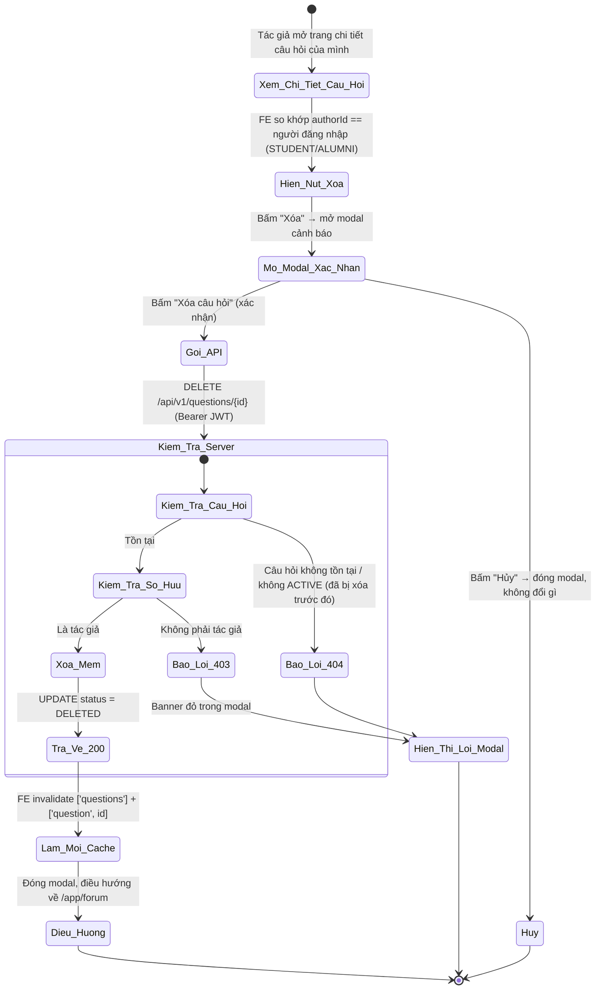
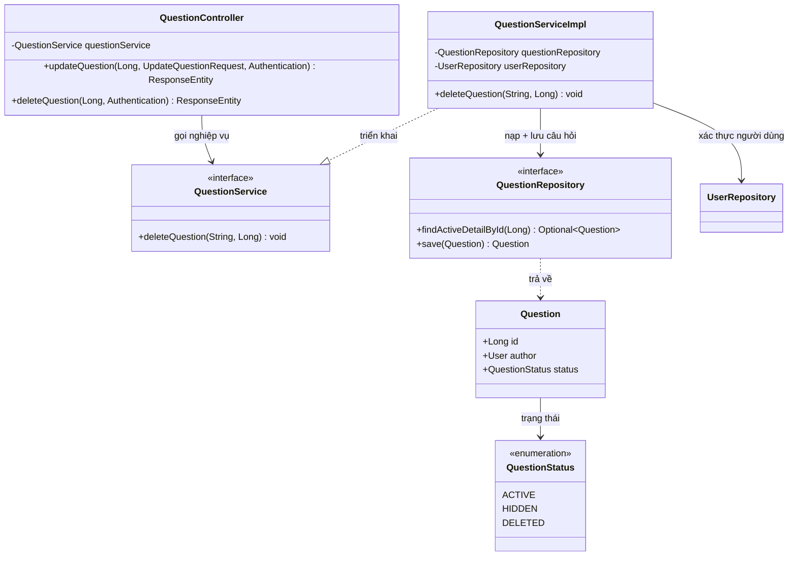
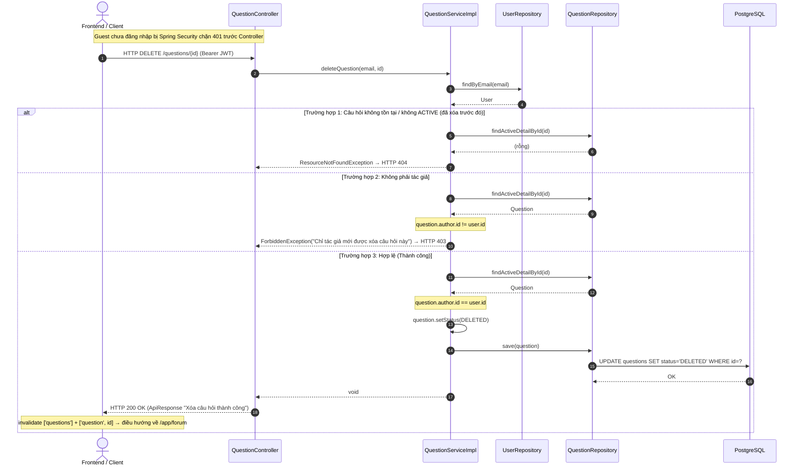

# ĐẶC TẢ YÊU CẦU & THIẾT KẾ CHI TIẾT: UC47 - XÓA CÂU HỎI TRÊN DIỄN ĐÀN Q&A (DELETE A QUESTION)

## PHẦN 1: ĐẶC TẢ NGHIỆP VỤ (REPORT 3)

### 2.2.3 Business Workflow (Luồng nghiệp vụ)

#### Mô tả chi tiết luồng xử lý bằng chữ (Business Step Description):
* **Bước 1 - Hiển thị nút Xóa**: Trên trang chi tiết câu hỏi (`/app/forum/{id}`), Frontend so khớp `authorId` (do API trả về) với người đang đăng nhập; chỉ **chính tác giả** (STUDENT/ALUMNI) mới thấy nút "Xóa" (cạnh nút "Chỉnh sửa" — UC46).
* **Bước 2 - Xác nhận**: Bấm "Xóa" mở modal cảnh báo "Hành động này không thể hoàn tác". Người dùng có thể "Hủy" (đóng modal, không đổi gì) hoặc bấm "Xóa câu hỏi" để xác nhận.
* **Bước 3 - Gửi & Kiểm tra phía Server**: Client gọi `DELETE /questions/{id}` kèm Bearer JWT. Server (`QuestionServiceImpl.deleteQuestion`, `@Transactional`):
  * Nạp User theo email (JWT); không tồn tại → 404.
  * Nạp câu hỏi ACTIVE theo id (`findActiveDetailById`); không tồn tại/đã DELETED/HIDDEN trước đó → 404.
  * **Kiểm tra quyền sở hữu**: `question.author.id` khác người đăng nhập → 403.
  * Chuyển `status` sang `DELETED` (xóa mềm) → lưu. **Không xóa cứng** dữ liệu, không đụng tới câu trả lời bên dưới.
* **Bước 4 - Kết thúc**: Server trả HTTP 200 (không có payload). Frontend làm mới cache danh sách (`['questions']`) và chi tiết (`['question', id]`), đóng modal, **điều hướng về `/app/forum`** (vì câu hỏi vừa xóa không còn xem được nữa). Guest gọi API DELETE bị Spring Security chặn 401 trước khi vào Controller.

---

### 3.5 Module Diễn đàn Q&A: Xóa câu hỏi
Module 4 (Q&A Forum) gồm: xem danh sách (UC38), xem chi tiết (UC39), đặt câu hỏi (UC40), trả lời (UC41), tìm kiếm (UC44), lọc theo thể loại (UC45), chỉnh sửa câu hỏi (UC46) và **xóa câu hỏi (UC47)**. UC47 cho phép chính tác giả gỡ bỏ câu hỏi không còn muốn hiển thị công khai, dùng cơ chế **xóa mềm** giống UC23 (Delete a post) để giữ lại dữ liệu phục vụ audit/khôi phục sau này nếu cần (không có tính năng khôi phục trong phạm vi UC47).

#### 3.5.1 Xóa câu hỏi trên diễn đàn (Delete a question)

**Function trigger**:
*   **Navigation path**: `/app/forum/{id}` (chi tiết câu hỏi) → nút "Xóa" (chỉ tác giả) → modal xác nhận → "Xóa câu hỏi".
*   **Timing Frequency**: On demand (khi tác giả muốn gỡ bỏ câu hỏi đã đăng).

**Function description**:
*   **Actors/Roles**: Sinh viên (STUDENT), Cựu sinh viên (ALUMNI) — nhưng **chỉ tác giả** của câu hỏi. Người khác (kể cả STUDENT/ALUMNI khác) không thấy nút Xóa và bị API từ chối 403; Guest bị chặn 401.
*   **Purpose**: Cho phép tác giả tự gỡ bỏ câu hỏi của mình khỏi diễn đàn công khai (VD đăng nhầm, không còn cần thiết, thông tin nhạy cảm).
*   **Interface**:
    *   **Nút "Xóa"** (icon thùng rác, màu đỏ khi hover) nằm cạnh nút "Chỉnh sửa" ở hàng đầu card chi tiết — chỉ hiện với tác giả.
    *   **Modal xác nhận**: tiêu đề "Xóa câu hỏi", icon cảnh báo màu đỏ, nội dung "Bạn có chắc chắn muốn xóa câu hỏi này không? Hành động này không thể hoàn tác.", 2 nút "Hủy" / "Xóa câu hỏi" (màu đỏ, có spinner khi đang xử lý).
    *   **Trạng thái lỗi**: banner đỏ trong modal nếu API trả lỗi (403/404/500), modal vẫn mở để người dùng đọc thông báo.

**Data processing**:
1.  Client gọi `DELETE /questions/{id}` (Bearer JWT), không có request body.
2.  Server (`QuestionServiceImpl.deleteQuestion`, `@Transactional`): nạp User (404), nạp câu hỏi ACTIVE (404), kiểm tra sở hữu (403), đổi `status = DELETED`, lưu.
3.  Server trả HTTP 200 `ApiResponse<Void>` (data = null).
4.  Client `invalidateQueries(['questions'])` + `['question', id]` → danh sách tự loại bỏ câu hỏi đã xóa; đóng modal; điều hướng về `/app/forum`.

**Screen layout**:
*   *Figure 1: Nút "Xóa" cạnh nút "Chỉnh sửa" trên card chi tiết (chỉ tác giả).*
*   *Figure 2: Modal xác nhận xóa câu hỏi.*

**Function details**:
*   **Data**:
    *   Tham số đầu vào: `id` (Long, path variable) — không có request body.
    *   Trả về: `ApiResponse<Void>` — không có payload dữ liệu, chỉ `message` thành công.
*   **Validation**:
    *   Không có validate dữ liệu đầu vào (không có body/query param) — chỉ kiểm tra tồn tại + quyền sở hữu ở tầng nghiệp vụ.
*   **Business rules**: Xem mục 5.1 (BR-DQ-01 → BR-DQ-05).
*   **Error Handling**:
    *   Câu hỏi không tồn tại/không ACTIVE (kể cả đã bị xóa trước đó) → 404 (MSG-DQ-01).
    *   Không phải tác giả → 403 (MSG-DQ-02).
    *   Guest chưa đăng nhập → 401, chặn bởi Spring Security trước Controller (MSG-DQ-03).
*   **Normal case**: Tác giả xác nhận xóa; hệ thống chuyển câu hỏi sang `DELETED`, trả 200 "Xóa câu hỏi thành công"; modal đóng, điều hướng về danh sách, câu hỏi không còn xuất hiện.
*   **Abnormal case**: Không phải tác giả → 403; câu hỏi đã bị xóa/không tồn tại (VD 2 tab cùng xóa) → 404; Guest → 401.

---

### 5. Requirement Appendix (Phụ lục Yêu cầu)

#### 5.1 Business Rules (Quy tắc Nghiệp vụ)

| ID | Định nghĩa Quy tắc (Rule Definition) |
| :--- | :--- |
| BR-DQ-01 | Chỉ **chính tác giả** của câu hỏi mới được xóa; người khác (kể cả STUDENT/ALUMNI khác) bị từ chối 403. |
| BR-DQ-02 | Chỉ xóa được câu hỏi đang tồn tại và ở trạng thái ACTIVE; câu hỏi đã HIDDEN/DELETED hoặc không tồn tại trả 404 (kể cả gọi xóa lần 2 với cùng id). |
| BR-DQ-03 | Xóa là **xóa mềm** (`status = DELETED`) — không xóa cứng bản ghi khỏi DB. Câu trả lời (answers) bên dưới KHÔNG bị xóa/đổi trạng thái, chỉ không còn truy cập được qua UI vì câu hỏi cha không còn ACTIVE. |
| BR-DQ-04 | Chức năng yêu cầu đăng nhập với vai trò STUDENT/ALUMNI; Guest bị chặn 401 (kế thừa cơ chế chung của module). |
| BR-DQ-05 | Sau khi xóa thành công, câu hỏi biến mất khỏi danh sách (UC38/UC44/UC45) và trang chi tiết trả 404 nếu truy cập trực tiếp bằng URL cũ. |

#### 5.2 Common Requirements (Yêu cầu Chung)
*   Mọi thông điệp lỗi hiển thị cho người dùng đều bằng **Tiếng Việt**, lấy nguyên văn từ Backend.
*   Nút "Xóa" chỉ hiển thị cho tác giả (RBAC UI dựa trên `authorId`); Backend luôn kiểm tra lại quyền sở hữu (không tin Client).
*   Hành động xóa là **destructive** → bắt buộc modal xác nhận, không xóa ngay khi bấm nút đầu tiên.
*   Toàn bộ giao tiếp client–server mã hóa qua HTTPS/TLS; token Bearer tự đính bởi interceptor.

#### 5.3 Application Messages List (Danh sách Thông điệp Ứng dụng)

| # | Mã thông điệp | Loại thông điệp | Ngữ cảnh | Nội dung hiển thị | HTTP |
| :--- | :--- | :--- | :--- | :--- | :--- |
| 1 | MSG-DQ-01 | Banner (Alert error, trong modal) | Câu hỏi không tồn tại/không ACTIVE | Không tìm thấy câu hỏi với id: {id} | 404 |
| 2 | MSG-DQ-02 | Banner (Alert error, trong modal) | Không phải tác giả | Chỉ tác giả mới được xóa câu hỏi này | 403 |
| 3 | MSG-DQ-03 | Chặn bởi Spring Security | Guest chưa đăng nhập | Bạn chưa đăng nhập hoặc phiên làm việc đã hết hạn. | 401 |
| 4 | MSG-DQ-04 | API response (200) | Xóa thành công (FE đóng modal + điều hướng) | Xóa câu hỏi thành công | 200 |

---

## PHẦN 2: THIẾT KẾ CHI TIẾT (REPORT 4)

### 3. Detail Design (Thiết kế chi tiết)

#### 3.1 Chức năng Xóa câu hỏi (Delete a question)

##### 3.1.1 Class Diagram (Sơ đồ Lớp)

###### Mô tả chi tiết cấu trúc các lớp (Class Design Description):
* **Lớp Controller (`QuestionController`)**: Bổ sung `DELETE /api/v1/questions/{id}` (lấy email từ `Authentication`) → gọi `deleteQuestion`, trả HTTP 200 kèm `ApiResponse<Void>`. Endpoint không nằm trong `Endpoints.PUBLIC_GET` (chỉ GET được liệt kê công khai) nên tự động yêu cầu JWT — không cần sửa `Endpoints.java`/`SecurityConfig`.
* **Lớp Service (`QuestionService`, `QuestionServiceImpl`)**: `deleteQuestion` (`@Transactional`): nạp User (404), nạp câu hỏi ACTIVE (404), kiểm tra sở hữu (403), set `status = DELETED`, `save`. Không trả về giá trị (void) — khớp response `ApiResponse<Void>`.
* **Lớp Repository & Entity**: Tái sử dụng nguyên `QuestionRepository.findActiveDetailById` (đã có từ UC39/UC46) và `Question`/`QuestionStatus` (đã có từ UC38, giá trị `DELETED` đã định nghĩa sẵn) — **không tạo migration, không đổi cấu trúc bảng `questions`**.

##### 3.1.2 Sequence Diagram (Sơ đồ Tuần tự)

###### Mô tả chi tiết luồng xử lý bằng chữ (Sequence Flow Description):
1.  **Luồng thành công (Normal Case)**: Client gửi `DELETE /questions/{id}` kèm Bearer JWT. Controller gọi `deleteQuestion`. Service nạp User, nạp câu hỏi ACTIVE, xác nhận quyền sở hữu, đổi `status = DELETED`, lưu. Controller trả HTTP 200 "Xóa câu hỏi thành công". Frontend làm mới cache và điều hướng về danh sách.
2.  **Luồng lỗi Không tìm thấy (404)**: Câu hỏi không tồn tại, hoặc đã ở trạng thái HIDDEN/DELETED (kể cả gọi xóa 2 lần liên tiếp cùng id) → `ResourceNotFoundException` → 404.
3.  **Luồng lỗi Quyền sở hữu (403)**: `question.author.id` khác người đăng nhập → `ForbiddenException` → 403. Guest bị Spring Security chặn 401 trước Controller, không tới được Service.
