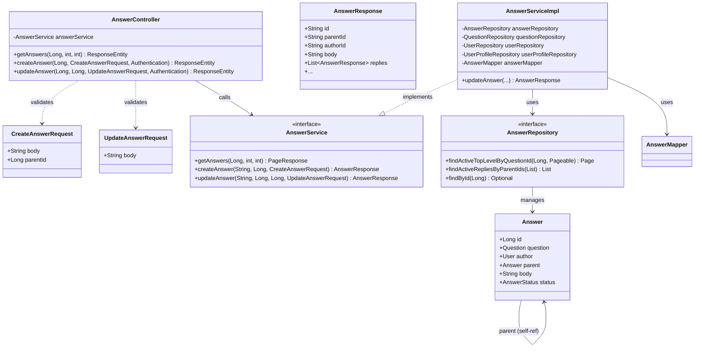
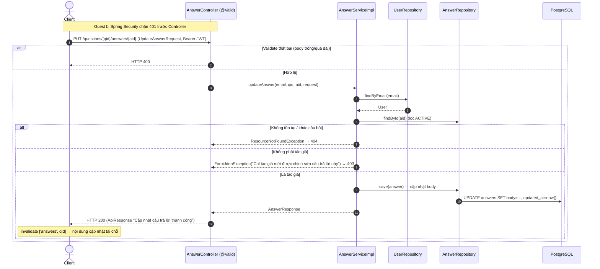
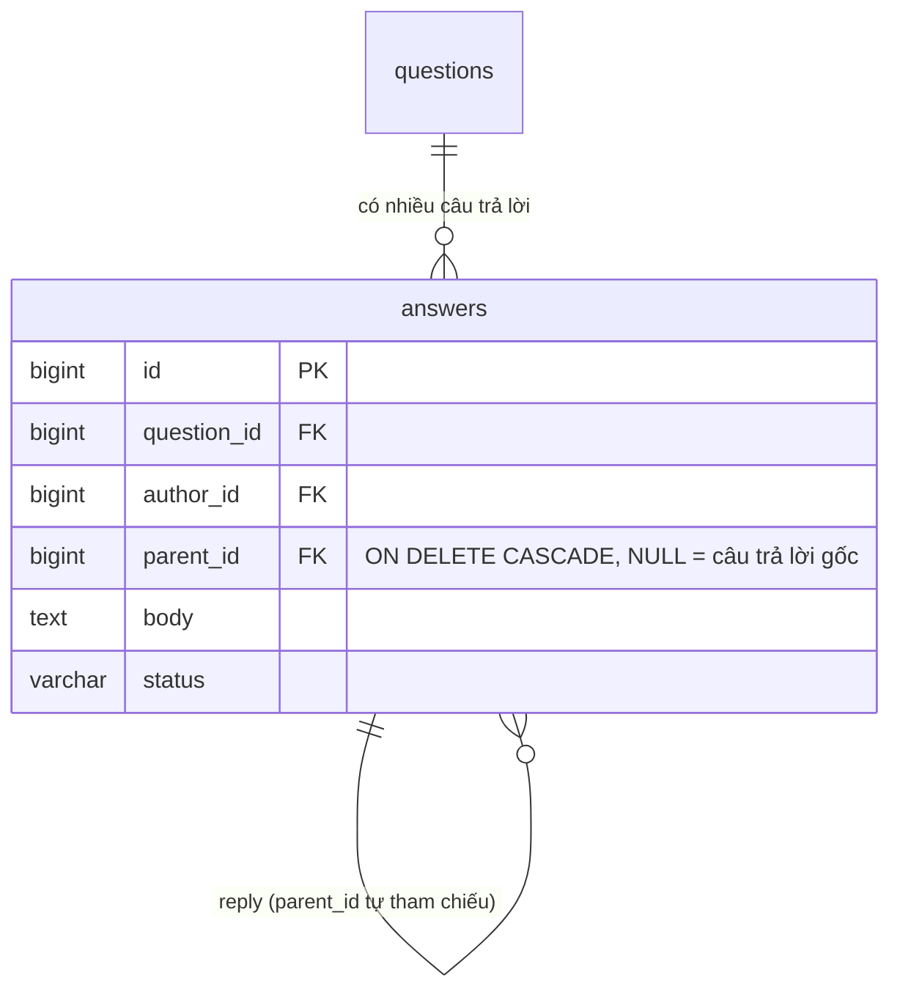

# ĐẶC TẢ YÊU CẦU & THIẾT KẾ CHI TIẾT: UC48 - CHỈNH SỬA CÂU TRẢ LỜI + TRẢ LỜI LỒNG NHAU (EDIT AN ANSWER / REPLY)

## PHẦN 1: ĐẶC TẢ NGHIỆP VỤ (REPORT 3)

### 2.2.3 Business Workflow (Luồng nghiệp vụ)

```mermaid
stateDiagram-v2
    [*] --> Xem_Cau_Tra_Loi : Người dùng mở chi tiết câu hỏi → khu vực câu trả lời
    Xem_Cau_Tra_Loi --> Hien_Nut : FE hiện nút theo quyền (Trả lời cho STUDENT/ALUMNI, Chỉnh sửa cho tác giả)

    state Hanh_Dong {
        [*] --> Chon
        Chon --> Reply : Bấm "Trả lời" một câu trả lời gốc
        Chon --> Edit : Bấm "Chỉnh sửa" (chỉ tác giả)
    }
    Hien_Nut --> Hanh_Dong

    Reply --> Validate_Client_R : Nhập nội dung reply (Zod)
    Edit --> Validate_Client_E : Sửa nội dung (Zod, điền sẵn)

    Validate_Client_R --> Goi_POST : POST /questions/{qid}/answers { body, parentId }
    Validate_Client_E --> Goi_PUT : PUT /questions/{qid}/answers/{aid} { body }

    state Server {
        [*] --> KT
        KT --> Loi_403 : (Edit) không phải tác giả
        KT --> Loi_404 : Câu trả lời/câu hỏi không tồn tại/không ACTIVE
        KT --> Loi_400 : (Reply) parentId không hợp lệ, hoặc nội dung trống/quá dài
        KT --> Luu : Hợp lệ
    }
    Goi_POST --> Server
    Goi_PUT --> Server
    Loi_400 --> Hanh_Dong
    Loi_403 --> Hanh_Dong
    Loi_404 --> Hanh_Dong

    Luu --> Tra_Ve : Reply→201 (không tăng answer_count); Edit→200
    Tra_Ve --> Lam_Moi : FE invalidate ['answers', qid]
    Lam_Moi --> [*] : Reply hiển thị lồng dưới câu trả lời gốc / nội dung sửa cập nhật tại chỗ
```

#### Mô tả chi tiết luồng xử lý bằng chữ (Business Step Description):
* **Bước 1 - Hiển thị hành động**: Trong khu vực câu trả lời, mỗi câu trả lời hiện nút **"Trả lời"** (với STUDENT/ALUMNI đã đăng nhập; chỉ ở câu trả lời gốc) và nút **"Chỉnh sửa"** (chỉ hiện với chính tác giả — FE so khớp `authorId`).
* **Bước 2 - Chỉnh sửa (UC48)**: Bấm "Chỉnh sửa" mở ô nhập tại chỗ điền sẵn nội dung cũ. Client validate Zod (bắt buộc ≤ 10000). Gọi `PUT /questions/{qid}/answers/{aid}`. Server (`AnswerServiceImpl.updateAnswer`, @Transactional): nạp User (404), nạp câu trả lời ACTIVE (404), xác nhận thuộc đúng câu hỏi (404), **kiểm tra sở hữu** (403 nếu không phải tác giả), cập nhật nội dung, trả 200.
* **Bước 3 - Trả lời lồng (reply)**: Bấm "Trả lời" một câu trả lời gốc mở ô nhập reply. Gọi `POST /questions/{qid}/answers` với `{ body, parentId }`. Server (`createAnswer`): RBAC STUDENT/ALUMNI (403), câu hỏi ACTIVE (404); nếu có `parentId` thì câu trả lời cha phải tồn tại/ACTIVE, cùng câu hỏi, và là **câu trả lời gốc** (chỉ 2 cấp) — sai → 400. Lưu reply. **Reply KHÔNG làm tăng `answer_count`** (chỉ câu trả lời gốc tăng).
* **Bước 4 - Kết thúc**: FE làm mới cache `['answers', qid]`; reply hiển thị **lồng bên dưới** câu trả lời gốc, nội dung sửa cập nhật tại chỗ. Guest gọi API POST/PUT bị Spring Security chặn 401.

---

### 3.4 Module Diễn đàn Q&A: Chỉnh sửa câu trả lời & Reply

Module 4 (Q&A Forum): UC38 xem danh sách, UC39 chi tiết, UC40 đặt câu hỏi, UC41 trả lời, UC46 sửa câu hỏi và **UC48 sửa câu trả lời + trả lời lồng nhau (reply)**. Câu trả lời theo mô hình **2 cấp**: câu trả lời gốc (parentId = null) và các reply (parentId trỏ tới câu trả lời gốc).

#### 3.4.1 Chỉnh sửa câu trả lời & Trả lời lồng nhau (Edit an answer / Reply)

**Function trigger**:
*   **Navigation path**: `/app/forum/{id}` → khu vực "Câu trả lời" → nút "Chỉnh sửa" (tác giả) / "Trả lời" (STUDENT/ALUMNI).
*   **Timing Frequency**: On demand.

**Function description**:
*   **Actors/Roles**: Sinh viên (STUDENT), Cựu sinh viên (ALUMNI). **Sửa**: chỉ tác giả của câu trả lời. **Reply**: mọi STUDENT/ALUMNI đã đăng nhập. Guest/Admin không có nút; Guest bị chặn 401, Admin bị 403 khi reply.
*   **Purpose**: Cho tác giả sửa lại câu trả lời của mình (UC48) và cho thành viên trao đổi qua lại bằng cách reply trực tiếp một câu trả lời.
*   **Interface**:
    *   Mỗi bong bóng câu trả lời có hàng hành động: **Trả lời** (icon mũi tên) — chỉ ở câu trả lời gốc; **Chỉnh sửa** (icon bút chì) — chỉ tác giả.
    *   **Sửa tại chỗ**: bong bóng chuyển thành ô nhập điền sẵn + nút Hủy/Lưu.
    *   **Reply tại chỗ**: ô nhập gọn hiện ngay dưới câu trả lời gốc; reply hiển thị **thụt lề, avatar nhỏ hơn**, có đường kẻ dọc gom nhóm.
    *   **Trạng thái**: nút khóa khi đang gửi/lưu hoặc nội dung trống; lỗi nghiệp vụ hiện banner đỏ.

**Data processing**:
1.  **Sửa**: `PUT /questions/{qid}/answers/{aid}` với `{ body }` (Bearer JWT). Server kiểm tra sở hữu → cập nhật → 200.
2.  **Reply**: `POST /questions/{qid}/answers` với `{ body, parentId }`. Server kiểm tra parent hợp lệ (gốc, cùng câu hỏi, ACTIVE) → lưu reply (không tăng answer_count) → 201.
3.  **Đọc**: `GET /questions/{qid}/answers` trả **câu trả lời gốc phân trang**, mỗi câu kèm danh sách `replies` (batch-load, tránh N+1).
4.  FE `invalidateQueries(['answers', qid])` → danh sách & reply tự cập nhật.

**Function details**:
*   **Data**:
    *   Sửa: `body` (String, bắt buộc, ≤ 10000).
    *   Reply: `body` (bắt buộc, ≤ 10000) + `parentId` (Long, id câu trả lời gốc).
    *   *Trả về (AnswerResponse)*: `id, parentId, authorId, body, author, avatar, authorHeadline, verified, votes, time, createdAt, replies[]`.
*   **Validation**:
    *   Client (Zod): `body` bắt buộc ≤ 10000.
    *   Server: `@NotBlank` + `@Size(max=10000)` cho `body` (UpdateAnswerRequest / CreateAnswerRequest); kiểm tra sở hữu & tính hợp lệ của `parentId` ở tầng Service.
*   **Business rules**: BR-EA-01 (chỉ tác giả sửa), BR-EA-02 (câu trả lời phải ACTIVE & thuộc đúng câu hỏi), BR-EA-03 (nội dung ≤ 10000, bắt buộc), BR-EA-04 (RBAC reply: STUDENT/ALUMNI), BR-EA-05 (reply chỉ tối đa 2 cấp — không reply cho reply), BR-EA-06 (parent phải cùng câu hỏi & ACTIVE), BR-EA-07 (reply không làm tăng answer_count).
*   **Error Handling**:
    *   Nội dung trống/quá dài → 400 (MSG-EA-01/02).
    *   Không phải tác giả (sửa) → 403 (MSG-EA-03).
    *   Câu trả lời không tồn tại/không ACTIVE → 404 (MSG-EA-04).
    *   parentId không hợp lệ (không tồn tại / khác câu hỏi / đã là reply) → 400 (MSG-EA-05/06/07).
    *   Guest → 401 (MSG-EA-08); Admin reply → 403 (MSG-EA-09).
*   **Normal case**: Tác giả sửa nội dung hợp lệ → 200 "Cập nhật câu trả lời thành công". Thành viên reply hợp lệ → 201 "Trả lời câu hỏi thành công", reply hiện lồng dưới câu trả lời gốc.
*   **Abnormal case**: Trống/quá dài → 400; sửa của người khác → 403; câu trả lời ẩn/không tồn tại → 404; reply parent sai → 400; Guest → 401.

---

### 5. Requirement Appendix (Phụ lục Yêu cầu)

#### 5.1 Business Rules (Quy tắc Nghiệp vụ)

| ID | Định nghĩa Quy tắc (Rule Definition) |
| :--- | :--- |
| BR-EA-01 | Chỉ **chính tác giả** của câu trả lời mới được chỉnh sửa; người khác bị từ chối 403. |
| BR-EA-02 | Chỉ sửa/thao tác được câu trả lời đang ACTIVE và thuộc đúng câu hỏi trên đường dẫn; ngược lại 404. |
| BR-EA-03 | Nội dung câu trả lời bắt buộc và không vượt quá 10000 ký tự. |
| BR-EA-04 | Reply yêu cầu đăng nhập vai trò STUDENT/ALUMNI; Guest 401, Admin 403. |
| BR-EA-05 | Mô hình câu trả lời chỉ 2 cấp: không được reply cho một reply (parent phải là câu trả lời gốc). |
| BR-EA-06 | Câu trả lời cha (parentId) phải tồn tại, ACTIVE và cùng thuộc câu hỏi đang thao tác. |
| BR-EA-07 | Reply KHÔNG làm tăng `answer_count` của câu hỏi; chỉ câu trả lời gốc mới tính vào bộ đếm. |

#### 5.2 Common Requirements (Yêu cầu Chung)
*   Thông điệp lỗi hiển thị bằng **Tiếng Việt**, lấy nguyên văn từ Backend.
*   Nút "Chỉnh sửa" chỉ hiện với tác giả (RBAC UI dựa trên `authorId`); Backend luôn kiểm tra lại quyền sở hữu.
*   Giao diện Warm Pastel, responsive; reply hiển thị lồng (thụt lề) dưới câu trả lời gốc.
*   Giao tiếp client–server qua HTTPS/TLS; token Bearer tự đính bởi interceptor.

#### 5.3 Application Messages List (Danh sách Thông điệp Ứng dụng)

| # | Mã thông điệp | Loại | Ngữ cảnh | Nội dung hiển thị | HTTP |
| :--- | :--- | :--- | :--- | :--- | :--- |
| 1 | MSG-EA-01 | Inline | Nội dung để trống | Nội dung câu trả lời không được để trống | 400 |
| 2 | MSG-EA-02 | Inline | Nội dung quá dài | Nội dung câu trả lời không được vượt quá 10000 ký tự | 400 |
| 3 | MSG-EA-03 | Banner | Sửa câu trả lời của người khác | Chỉ tác giả mới được chỉnh sửa câu trả lời này | 403 |
| 4 | MSG-EA-04 | Banner | Câu trả lời không tồn tại/không ACTIVE | Không tìm thấy câu trả lời với id: {id} | 404 |
| 5 | MSG-EA-05 | Banner | parentId không tồn tại | Câu trả lời cha không tồn tại | 400 |
| 6 | MSG-EA-06 | Banner | parent khác câu hỏi | Câu trả lời cha không thuộc câu hỏi này | 400 |
| 7 | MSG-EA-07 | Banner | reply cho reply | Chỉ được trả lời trực tiếp một câu trả lời gốc | 400 |
| 8 | MSG-EA-08 | Chặn bởi Spring Security | Guest chưa đăng nhập | Bạn chưa đăng nhập hoặc phiên làm việc đã hết hạn. | 401 |
| 9 | MSG-EA-09 | Banner | Admin/vai trò khác reply | Chỉ sinh viên và cựu sinh viên mới được trả lời câu hỏi | 403 |
| 10 | MSG-EA-10 | API response (200) | Sửa thành công (cập nhật tại chỗ) | Cập nhật câu trả lời thành công | 200 |
| 11 | MSG-EA-11 | API response (201) | Reply thành công (hiện lồng) | Trả lời câu hỏi thành công | 201 |

---

## PHẦN 2: THIẾT KẾ CHI TIẾT (REPORT 4)

### 3. Detail Design (Thiết kế chi tiết)

#### 3.1 Chỉnh sửa câu trả lời & Reply (Edit an answer / Reply)

##### 3.1.1 Class Diagram (Sơ đồ Lớp)

###### Mô tả chi tiết cấu trúc các lớp (Class Design Description):
* **AnswerController**: bổ sung `PUT /questions/{qid}/answers/{aid}` (`@Valid UpdateAnswerRequest`, email từ `Authentication`) → `updateAnswer`, trả 200. POST `createAnswer` giờ nhận thêm `parentId`.
* **CreateAnswerRequest**: thêm `parentId` (tùy chọn — reply). **UpdateAnswerRequest**: chỉ `body`.
* **AnswerResponse**: thêm `parentId` và `replies` (danh sách reply của câu trả lời gốc).
* **AnswerServiceImpl.updateAnswer** (@Transactional): nạp User (404), câu trả lời ACTIVE (404), thuộc đúng câu hỏi (404), sở hữu (403), cập nhật nội dung. **createAnswer**: validate `parentId` (gốc/ACTIVE/cùng câu hỏi, 2 cấp), chỉ tăng answer_count khi là câu trả lời gốc. **getAnswers**: lấy câu trả lời gốc phân trang + batch-load reply, lồng vào từng câu.
* **AnswerRepository**: `findActiveTopLevelByQuestionId` (parent IS NULL), `findActiveRepliesByParentIds` (batch reply), `findById` (cho sửa).
* **Answer (Entity)**: thêm `@ManyToOne parent` (tự tham chiếu `parent_id`).

##### 3.1.2 Sequence Diagram (luồng chỉnh sửa câu trả lời)

##### 3.1.3 Thiết kế DB (Migration V25 — thêm `answers.parent_id`)

* V25 thêm cột `parent_id` tự tham chiếu vào `answers` (NULL = gốc, có giá trị = reply). Xóa câu trả lời gốc → các reply con bị xóa theo (CASCADE). Mô hình 2 cấp.

###### Mô tả luồng xử lý bằng chữ (Sequence Flow Description):
1.  **Sửa (Normal)**: Client `PUT .../answers/{aid}` hợp lệ → Service kiểm tra sở hữu → cập nhật → 200; FE cập nhật tại chỗ.
2.  **Reply (Normal)**: Client `POST .../answers` với `parentId` hợp lệ → Service validate parent → lưu reply (không tăng answer_count) → 201; FE hiển thị lồng.
3.  **Lỗi 400**: body trống/quá dài, hoặc parentId sai (không tồn tại/khác câu hỏi/đã là reply).
4.  **Lỗi 403/404**: sửa câu trả lời của người khác → 403; câu trả lời không tồn tại/không ACTIVE/khác câu hỏi → 404. Guest → 401.
