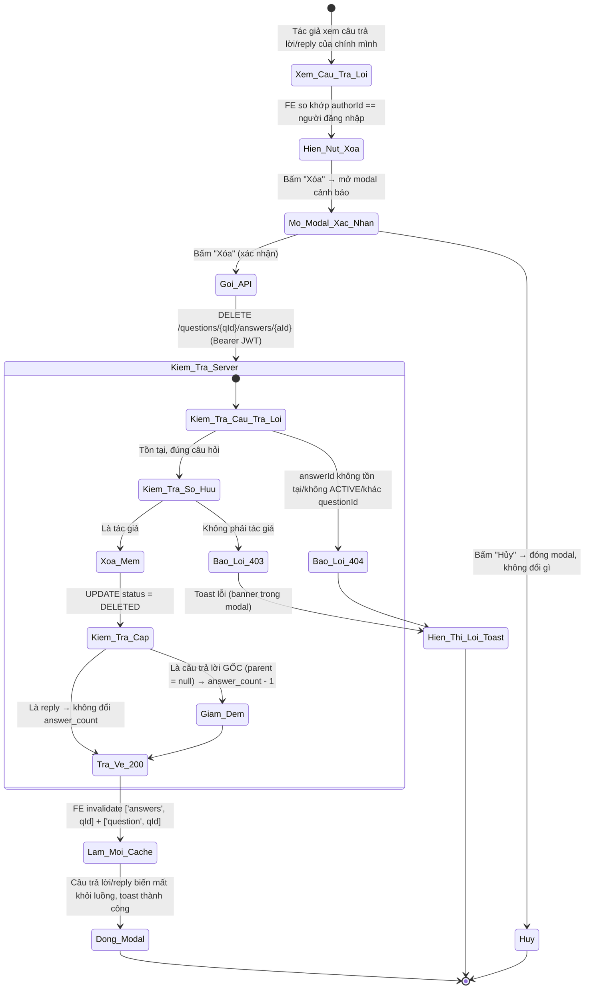
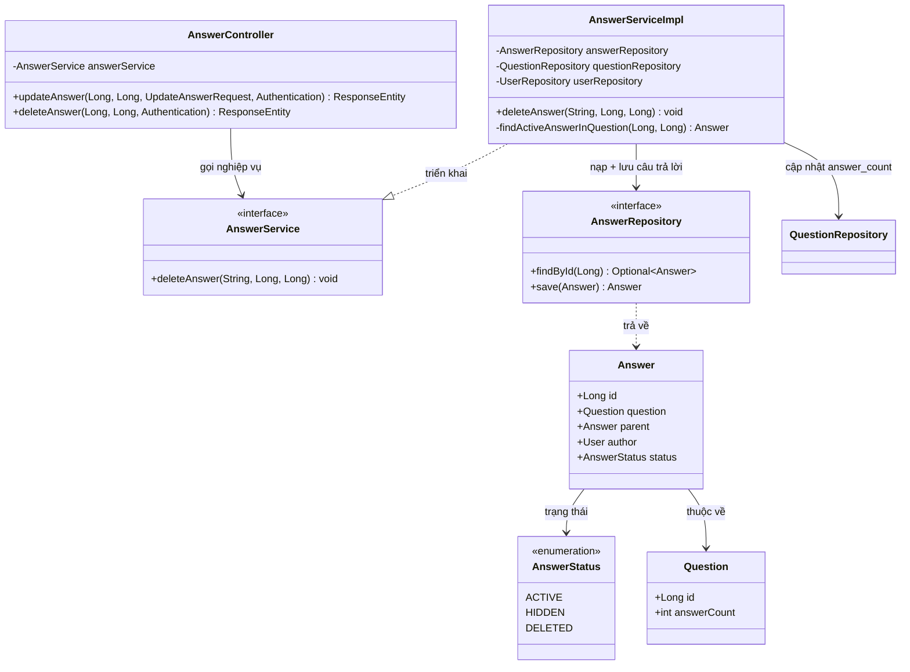

# ĐẶC TẢ YÊU CẦU & THIẾT KẾ CHI TIẾT: UC49 - XÓA CÂU TRẢ LỜI TRÊN DIỄN ĐÀN Q&A (DELETE AN ANSWER)

## PHẦN 1: ĐẶC TẢ NGHIỆP VỤ (REPORT 3)

### 2.2.3 Business Workflow (Luồng nghiệp vụ)



#### Mô tả chi tiết luồng xử lý bằng chữ (Business Step Description):
* **Bước 1 - Hiển thị nút Xóa**: Trong khu vực câu trả lời (`AnswersSection`) dưới trang chi tiết câu hỏi, mỗi bong bóng câu trả lời/reply so khớp `authorId` với người đang đăng nhập; chỉ **chính tác giả** mới thấy nút "Xóa" (cạnh "Chỉnh sửa" — UC48, và "Trả lời"). Áp dụng đồng nhất cho cả câu trả lời GỐC và REPLY.
* **Bước 2 - Xác nhận**: Bấm "Xóa" mở modal cảnh báo "Bạn có chắc muốn xóa câu trả lời này không?". Người dùng "Hủy" (đóng modal, không đổi gì) hoặc "Xóa" để xác nhận.
* **Bước 3 - Gửi & Kiểm tra phía Server**: Client gọi `DELETE /questions/{questionId}/answers/{answerId}` kèm Bearer JWT. Server (`AnswerServiceImpl.deleteAnswer`, `@Transactional`):
  * Nạp User theo email (JWT); không tồn tại → 404.
  * Tìm câu trả lời ACTIVE theo `answerId`, xác nhận thuộc đúng `questionId` (tái dùng helper `findActiveAnswerInQuestion` đã có từ UC43) — không tồn tại/không ACTIVE/khác câu hỏi → 404.
  * **Kiểm tra quyền sở hữu**: `answer.author.id` khác người đăng nhập → 403.
  * Chuyển `status` sang `DELETED` (xóa mềm) → lưu.
  * **Nếu là câu trả lời GỐC** (`parent == null`): giảm `question.answer_count` đi 1 (không âm) — đối xứng với lúc tạo (UC41 chỉ tăng bộ đếm cho câu trả lời gốc). **Nếu là REPLY**: không đổi bộ đếm.
* **Bước 4 - Kết thúc**: Server trả HTTP 200 (không payload). Frontend hiển thị toast thành công, làm mới cache danh sách câu trả lời (`['answers', questionId]`) và chi tiết câu hỏi (`['question', questionId]`) để cập nhật số câu trả lời hiển thị. Guest gọi API DELETE bị Spring Security chặn 401 trước Controller.

---

### 3.8 Module Diễn đàn Q&A: Xóa câu trả lời
Module 4 (Q&A Forum). UC49 hoàn thiện vòng đời CRUD của câu trả lời (UC41 tạo, UC48 sửa, UC49 xóa) — mirror gần như 1:1 UC47 (Delete a question), chỉ khác đối tượng là `Answer` và có thêm quy tắc đối xứng bộ đếm `answer_count` theo cấp (gốc/reply).

#### 3.8.1 Xóa câu trả lời (Delete an answer)

**Function trigger**:
*   **Navigation path**: `/app/forum/{id}` (chi tiết câu hỏi) → khu vực "Câu trả lời" → nút "Xóa" (chỉ tác giả) trên câu trả lời/reply của chính mình → modal xác nhận → "Xóa".
*   **Timing Frequency**: On demand (khi tác giả muốn gỡ bỏ câu trả lời/reply đã đăng).

**Function description**:
*   **Actors/Roles**: Sinh viên (STUDENT), Cựu sinh viên (ALUMNI) — nhưng **chỉ tác giả** của câu trả lời/reply đó. Người khác (kể cả Student/Alumni khác) không thấy nút Xóa và bị API từ chối 403; Guest bị chặn 401.
*   **Purpose**: Cho phép tác giả tự gỡ bỏ câu trả lời hoặc reply của mình (VD trả lời nhầm, không còn chính xác, muốn rút lại).
*   **Interface**:
    *   **Nút "Xóa"** (text link, đổi màu đỏ khi hover) nằm trong hàng hành động của mỗi câu trả lời/reply, cạnh "Trả lời"/"Chỉnh sửa" — chỉ hiện với chính tác giả bong bóng đó.
    *   **Modal xác nhận**: tiêu đề "Xóa câu trả lời", icon cảnh báo đỏ, nội dung "Bạn có chắc muốn xóa câu trả lời này không?", 2 nút "Hủy"/"Xóa" (đỏ, có spinner khi xử lý).
    *   **Thông báo**: toast thành công "Đã xóa câu trả lời thành công" hoặc toast lỗi nếu API thất bại.

**Data processing**:
1.  Client gọi `DELETE /questions/{questionId}/answers/{answerId}` (Bearer JWT), không có request body.
2.  Server (`AnswerServiceImpl.deleteAnswer`, `@Transactional`): nạp User (404), tìm câu trả lời ACTIVE đúng câu hỏi (404, tái dùng `findActiveAnswerInQuestion`), kiểm tra sở hữu (403), đổi `status = DELETED`, lưu; nếu là câu trả lời gốc thì giảm `question.answer_count`.
3.  Server trả HTTP 200 `ApiResponse<Void>`.
4.  Client hiện toast, `invalidateQueries(['answers', questionId])` + `['question', questionId])` → câu trả lời/reply biến mất khỏi luồng, số "Câu trả lời" trên đầu khu vực tự cập nhật đúng nếu xóa câu trả lời gốc.

**Screen layout**:
*   *Figure 1: Nút "Xóa" trong hàng hành động của câu trả lời/reply (chỉ tác giả).*
*   *Figure 2: Modal xác nhận xóa câu trả lời.*

**Function details**:
*   **Data**:
    *   Tham số đầu vào: `questionId`, `answerId` (Long, path variable) — không có request body.
    *   Trả về: `ApiResponse<Void>` — không có payload dữ liệu.
*   **Validation**: Không có validate dữ liệu đầu vào — chỉ kiểm tra tồn tại/đúng câu hỏi + quyền sở hữu ở tầng nghiệp vụ.
*   **Business rules**: Xem mục 5.1 (BR-DA-01 → BR-DA-06).
*   **Error Handling**:
    *   Câu trả lời không tồn tại/không ACTIVE/khác câu hỏi (kể cả xóa 2 lần) → 404 (MSG-DA-01).
    *   Không phải tác giả → 403 (MSG-DA-02).
    *   Guest chưa đăng nhập → 401, chặn bởi Spring Security trước Controller (MSG-DA-03).
*   **Normal case**: Tác giả xác nhận xóa câu trả lời/reply của mình; hệ thống chuyển sang `DELETED`, đối xứng giảm `answer_count` nếu là câu trả lời gốc, trả 200; toast thành công, câu trả lời biến mất khỏi luồng.
*   **Abnormal case**: Không phải tác giả → 403; câu trả lời đã xóa/không tồn tại/khác câu hỏi → 404; Guest → 401.

---

### 5. Requirement Appendix (Phụ lục Yêu cầu)

#### 5.1 Business Rules (Quy tắc Nghiệp vụ)

| ID | Định nghĩa Quy tắc (Rule Definition) |
| :--- | :--- |
| BR-DA-01 | Chỉ **chính tác giả** của câu trả lời/reply mới được xóa; người khác (kể cả STUDENT/ALUMNI khác) bị từ chối 403. |
| BR-DA-02 | Chỉ xóa được câu trả lời đang tồn tại, ở trạng thái ACTIVE, và thuộc đúng `questionId` trên đường dẫn; sai một trong ba điều kiện đều trả 404 như nhau (không phân biệt lý do, tránh lộ thông tin). |
| BR-DA-03 | Xóa là **xóa mềm** (`status = DELETED`) — không xóa cứng bản ghi. Reply của một câu trả lời GỐC đã xóa vẫn còn trong DB nhưng không còn hiển thị (vì thuật toán lấy câu trả lời gốc trước rồi mới nạp reply theo `parent_id` — gốc đã DELETED thì không nằm trong danh sách gốc, kéo theo reply của nó cũng không được nạp). |
| BR-DA-04 | Xóa câu trả lời **GỐC** (`parent = null`) làm giảm `questions.answer_count` đi 1 (không âm) — đối xứng với UC41 (chỉ tăng bộ đếm khi tạo câu trả lời gốc). Xóa **REPLY** không đổi `answer_count` (đối xứng với việc tạo reply cũng không tăng bộ đếm). |
| BR-DA-05 | Áp dụng đồng nhất cho **cả câu trả lời gốc lẫn reply** — cùng một endpoint, cùng logic kiểm tra sở hữu. |
| BR-DA-06 | Chức năng yêu cầu đăng nhập với vai trò STUDENT/ALUMNI; Guest bị chặn 401 (endpoint không nằm `PUBLIC_GET`). |

#### 5.2 Common Requirements (Yêu cầu Chung)
*   Mọi thông điệp lỗi/thành công hiển thị cho người dùng đều bằng **Tiếng Việt**, qua hệ thống toast dùng chung (`@/components/ui/Toast`).
*   Nút "Xóa" chỉ hiển thị cho tác giả (RBAC UI dựa trên `authorId`); Backend luôn kiểm tra lại quyền sở hữu (không tin Client).
*   Hành động xóa là **destructive** → bắt buộc modal xác nhận, không xóa ngay khi bấm nút đầu tiên.
*   Không tạo migration mới — `AnswerStatus.DELETED` và cột `answers.status` đã có sẵn từ V1 (UC41).

#### 5.3 Application Messages List (Danh sách Thông điệp Ứng dụng)

| # | Mã thông điệp | Loại thông điệp | Ngữ cảnh | Nội dung hiển thị | HTTP |
| :--- | :--- | :--- | :--- | :--- | :--- |
| 1 | MSG-DA-01 | Toast lỗi | Câu trả lời không tồn tại/không ACTIVE/khác câu hỏi | Không tìm thấy câu trả lời với id: {id} | 404 |
| 2 | MSG-DA-02 | Toast lỗi | Không phải tác giả | Chỉ tác giả mới được xóa câu trả lời này | 403 |
| 3 | MSG-DA-03 | Chặn bởi Spring Security | Guest chưa đăng nhập | Bạn chưa đăng nhập hoặc phiên làm việc đã hết hạn. | 401 |
| 4 | MSG-DA-04 | Toast thành công | Xóa thành công | Đã xóa câu trả lời thành công | 200 |

---

## PHẦN 2: THIẾT KẾ CHI TIẾT (REPORT 4)

### 3. Detail Design (Thiết kế chi tiết)

#### 3.1 Chức năng Xóa câu trả lời (Delete an answer)

##### 3.1.1 Class Diagram (Sơ đồ Lớp)



###### Mô tả chi tiết cấu trúc các lớp (Class Design Description):
* **Lớp Controller (`AnswerController`)**: Bổ sung `DELETE /api/v1/questions/{questionId}/answers/{answerId}` (lấy email từ `Authentication`) → gọi `deleteAnswer`, trả HTTP 200 kèm `ApiResponse<Void>`. Endpoint không nằm `PUBLIC_GET` nên tự động yêu cầu JWT — không cần sửa `Endpoints.java`/`SecurityConfig`.
* **Lớp Service (`AnswerService`, `AnswerServiceImpl`)**: `deleteAnswer` (`@Transactional`): nạp User (404), **tái sử dụng nguyên** helper `findActiveAnswerInQuestion` đã tạo từ UC43 (Vote on an answer) để tìm + validate câu trả lời (404), kiểm tra sở hữu (403), set `status = DELETED`, `save`; nếu `answer.parent == null` thì giảm `question.answerCount`.
* **Lớp Repository & Entity**: Tái sử dụng nguyên `AnswerRepository.findById` (đã có từ UC48) và `Answer`/`AnswerStatus`/`Question` (đã có từ UC41, giá trị `DELETED` đã định nghĩa sẵn) — **không tạo migration, không đổi cấu trúc bảng `answers`/`questions`**.

##### 3.1.2 Sequence Diagram (Sơ đồ Tuần tự)

```mermaid
sequenceDiagram
    autonumber
    actor Client as Frontend / Client
    participant Ctrl as AnswerController
    participant Service as AnswerServiceImpl
    participant UserRepo as UserRepository
    participant ARepo as AnswerRepository
    participant QRepo as QuestionRepository
    participant DB as PostgreSQL

    Note over Client, Ctrl: Guest chưa đăng nhập bị Spring Security chặn 401 trước Controller
    Client->>Ctrl: HTTP DELETE /questions/{qId}/answers/{aId} (Bearer JWT)
    Ctrl->>Service: deleteAnswer(email, questionId, answerId)
    Service->>UserRepo: findByEmail(email)
    UserRepo-->>Service: User

    alt Trường hợp 1: answerId không tồn tại/không ACTIVE/khác câu hỏi
        Service->>ARepo: findById(answerId)
        ARepo-->>Service: (rỗng hoặc question_id khác questionId)
        Service-->>Ctrl: ResourceNotFoundException -> HTTP 404
    else Trường hợp 2: Không phải tác giả
        Service->>ARepo: findById(answerId) -> khớp questionId, ACTIVE
        ARepo-->>Service: Answer
        Note over Service: answer.author.id != user.id
        Service-->>Ctrl: ForbiddenException("Chỉ tác giả mới được xóa câu trả lời này") -> HTTP 403
    else Trường hợp 3: Hợp lệ, là câu trả lời GỐC (Thành công)
        Service->>ARepo: findById(answerId) -> khớp questionId, ACTIVE
        ARepo-->>Service: Answer (parent = null)
        Service->>Service: answer.setStatus(DELETED)
        Service->>ARepo: save(answer)
        ARepo->>DB: UPDATE answers SET status='DELETED' WHERE id=?
        Service->>QRepo: question.setAnswerCount(-1); save(question)
        QRepo->>DB: UPDATE questions SET answer_count = answer_count - 1
        Service-->>Ctrl: void
        Ctrl-->>Client: HTTP 200 OK (ApiResponse "Xóa câu trả lời thành công")
        Note over Client: invalidate ['answers', qId] + ['question', qId] -> toast, câu trả lời biến mất
    else Trường hợp 4: Hợp lệ, là REPLY (Thành công, không đổi answer_count)
        Service->>ARepo: findById(answerId) -> khớp questionId, ACTIVE
        ARepo-->>Service: Answer (parent != null)
        Service->>Service: answer.setStatus(DELETED)
        Service->>ARepo: save(answer)
        ARepo->>DB: UPDATE answers SET status='DELETED' WHERE id=?
        Note over Service: parent != null -> KHÔNG đổi answer_count
        Service-->>Ctrl: void
        Ctrl-->>Client: HTTP 200 OK
    end
```

###### Mô tả chi tiết luồng xử lý bằng chữ (Sequence Flow Description):
1.  **Luồng thành công — câu trả lời GỐC**: Client gửi `DELETE /questions/{qId}/answers/{aId}`. Service nạp User, tìm câu trả lời ACTIVE đúng câu hỏi, xác nhận sở hữu, đổi `status = DELETED`, lưu; vì `parent == null` nên giảm thêm `question.answer_count`. Trả HTTP 200.
2.  **Luồng thành công — REPLY**: Giống trên nhưng `parent != null` nên **không** đổi `answer_count` (đối xứng với lúc tạo reply cũng không tăng bộ đếm).
3.  **Luồng lỗi Không tìm thấy (404)**: `answerId` không tồn tại, không ACTIVE, hoặc thuộc `questionId` khác trên đường dẫn (kể cả gọi xóa 2 lần liên tiếp cùng id) → `ResourceNotFoundException`.
4.  **Luồng lỗi Quyền sở hữu (403)**: `answer.author.id` khác người đăng nhập → `ForbiddenException`. Guest bị Spring Security chặn 401 trước Controller, không tới được Service.
