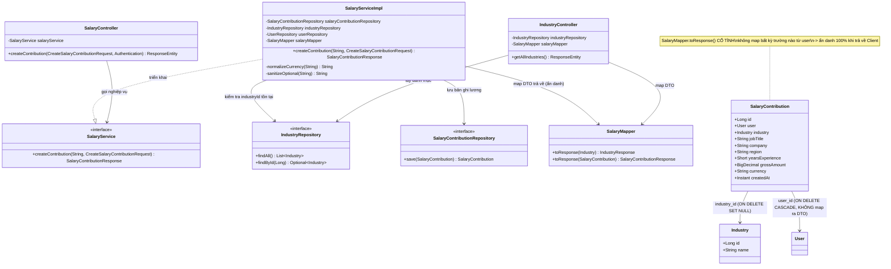
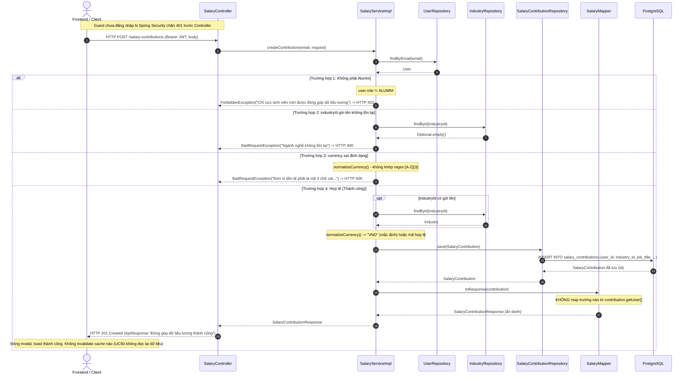

# ĐẶC TẢ YÊU CẦU & THIẾT KẾ CHI TIẾT: UC50 - ĐÓNG GÓP DỮ LIỆU LƯƠNG ẨN DANH (CONTRIBUTE SALARY DATA)

## PHẦN 1: ĐẶC TẢ NGHIỆP VỤ (REPORT 3)

### 2.2.3 Business Workflow (Luồng nghiệp vụ)

```mermaid
stateDiagram-v2
    [*] --> Xem_Trang_Salary : Cựu sinh viên (ALUMNI) vào trang Bảng lương ẩn danh
    Xem_Trang_Salary --> Hien_Nut_Dong_Gop : FE kiểm tra role === ALUMNI (Student/Guest/Admin không thấy nút)
    Hien_Nut_Dong_Gop --> Mo_Modal : Bấm "Đóng góp dữ liệu"

    Mo_Modal --> Nhap_Form : Điền chức danh + mức lương (bắt buộc); ngành nghề/công ty/khu vực/kinh nghiệm (tùy chọn)
    Nhap_Form --> Validate_FE : Bấm "Gửi đóng góp"
    Validate_FE --> Nhap_Form : Zod báo lỗi field (chưa gọi API)
    Validate_FE --> Goi_API : Hợp lệ

    Goi_API --> Kiem_Tra_Server : POST /salary-contributions (Bearer JWT)

    state Kiem_Tra_Server {
        [*] --> Kiem_Tra_Vai_Tro
        Kiem_Tra_Vai_Tro --> Bao_Loi_403 : role != ALUMNI (Student/Admin)
        Kiem_Tra_Vai_Tro --> Kiem_Tra_Nganh : role == ALUMNI
        Kiem_Tra_Nganh --> Bao_Loi_400_Nganh : industryId gửi lên không tồn tại
        Kiem_Tra_Nganh --> Chuan_Hoa_Currency : industryId hợp lệ hoặc null
        Chuan_Hoa_Currency --> Bao_Loi_400_Currency : currency có giá trị nhưng sai định dạng 3 chữ cái
        Chuan_Hoa_Currency --> Luu_DB : Hợp lệ (bỏ trống -> mặc định "VND")
        Luu_DB --> Tra_Ve_201 : INSERT salary_contributions (kèm user_id ẩn, KHÔNG trả về Client)
    }

    Bao_Loi_403 --> Hien_Thi_Loi_Toast
    Bao_Loi_400_Nganh --> Hien_Thi_Loi_Toast
    Bao_Loi_400_Currency --> Hien_Thi_Loi_Toast
    Hien_Thi_Loi_Toast --> Nhap_Form
    Tra_Ve_201 --> Dong_Modal : Toast thành công, đóng modal
    Dong_Modal --> [*]
```

#### Mô tả chi tiết luồng xử lý bằng chữ (Business Step Description):
* **Bước 1 - Hiển thị nút "Đóng góp dữ liệu"**: Trên trang Bảng lương ẩn danh (`SalaryPage`), nút chỉ hiển thị khi người dùng đã đăng nhập và có vai trò **ALUMNI** — Guest, Student và Admin không thấy nút (RBAC ẩn ở FE, khớp Backend chặn 403).
* **Bước 2 - Nhập form**: Bấm nút mở modal `ContributeSalaryModal` với các trường: Chức danh công việc (*bắt buộc*), Mức lương gộp/tháng VNĐ (*bắt buộc*), Ngành nghề (dropdown, tùy chọn), Công ty (tùy chọn), Khu vực (tùy chọn), Số năm kinh nghiệm (tùy chọn). Modal nhấn mạnh cam kết **ẩn danh 100%** bằng badge + dòng giải thích.
* **Bước 3 - Validate phía Client**: React Hook Form + Zod (`createSalaryContributionSchema`) kiểm tra: chức danh không rỗng (≤150 ký tự), mức lương > 0 (≤ NUMERIC(12,2) cho phép), số năm kinh nghiệm 0–60 nếu có nhập. Lỗi hiển thị ngay dưới từng field, chưa gọi API.
* **Bước 4 - Gửi & Kiểm tra phía Server**: Client gọi `POST /salary-contributions` kèm Bearer JWT. Server (`SalaryServiceImpl.createContribution`, `@Transactional`):
  * Nạp User theo email (JWT); không tồn tại → 404.
  * **Kiểm tra vai trò**: chỉ **ALUMNI** được đóng góp — Student/Admin → 403.
  * Nếu có `industryId`: kiểm tra tồn tại trong bảng `industries` — không tồn tại → 400.
  * **Chuẩn hóa `currency`**: bỏ trống → mặc định `"VND"`; có giá trị thì phải đúng định dạng 3 chữ cái viết hoa (VD `USD`) — sai định dạng → 400.
  * Lưu bản ghi `salary_contributions` (kèm `user_id` để truy vết nội bộ/chống spam, nhưng **không bao giờ trả `user_id` hay bất kỳ trường định danh nào về Client**).
* **Bước 5 - Kết thúc**: Server trả HTTP 201 với `SalaryContributionResponse` (không chứa thông tin định danh). Frontend đóng modal, hiện toast "Đã ghi nhận đóng góp dữ liệu lương của bạn. Cảm ơn bạn!". UC50 chỉ lo phần **ghi** dữ liệu — không hiển thị lại danh sách/thống kê (thuộc UC53 - View salary statistics, ngoài phạm vi UC50), nên không cần invalidate cache nào.

---

### 3.9 Module Salary Board: Đóng góp dữ liệu lương

Module 5 (Career Paths & Salary). UC50 là chức năng **ghi** đầu tiên của Salary Board — Alumni đóng góp một mẫu lương ẩn danh để phục vụ thống kê cộng đồng (UC53, ngoài phạm vi UC50). Thiết kế đặt trọng tâm vào **ẩn danh theo thiết kế** (anonymity-by-design): entity `SalaryContribution` có liên kết `user` để truy vết nội bộ, nhưng tầng Mapper/DTO trả về Client **cố tình không map bất kỳ trường nào** từ `user`.

#### 3.9.1 Đóng góp dữ liệu lương (Contribute salary data)

**Function trigger**:
*   **Navigation path**: `/app/salary` (Bảng lương ẩn danh) → nút "Đóng góp dữ liệu" (chỉ Alumni đã đăng nhập) → modal → "Gửi đóng góp".
*   **Timing Frequency**: On demand (khi Alumni muốn chia sẻ mức lương thực tế của mình).

**Function description**:
*   **Actors/Roles**: **Cựu sinh viên (ALUMNI)** — KHÁC các UC Q&A Forum khác (thường cho phép cả STUDENT + ALUMNI), vì dữ liệu lương thực tế chỉ có ý nghĩa từ người đã đi làm. Student/Admin bị API từ chối 403 (và không thấy nút ở FE); Guest bị chặn 401.
*   **Purpose**: Cho phép Alumni đóng góp một mẫu dữ liệu lương thực tế (ẩn danh) để làm giàu dữ liệu thống kê của Bảng lương cộng đồng.
*   **Interface**:
    *   **Nút "Đóng góp dữ liệu"** (gold, icon `Plus`) trên `PageHeader` của `SalaryPage` — chỉ hiển thị khi `user.role === 'ALUMNI'`.
    *   **Modal `ContributeSalaryModal`**: tiêu đề "Đóng góp dữ liệu lương", badge "Ẩn danh 100%" + dòng giải thích "Hệ thống không lưu tên/thông tin định danh cùng dữ liệu lương bạn đóng góp", form gồm 6 trường (2 bắt buộc, 4 tùy chọn), nút "Hủy"/"Gửi đóng góp" (có spinner khi xử lý).
    *   **Thông báo**: toast thành công "Đã ghi nhận đóng góp dữ liệu lương của bạn. Cảm ơn bạn!" hoặc banner lỗi trong modal nếu API thất bại.

**Data processing**:
1.  Client gọi `POST /salary-contributions` (Bearer JWT) với body `{ industryId?, jobTitle, company?, region?, yearsExperience?, grossAmount, currency? }`.
2.  Server (`SalaryServiceImpl.createContribution`, `@Transactional`): nạp User (404), kiểm tra vai trò ALUMNI (403), kiểm tra `industryId` tồn tại nếu có (400), chuẩn hóa `currency` (400 nếu sai định dạng), lưu `SalaryContribution` (gắn `user` nội bộ).
3.  Server trả HTTP 201 `ApiResponse<SalaryContributionResponse>` — DTO không có trường định danh.
4.  Client đóng modal, hiện toast thành công. Không cập nhật lại danh sách/thống kê nào (UC50 không đọc lại dữ liệu).

**Screen layout**:
*   *Figure 1: Nút "Đóng góp dữ liệu" trên `PageHeader` của trang Bảng lương (chỉ Alumni).*
*   *Figure 2: Modal đóng góp dữ liệu lương với badge "Ẩn danh 100%".*

**Function details**:
*   **Data**:
    *   Tham số đầu vào (request body): `industryId` (Long, tùy chọn), `jobTitle` (String, bắt buộc, ≤150 ký tự), `company`/`region` (String, tùy chọn, ≤150/120 ký tự), `yearsExperience` (Short, tùy chọn, 0–60), `grossAmount` (BigDecimal, bắt buộc, > 0, tối đa `NUMERIC(12,2)`), `currency` (String, tùy chọn, mặc định "VND").
    *   Trả về: `SalaryContributionResponse` — `id`, `industry` (tên ngành, chuỗi rỗng nếu không chọn), `jobTitle`, `company`, `region`, `yearsExperience`, `grossAmount`, `currency`, `createdAt`. **Không có trường liên quan người dùng.**
*   **Validation**: Bean Validation tại DTO (`@NotBlank`, `@Size`, `@Min`/`@Max`, `@NotNull`, `@DecimalMin`, `@Digits`) cho các trường có thể validate tĩnh; riêng `currency` (cho phép bỏ trống) và `industryId` (phải tồn tại) validate thủ công ở tầng Service.
*   **Business rules**: Xem mục 5.1 (BR-CS-01 → BR-CS-07).
*   **Error Handling**:
    *   Không phải ALUMNI → 403 (MSG-CS-01).
    *   `jobTitle` rỗng/quá dài → 400 (MSG-CS-02).
    *   `grossAmount` ≤ 0 hoặc rỗng → 400 (MSG-CS-03).
    *   `industryId` không tồn tại → 400 (MSG-CS-04).
    *   `currency` sai định dạng → 400 (MSG-CS-05).
    *   Guest chưa đăng nhập → 401, chặn bởi Spring Security trước Controller (MSG-CS-06).
*   **Normal case**: Alumni điền chức danh + mức lương (kèm các trường tùy chọn), hệ thống lưu bản ghi ẩn danh, trả 201; toast thành công, modal đóng.
*   **Abnormal case**: Không phải Alumni → 403; thiếu/sai dữ liệu bắt buộc → 400; ngành nghề không tồn tại → 400; currency sai định dạng → 400; Guest → 401.

---

### 5. Requirement Appendix (Phụ lục Yêu cầu)

#### 5.1 Business Rules (Quy tắc Nghiệp vụ)

| ID | Định nghĩa Quy tắc (Rule Definition) |
| :--- | :--- |
| BR-CS-01 | Chỉ **Cựu sinh viên (ALUMNI)** mới được đóng góp dữ liệu lương; STUDENT/ADMIN bị từ chối 403 — khác các UC Q&A Forum khác (thường cho phép cả STUDENT + ALUMNI). |
| BR-CS-02 | `jobTitle` bắt buộc, không rỗng, tối đa 150 ký tự; `grossAmount` bắt buộc, phải > 0, tối đa `NUMERIC(12,2)` (khớp cột DB). |
| BR-CS-03 | `industryId`, `company`, `region`, `yearsExperience` đều **tùy chọn**; nếu `industryId` có gửi lên thì phải tồn tại trong bảng `industries`, ngược lại trả 400 "Ngành nghề không tồn tại". |
| BR-CS-04 | `currency` tùy chọn: bỏ trống/rỗng → mặc định `"VND"`; có giá trị thì phải đúng định dạng 3 chữ cái viết hoa (mã ISO 4217, VD `USD`) — sai định dạng trả 400. |
| BR-CS-05 | **Ẩn danh theo thiết kế**: bản ghi lưu `user_id` nội bộ (phục vụ truy vết/chống spam sau này nếu cần), nhưng `SalaryContributionResponse` trả về Client **không chứa bất kỳ trường định danh nào** (không tên, không email, không userId) — Mapper cố tình không map từ `contribution.getUser()`. |
| BR-CS-06 | Nếu ngành nghề liên kết (`industry`) bị xóa sau này, bản ghi lương **không bị xóa theo** — `industry_id` chỉ `ON DELETE SET NULL` (giữ lại dữ liệu lương, chỉ mất liên kết ngành). |
| BR-CS-07 | Chức năng yêu cầu đăng nhập (JWT); Guest bị chặn 401 (endpoint không nằm `PUBLIC_GET`). Riêng `GET /industries` (danh mục ngành cho dropdown) là **công khai**, không cần đăng nhập. |

#### 5.2 Common Requirements (Yêu cầu Chung)
*   Mọi thông điệp lỗi/thành công hiển thị cho người dùng đều bằng **Tiếng Việt**, qua hệ thống toast dùng chung (`@/components/ui/Toast`).
*   Nút "Đóng góp dữ liệu" chỉ hiển thị cho Alumni (RBAC UI dựa trên `user.role`); Backend luôn kiểm tra lại vai trò (không tin Client).
*   UC50 chỉ lo phần **ghi** dữ liệu — Bảng lương thống kê/hiển thị lại dữ liệu (biểu đồ dải lương theo vị trí trên `SalaryPage`) thuộc **UC53 (View salary statistics)**, ngoài phạm vi UC50; phần đó vẫn dùng dữ liệu mock tĩnh, không đổi trong UC này.
*   Migration mới: **V13** (`create_salary_contributions_table`) — tạo 2 bảng `industries` (danh mục ngành nghề, seed sẵn 8 ngành phổ biến) và `salary_contributions` (dữ liệu lương, `user_id` FK `ON DELETE CASCADE`, `industry_id` FK `ON DELETE SET NULL`).

#### 5.3 Application Messages List (Danh sách Thông điệp Ứng dụng)

| # | Mã thông điệp | Loại thông điệp | Ngữ cảnh | Nội dung hiển thị | HTTP |
| :--- | :--- | :--- | :--- | :--- | :--- |
| 1 | MSG-CS-01 | Toast lỗi | Không phải Alumni | Chỉ cựu sinh viên mới được đóng góp dữ liệu lương | 403 |
| 2 | MSG-CS-02 | Lỗi field (FE) / Toast lỗi (BE) | Chức danh rỗng/quá dài | Chức danh công việc không được để trống / không được vượt quá 150 ký tự | 400 |
| 3 | MSG-CS-03 | Lỗi field (FE) / Toast lỗi (BE) | Mức lương không hợp lệ | Mức lương không được để trống / phải lớn hơn 0 | 400 |
| 4 | MSG-CS-04 | Toast lỗi | Ngành nghề không tồn tại | Ngành nghề không tồn tại | 400 |
| 5 | MSG-CS-05 | Toast lỗi | Sai định dạng currency | Đơn vị tiền tệ phải là mã 3 chữ cái (VD: VND, USD) | 400 |
| 6 | MSG-CS-06 | Chặn bởi Spring Security | Guest chưa đăng nhập | Bạn chưa đăng nhập hoặc phiên làm việc đã hết hạn. | 401 |
| 7 | MSG-CS-07 | Toast thành công | Đóng góp thành công | Đã ghi nhận đóng góp dữ liệu lương của bạn. Cảm ơn bạn! | 201 |

---

## PHẦN 2: THIẾT KẾ CHI TIẾT (REPORT 4)

### 3. Detail Design (Thiết kế chi tiết)

#### 3.1 Chức năng Đóng góp dữ liệu lương (Contribute salary data)

##### 3.1.1 Class Diagram (Sơ đồ Lớp)

###### Mô tả chi tiết cấu trúc các lớp (Class Design Description):
* **Lớp Controller (`IndustryController`)**: `GET /api/v1/industries` — công khai (`PUBLIC_GET`), gọi thẳng `IndustryRepository` + `SalaryMapper` (không qua Service), mirror pattern `MajorController` vì chỉ là danh mục tĩnh phục vụ dropdown.
* **Lớp Controller (`SalaryController`)**: `POST /api/v1/salary-contributions` — yêu cầu JWT (không nằm `PUBLIC_GET`), lấy email từ `Authentication`, gọi `salaryService.createContribution`, trả HTTP 201.
* **Lớp Service (`SalaryService`, `SalaryServiceImpl`)**: `createContribution` (`@Transactional`): nạp User (404), kiểm tra `role == ALUMNI` (403), kiểm tra `industryId` tồn tại nếu có (400), `normalizeCurrency` chuẩn hóa/validate currency (400 nếu sai định dạng), `sanitizeOptional` cắt khoảng trắng + quy chuỗi rỗng về null cho `company`/`region`, lưu `SalaryContribution`, map trả về qua `SalaryMapper` (không lộ `user`).
* **Lớp Repository (`IndustryRepository`, `SalaryContributionRepository`)**: `JpaRepository` thuần, không cần method tùy biến — `IndustryRepository.findAll()`/`findById()` và `SalaryContributionRepository.save()` là đủ cho UC50.
* **Lớp Entity (`Industry`, `SalaryContribution`)**: Mới tạo hoàn toàn (migration V13). `SalaryContribution.user` là `@ManyToOne` bắt buộc (lưu nội bộ, không public), `industry` là `@ManyToOne` tùy chọn (`ON DELETE SET NULL`).
* **Lớp Mapper (`SalaryMapper`)**: `toResponse(SalaryContribution)` là điểm chốt đảm bảo tính ẩn danh — không đọc bất kỳ field nào từ `contribution.getUser()`.

##### 3.1.2 Sequence Diagram (Sơ đồ Tuần tự)

###### Mô tả chi tiết luồng xử lý bằng chữ (Sequence Flow Description):
1.  **Luồng thành công**: Client gửi `POST /salary-contributions`. Service nạp User, xác nhận vai trò ALUMNI, kiểm tra ngành nghề tồn tại nếu có chọn, chuẩn hóa currency, lưu bản ghi, map DTO ẩn danh trả về. Trả HTTP 201.
2.  **Luồng lỗi Không phải Alumni (403)**: `user.role != ALUMNI` → `ForbiddenException`. Guest bị Spring Security chặn 401 trước khi tới Service.
3.  **Luồng lỗi Ngành nghề không tồn tại (400)**: `industryId` gửi lên nhưng không tìm thấy trong bảng `industries` → `BadRequestException`.
4.  **Luồng lỗi Currency sai định dạng (400)**: `currency` có giá trị nhưng không khớp `[A-Z]{3}` (sau khi trim + uppercase) → `BadRequestException`.
5.  **Luồng lỗi Validate tĩnh (400)**: `jobTitle` rỗng/quá dài, `grossAmount` ≤ 0/rỗng/quá lớn — chặn bởi Bean Validation (`@Valid`) trước khi vào Service, trả 400 kèm message tương ứng.

### 4. Kết quả kiểm thử thực tế (Manual QA — DB level)
Đã verify bằng scratch database (`alumnect_migtest_uc50`) — replay toàn bộ migration V1→V13, kiểm tra cấu trúc bảng và ràng buộc trực tiếp qua `psql`, sau đó xóa scratch DB:

| Kịch bản | Kết quả |
| :--- | :--- |
| Cấu trúc bảng `industries`/`salary_contributions` sau khi chạy V13 | Đúng như migration: cột, kiểu dữ liệu, default `currency = 'VND'` áp dụng đúng |
| Seed 8 ngành nghề mặc định | `INSERT ... ON CONFLICT (name) DO NOTHING` chạy thành công, không trùng lặp |
| FK `salary_contributions.industry_id ... ON DELETE SET NULL` | Xóa một `industry` đang được tham chiếu → bản ghi lương liên quan giữ nguyên, chỉ `industry_id` chuyển `NULL` |
| FK `salary_contributions.user_id ... ON DELETE CASCADE` | Xóa một `user` đang có đóng góp lương → bản ghi lương liên quan bị xóa theo |
| Build Backend (`mvn -q -o compile`) | Thành công, không lỗi |
| Build Frontend (`npm run build`) | Thành công sau khi sửa schema Zod `yearsExperience` (dùng `.nullable().catch(null)` thay vì `.preprocess()` để giữ đúng kiểu suy luận cho `zodResolver` + `useForm<CreateSalaryContributionInput>`) |
