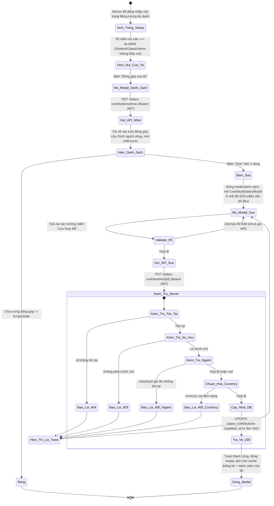
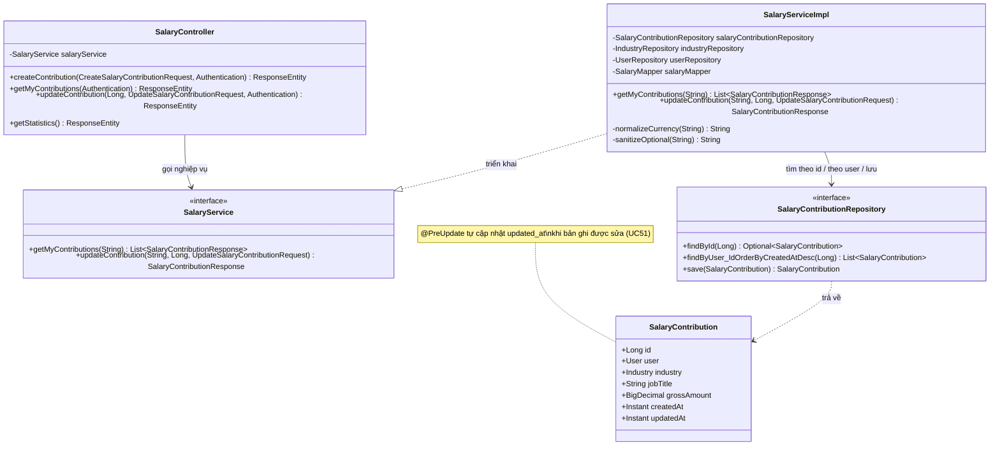

# ĐẶC TẢ YÊU CẦU & THIẾT KẾ CHI TIẾT: UC51 - CHỈNH SỬA ĐÓNG GÓP LƯƠNG (EDIT SALARY CONTRIBUTION)

## PHẦN 1: ĐẶC TẢ NGHIỆP VỤ (REPORT 3)

### 2.2.3 Business Workflow (Luồng nghiệp vụ)



#### Mô tả chi tiết luồng xử lý bằng chữ (Business Step Description):
* **Bước 1 - Hiển thị nút "Đóng góp của tôi"**: Trên trang Bảng lương ẩn danh (`SalaryPage`), nút chỉ hiển thị khi người dùng đã đăng nhập với vai trò **ALUMNI** — cùng điều kiện với nút "Đóng góp dữ liệu" (UC50).
* **Bước 2 - Xem danh sách**: Bấm nút mở `MyContributionsModal`, gọi `GET /salary-contributions/mine` (Bearer JWT), hiển thị các lượt đóng góp của chính người dùng (mới nhất trước) — chỉ chính họ thấy được danh sách này, người khác không truy cập được (kiểm tra ở tầng Backend qua `user_id`).
* **Bước 3 - Chọn bản ghi cần sửa**: Bấm "Sửa" trên 1 dòng → đóng modal danh sách, mở lại `ContributeSalaryModal` ở **chế độ SỬA** (điền sẵn toàn bộ dữ liệu của bản ghi đó, bao gồm `industryId` để dropdown ngành nghề chọn đúng).
* **Bước 4 - Validate & Gửi**: Cùng schema Zod với lúc tạo (UC50). Client gọi `PUT /salary-contributions/{id}` (Bearer JWT). Server (`SalaryServiceImpl.updateContribution`, `@Transactional`):
  * Nạp User theo email (JWT); không tồn tại → 404.
  * Tìm lượt đóng góp theo `id`; không tồn tại → 404.
  * **Kiểm tra quyền sở hữu**: `contribution.user.id` khác người đăng nhập → 403.
  * Nếu có `industryId`: kiểm tra tồn tại — không tồn tại → 400.
  * **Chuẩn hóa `currency`**: cùng logic UC50 (bỏ trống → "VND", sai định dạng → 400).
  * Cập nhật toàn bộ các trường, lưu — `@PreUpdate` tự động cập nhật `updated_at`.
* **Bước 5 - Kết thúc**: Server trả HTTP 200 với `SalaryContributionResponse` đã cập nhật. Frontend đóng modal, hiện toast "Đã cập nhật dữ liệu lương thành công!", làm mới cache thống kê (`['salary-statistics']`, UC53) và danh sách đóng góp của chính mình (`['my-salary-contributions']`).

---

### 3.11 Module Salary Board: Chỉnh sửa đóng góp lương

Module 4 (Q&A Forum & Salary Board). UC51 hoàn thiện quyền tự quản lý dữ liệu của Alumni đối với lượt đóng góp lương đã gửi (UC50 tạo, UC51 sửa) — dù Salary Board ẩn danh với **người khác**, chính chủ vẫn cần xem lại và sửa được dữ liệu của mình (VD nhập sai, muốn cập nhật mức lương mới). Đây là lý do entity `SalaryContribution` đã lưu sẵn `user` từ UC50 dù không public — chính là để phục vụ UC51.

#### 3.11.1 Xem danh sách đóng góp của tôi

**Function trigger**: `/app/salary` → nút "Đóng góp của tôi" (chỉ Alumni) → modal danh sách.
**Actors/Roles**: Cựu sinh viên (ALUMNI) — chỉ xem được đóng góp của **chính mình**, không xem được của người khác (không có API nào cho phép việc này).
**Interface**: Modal liệt kê từng lượt đóng góp (chức danh, ngành/công ty/khu vực, mức lương), nút "Sửa" trên mỗi dòng. Trạng thái: skeleton khi tải, banner lỗi + nút "Thử lại", `EmptyState` khi chưa từng đóng góp.

#### 3.11.2 Chỉnh sửa đóng góp lương (Edit salary contribution)

**Function trigger**: Từ danh sách "Đóng góp của tôi" → bấm "Sửa" trên 1 dòng → modal chỉnh sửa (điền sẵn dữ liệu) → "Lưu thay đổi".
**Function description**:
*   **Actors/Roles**: Cựu sinh viên (ALUMNI) — nhưng **chỉ chính chủ** của lượt đóng góp đó. Người khác (kể cả Alumni khác) bị API từ chối 403 (không có UI nào dẫn tới việc này vì danh sách "của tôi" chỉ hiện dữ liệu của chính mình).
*   **Purpose**: Cho phép chính chủ tự sửa lại dữ liệu lương đã đóng góp (VD nhập sai chức danh, cập nhật mức lương mới sau khi tăng lương).
*   **Interface**: Tái sử dụng nguyên `ContributeSalaryModal` (UC50) ở chế độ SỬA — tiêu đề đổi thành "Chỉnh sửa dữ liệu lương", nút "Lưu thay đổi" thay vì "Gửi đóng góp".

**Data processing**:
1.  Client gọi `PUT /salary-contributions/{id}` (Bearer JWT) với body giống hệt lúc tạo (UC50).
2.  Server (`SalaryServiceImpl.updateContribution`, `@Transactional`): nạp User (404), tìm lượt đóng góp theo id (404), kiểm tra sở hữu (403), kiểm tra `industryId` tồn tại nếu có (400), chuẩn hóa `currency` (400 nếu sai định dạng), cập nhật các trường, lưu (`@PreUpdate` tự cập nhật `updatedAt`).
3.  Server trả HTTP 200 `ApiResponse<SalaryContributionResponse>`.
4.  Client đóng modal, toast thành công, làm mới cache thống kê (UC53) + danh sách "của tôi".

**Function details**:
*   **Data**:
    *   Tham số đầu vào: `id` (Long, path variable) + request body (cùng bộ trường `CreateSalaryContributionRequest`: `industryId?`, `jobTitle`, `company?`, `region?`, `yearsExperience?`, `grossAmount`, `currency?`).
    *   Trả về: `SalaryContributionResponse` — giống hệt UC50, nay có thêm `industryId` để Frontend điền sẵn dropdown khi mở form sửa lần sau.
*   **Validation**: Giống hệt UC50 (Bean Validation cho các trường tĩnh; `industryId`/`currency` validate thủ công ở Service).
*   **Business rules**: Xem mục 5.1 (BR-ES-01 → BR-ES-06).
*   **Error Handling**:
    *   `id` không tồn tại → 404 (MSG-ES-01).
    *   Không phải chính chủ → 403 (MSG-ES-02).
    *   `industryId` không tồn tại → 400 (MSG-ES-03).
    *   `currency` sai định dạng → 400 (MSG-ES-04).
    *   Guest chưa đăng nhập → 401 (MSG-ES-05).
*   **Normal case**: Chính chủ sửa lại dữ liệu, hệ thống cập nhật đúng bản ghi, trả 200; toast thành công, thống kê + danh sách "của tôi" tự làm mới.
*   **Abnormal case**: Không phải chính chủ → 403; `id` không tồn tại → 404; ngành nghề không tồn tại/currency sai định dạng → 400; Guest → 401.

---

### 5. Requirement Appendix (Phụ lục Yêu cầu)

#### 5.1 Business Rules (Quy tắc Nghiệp vụ)

| ID | Định nghĩa Quy tắc (Rule Definition) |
| :--- | :--- |
| BR-ES-01 | Chỉ **chính chủ** (người đã tạo lượt đóng góp đó) mới được sửa; người khác (kể cả ALUMNI khác) bị từ chối 403. Kiểm tra qua `contribution.user.id == người đăng nhập`, không dựa vào role. |
| BR-ES-02 | Danh sách "Đóng góp của tôi" (`GET /mine`) chỉ trả về dữ liệu của **chính người gọi API** — không có endpoint nào cho phép xem đóng góp của người khác, giữ đúng cam kết ẩn danh với người ngoài. |
| BR-ES-03 | Form sửa dùng **cùng bộ trường và cùng validate** với lúc tạo (UC50): `jobTitle`/`grossAmount` bắt buộc; `industryId`/`company`/`region`/`yearsExperience`/`currency` tùy chọn. |
| BR-ES-04 | Sửa thành công cập nhật `updated_at` (qua `@PreUpdate`), **không đổi** `created_at` (giữ nguyên thời điểm tạo gốc). |
| BR-ES-05 | `SalaryContributionResponse` (dùng chung cho tạo/xem danh sách của tôi/sửa) nay có thêm `industryId` — **không phải thông tin định danh cá nhân** nên không vi phạm cam kết ẩn danh, chỉ để Frontend điền sẵn dropdown khi mở form sửa. |
| BR-ES-06 | Chức năng yêu cầu đăng nhập (JWT); Guest bị chặn 401 (endpoint không nằm `PUBLIC_GET`). |

#### 5.2 Common Requirements (Yêu cầu Chung)
*   Mọi thông điệp lỗi/thành công hiển thị cho người dùng đều bằng **Tiếng Việt**, qua hệ thống toast dùng chung.
*   Nút "Đóng góp của tôi" chỉ hiển thị cho Alumni (RBAC UI dựa trên `user.role`); Backend luôn kiểm tra lại quyền sở hữu ở tầng sửa (không tin Client).
*   Không tạo migration mới — chỉ thêm code đọc/ghi trên bảng `salary_contributions` đã có (V13, từ UC50); cột `updated_at` đã tồn tại sẵn từ V13 nhưng chưa được dùng tới cho đến UC51.
*   Form sửa **tái sử dụng nguyên component** `ContributeSalaryModal` (UC50) qua prop `editContribution` — mirror pattern `AskQuestionModal` (UC40/UC46) dùng chung 1 modal cho cả tạo và sửa.

#### 5.3 Application Messages List (Danh sách Thông điệp Ứng dụng)

| # | Mã thông điệp | Loại thông điệp | Ngữ cảnh | Nội dung hiển thị | HTTP |
| :--- | :--- | :--- | :--- | :--- | :--- |
| 1 | MSG-ES-01 | Toast lỗi | Lượt đóng góp không tồn tại | Không tìm thấy lượt đóng góp với id: {id} | 404 |
| 2 | MSG-ES-02 | Toast lỗi | Không phải chính chủ | Chỉ chính chủ mới được chỉnh sửa lượt đóng góp này | 403 |
| 3 | MSG-ES-03 | Toast lỗi | Ngành nghề không tồn tại | Ngành nghề không tồn tại | 400 |
| 4 | MSG-ES-04 | Toast lỗi | Sai định dạng currency | Đơn vị tiền tệ phải là mã 3 chữ cái (VD: VND, USD) | 400 |
| 5 | MSG-ES-05 | Chặn bởi Spring Security | Guest chưa đăng nhập | Bạn chưa đăng nhập hoặc phiên làm việc đã hết hạn. | 401 |
| 6 | MSG-ES-06 | Toast thành công | Sửa thành công | Đã cập nhật dữ liệu lương thành công! | 200 |

---

## PHẦN 2: THIẾT KẾ CHI TIẾT (REPORT 4)

### 3. Detail Design (Thiết kế chi tiết)

#### 3.1 Chức năng Chỉnh sửa đóng góp lương (Edit salary contribution)

##### 3.1.1 Class Diagram (Sơ đồ Lớp)



###### Mô tả chi tiết cấu trúc các lớp (Class Design Description):
* **Lớp Controller (`SalaryController`)**: Bổ sung `GET /api/v1/salary-contributions/mine` (lấy email từ `Authentication`, gọi `getMyContributions`) và `PUT /api/v1/salary-contributions/{contributionId}` (`@Valid @RequestBody UpdateSalaryContributionRequest`, gọi `updateContribution`, trả 200). Cả 2 endpoint không nằm `PUBLIC_GET` nên tự động yêu cầu JWT.
* **Lớp Service (`SalaryService`, `SalaryServiceImpl`)**: `getMyContributions` nạp User (404), gọi `findByUser_IdOrderByCreatedAtDesc`, map từng bản ghi qua `SalaryMapper` (đã dùng ở UC50, tái sử dụng nguyên). `updateContribution` nạp User (404), tìm `SalaryContribution` theo id (404), kiểm tra sở hữu (403), kiểm tra `industryId`/chuẩn hóa `currency` (tái dùng 2 helper `normalizeCurrency`/`sanitizeOptional` đã có từ UC50), cập nhật field rồi `save` — JPA dirty-checking + `@PreUpdate` tự cập nhật `updatedAt`.
* **Lớp Repository (`SalaryContributionRepository`)**: Bổ sung 1 method mới `findByUser_IdOrderByCreatedAtDesc(Long)` — Spring Data tự sinh câu lệnh theo tên hàm, không cần `@Query` thủ công. `findById`/`save` đã có sẵn từ `JpaRepository`.
* **Lớp Entity (`SalaryContribution`)**: Không đổi cấu trúc — cột `updated_at` và callback `@PreUpdate` đã có sẵn từ V13 (UC50), UC51 là nơi đầu tiên thực sự dùng tới.
* **Lớp DTO**: `UpdateSalaryContributionRequest` (mới, cùng bộ trường `CreateSalaryContributionRequest`). `SalaryContributionResponse` (đã có từ UC50) bổ sung field `industryId`.

##### 3.1.2 Sequence Diagram (Sơ đồ Tuần tự)

```mermaid
sequenceDiagram
    autonumber
    actor Client as Frontend / Client
    participant Ctrl as SalaryController
    participant Service as SalaryServiceImpl
    participant UserRepo as UserRepository
    participant SRepo as SalaryContributionRepository
    participant IndRepo as IndustryRepository
    participant DB as PostgreSQL

    Note over Client, Ctrl: Guest chưa đăng nhập bị Spring Security chặn 401 trước Controller
    Client->>Ctrl: HTTP PUT /salary-contributions/{id} (Bearer JWT, body)
    Ctrl->>Service: updateContribution(email, id, request)
    Service->>UserRepo: findByEmail(email)
    UserRepo-->>Service: User

    alt Trường hợp 1: id không tồn tại
        Service->>SRepo: findById(id)
        SRepo-->>Service: Optional.empty()
        Service-->>Ctrl: ResourceNotFoundException -> HTTP 404
    else Trường hợp 2: Không phải chính chủ
        Service->>SRepo: findById(id)
        SRepo-->>Service: SalaryContribution
        Note over Service: contribution.user.id != user.id
        Service-->>Ctrl: ForbiddenException("Chỉ chính chủ mới được chỉnh sửa...") -> HTTP 403
    else Trường hợp 3: industryId không tồn tại
        Service->>IndRepo: findById(industryId)
        IndRepo-->>Service: Optional.empty()
        Service-->>Ctrl: BadRequestException("Ngành nghề không tồn tại") -> HTTP 400
    else Trường hợp 4: Hợp lệ (Thành công)
        Service->>SRepo: findById(id) -> đúng chính chủ
        opt industryId có gửi lên
            Service->>IndRepo: findById(industryId)
            IndRepo-->>Service: Industry
        end
        Note over Service: normalizeCurrency(); cập nhật các field trên entity đã nạp
        Service->>SRepo: save(contribution)
        SRepo->>DB: UPDATE salary_contributions SET ... , updated_at = now() WHERE id = ?
        DB-->>SRepo: SalaryContribution đã cập nhật
        SRepo-->>Service: SalaryContribution
        Service-->>Ctrl: SalaryContributionResponse
        Ctrl-->>Client: HTTP 200 OK (ApiResponse "Cập nhật dữ liệu lương thành công")
        Note over Client: invalidate ['salary-statistics'] + ['my-salary-contributions'] -> toast, đóng modal
    end
```

###### Mô tả chi tiết luồng xử lý bằng chữ (Sequence Flow Description):
1.  **Luồng thành công**: Client gửi `PUT /salary-contributions/{id}`. Service nạp User, tìm bản ghi, xác nhận sở hữu, kiểm tra ngành nghề nếu có chọn, chuẩn hóa currency, cập nhật field, lưu (`updated_at` tự làm mới). Trả HTTP 200.
2.  **Luồng lỗi Không tìm thấy (404)**: `id` không tồn tại trong bảng `salary_contributions`.
3.  **Luồng lỗi Quyền sở hữu (403)**: `contribution.user.id` khác người đăng nhập. Guest bị Spring Security chặn 401 trước Controller.
4.  **Luồng lỗi Validate nghiệp vụ (400)**: `industryId` gửi lên không tồn tại, hoặc `currency` có giá trị nhưng sai định dạng 3 chữ cái.

### 4. Kết quả kiểm thử thực tế
* ✅ `mvn -q -o compile` (Backend) — BUILD SUCCESS.
* ✅ `npm run build` (`tsc -b && vite build`, Frontend) — PASS.
* ⏳ Chưa test tay qua UI/Postman trong phiên này — cần user restart Backend rồi test: xem danh sách "Đóng góp của tôi", sửa 1 bản ghi (kiểm tra dropdown ngành nghề điền đúng sẵn), thử sửa bản ghi của người khác qua Postman (kỳ vọng 403).
