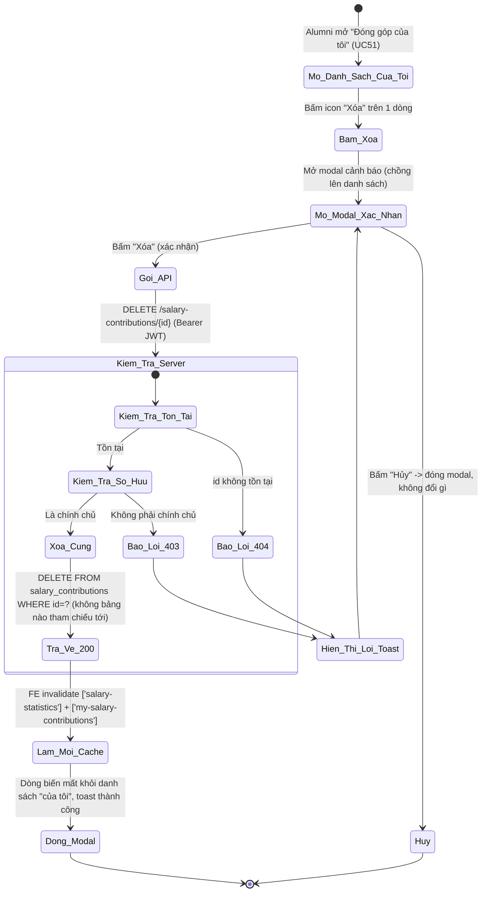
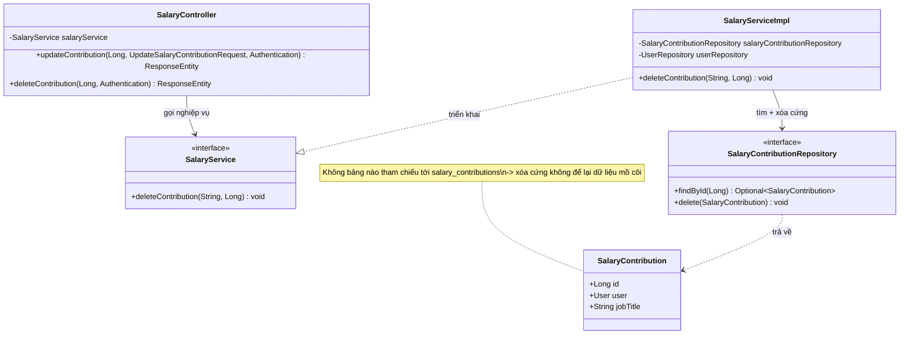
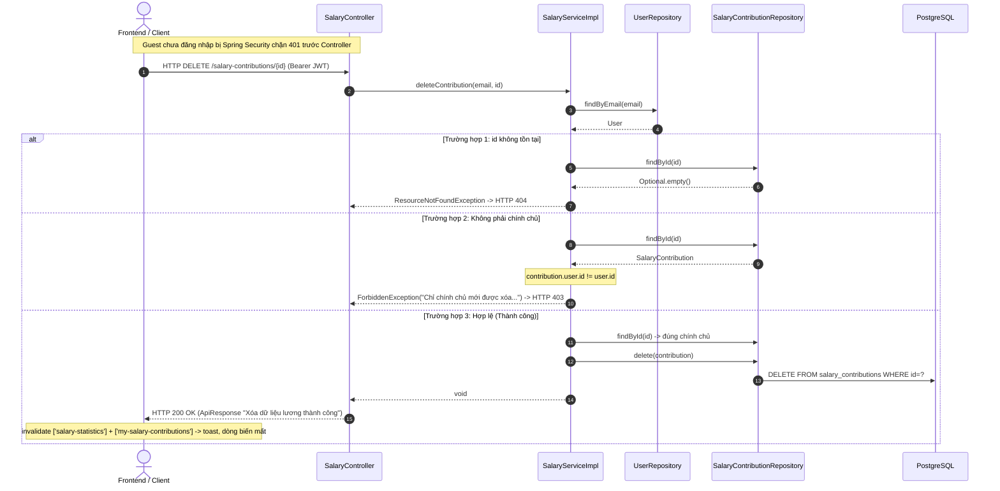

# ĐẶC TẢ YÊU CẦU & THIẾT KẾ CHI TIẾT: UC52 - XÓA ĐÓNG GÓP LƯƠNG (DELETE SALARY CONTRIBUTION)

## PHẦN 1: ĐẶC TẢ NGHIỆP VỤ (REPORT 3)

### 2.2.3 Business Workflow (Luồng nghiệp vụ)

#### Mô tả chi tiết luồng xử lý bằng chữ (Business Step Description):
* **Bước 1 - Vào danh sách "Đóng góp của tôi"**: Giống UC51, Alumni mở modal danh sách đóng góp của chính mình. Mỗi dòng nay có thêm icon "Xóa" (thùng rác, đổi màu đỏ khi hover) cạnh nút "Sửa".
* **Bước 2 - Xác nhận**: Bấm icon "Xóa" mở `DeleteSalaryContributionModal` (chồng lên danh sách) — cảnh báo "Bạn có chắc muốn xóa lượt đóng góp '{jobTitle}' này không? Hành động này không thể hoàn tác." Người dùng "Hủy" (đóng modal, không đổi gì) hoặc "Xóa" để xác nhận.
* **Bước 3 - Gửi & Kiểm tra phía Server**: Client gọi `DELETE /salary-contributions/{id}` kèm Bearer JWT. Server (`SalaryServiceImpl.deleteContribution`, `@Transactional`):
  * Nạp User theo email (JWT); không tồn tại → 404.
  * Tìm lượt đóng góp theo `id`; không tồn tại → 404.
  * **Kiểm tra quyền sở hữu**: `contribution.user.id` khác người đăng nhập → 403.
  * **Xóa CỨNG** (`salaryContributionRepository.delete(contribution)`) — không cần dọn dữ liệu liên quan nào khác vì **không bảng nào tham chiếu tới `salary_contributions`** (khác Answer/Vote ở UC49 cần dọn `votes` trước khi xóa).
* **Bước 4 - Kết thúc**: Server trả HTTP 200 (không payload). Frontend hiển thị toast thành công, làm mới cache thống kê (`['salary-statistics']`, UC53) và danh sách "của tôi" (`['my-salary-contributions']`) — dòng vừa xóa biến mất khỏi danh sách ngay, danh sách modal vẫn mở (không đóng theo). Guest gọi API DELETE bị Spring Security chặn 401 trước Controller.

---

### 3.12 Module Salary Board: Xóa đóng góp lương

Module 4 (Q&A Forum & Salary Board). UC52 hoàn thiện vòng đời CRUD của một lượt đóng góp lương (UC50 tạo, UC51 sửa, UC52 xóa) — cùng nhóm quyền tự quản lý dữ liệu cá nhân với UC51.

**Xóa CỨNG (hard delete)**, không phải đổi trạng thái — vì:
1. Bảng `salary_contributions` **không có cột trạng thái** để soft-delete (khác Question/Post có `status`).
2. **Không có bảng nào tham chiếu** tới `salary_contributions` (khác Answer có Vote đa hình phải dọn trước khi xóa ở UC49) — xóa cứng không để lại dữ liệu mồ côi.
3. Mục đích của UC52 mang tính **quyền riêng tư** (chính chủ muốn rút lại dữ liệu lương đã chia sẻ) — không có giá trị lưu lại lịch sử như Question/Post.

#### 3.12.1 Xóa đóng góp lương (Delete salary contribution)

**Function trigger**:
*   **Navigation path**: `/app/salary` → "Đóng góp của tôi" (UC51) → icon "Xóa" trên 1 dòng → modal xác nhận → "Xóa".
*   **Timing Frequency**: On demand (khi chính chủ muốn rút lại dữ liệu đã đóng góp).

**Function description**:
*   **Actors/Roles**: Cựu sinh viên (ALUMNI) — nhưng **chỉ chính chủ** của lượt đóng góp đó. Người khác bị API từ chối 403 (không có UI nào dẫn tới việc này vì danh sách "của tôi" chỉ hiện dữ liệu của chính mình); Guest bị chặn 401.
*   **Purpose**: Cho phép chính chủ tự gỡ bỏ vĩnh viễn 1 lượt đóng góp lương đã gửi (VD nhập nhầm, muốn rút lại dữ liệu).
*   **Interface**:
    *   **Icon "Xóa"** (thùng rác) trong danh sách "Đóng góp của tôi", cạnh nút "Sửa".
    *   **Modal xác nhận**: tiêu đề "Xóa dữ liệu lương", icon cảnh báo đỏ, nội dung nêu rõ chức danh + "không thể hoàn tác", 2 nút "Hủy"/"Xóa" (đỏ, có spinner khi xử lý).
    *   **Thông báo**: toast thành công "Đã xóa dữ liệu lương thành công" hoặc banner lỗi trong modal nếu API thất bại.

**Data processing**:
1.  Client gọi `DELETE /salary-contributions/{id}` (Bearer JWT), không có request body.
2.  Server (`SalaryServiceImpl.deleteContribution`, `@Transactional`): nạp User (404), tìm lượt đóng góp (404), kiểm tra sở hữu (403), **xóa cứng** bản ghi.
3.  Server trả HTTP 200 `ApiResponse<Void>`.
4.  Client hiện toast, `invalidateQueries(['salary-statistics'])` + `invalidateQueries(['my-salary-contributions'])` → dòng biến mất khỏi danh sách, thống kê tự cập nhật lần tải sau.

**Screen layout**:
*   *Figure 1: Icon "Xóa" cạnh nút "Sửa" trong danh sách "Đóng góp của tôi".*
*   *Figure 2: Modal xác nhận xóa dữ liệu lương.*

**Function details**:
*   **Data**:
    *   Tham số đầu vào: `id` (Long, path variable) — không có request body.
    *   Trả về: `ApiResponse<Void>` — không có payload dữ liệu.
*   **Validation**: Không có validate dữ liệu đầu vào — chỉ kiểm tra tồn tại + quyền sở hữu ở tầng nghiệp vụ.
*   **Business rules**: Xem mục 5.1 (BR-DS-01 → BR-DS-05).
*   **Error Handling**:
    *   Lượt đóng góp không tồn tại (kể cả xóa 2 lần) → 404 (MSG-DS-01).
    *   Không phải chính chủ → 403 (MSG-DS-02).
    *   Guest chưa đăng nhập → 401, chặn bởi Spring Security trước Controller (MSG-DS-03).
*   **Normal case**: Chính chủ xác nhận xóa, hệ thống xóa cứng bản ghi, trả 200; toast thành công, dòng biến mất khỏi danh sách "của tôi".
*   **Abnormal case**: Không phải chính chủ → 403; lượt đóng góp đã xóa/không tồn tại → 404; Guest → 401.

---

### 5. Requirement Appendix (Phụ lục Yêu cầu)

#### 5.1 Business Rules (Quy tắc Nghiệp vụ)

| ID | Định nghĩa Quy tắc (Rule Definition) |
| :--- | :--- |
| BR-DS-01 | Chỉ **chính chủ** (người đã tạo lượt đóng góp đó) mới được xóa; người khác bị từ chối 403. Kiểm tra qua `contribution.user.id == người đăng nhập`, giống hệt cơ chế BR-ES-01 (UC51). |
| BR-DS-02 | Xóa là **xóa cứng** (`DELETE FROM salary_contributions`, KHÔNG phải đổi trạng thái) — bảng không có cột trạng thái, và không bảng nào tham chiếu tới `salary_contributions` nên không cần dọn dữ liệu liên quan (khác UC49 cần dọn `votes` mồ côi trước khi xóa cứng Answer). |
| BR-DS-03 | Chỉ xóa được lượt đóng góp đang tồn tại; không tồn tại (kể cả gọi xóa 2 lần liên tiếp — lần 2 trả 404 vì đã xóa cứng thật) → 404. |
| BR-DS-04 | Xóa không ảnh hưởng tới các lượt đóng góp khác — thống kê (UC53) tự động phản ánh đúng số liệu mới ở lần tải tiếp theo (không cần xử lý gì thêm vì thống kê luôn tính động từ dữ liệu hiện có trong bảng). |
| BR-DS-05 | Chức năng yêu cầu đăng nhập (JWT); Guest bị chặn 401 (endpoint không nằm `PUBLIC_GET`). |

#### 5.2 Common Requirements (Yêu cầu Chung)
*   Mọi thông điệp lỗi/thành công hiển thị cho người dùng đều bằng **Tiếng Việt**, qua hệ thống toast dùng chung.
*   Hành động xóa là **destructive và KHÔNG THỂ HOÀN TÁC** (xóa cứng, không có tính năng khôi phục) → bắt buộc modal xác nhận trước khi gọi API.
*   Không tạo migration mới — không cần cột/bảng mới cho xóa cứng.
*   Modal xác nhận xóa **chồng lên** modal danh sách "Đóng góp của tôi" (không đóng danh sách trước) — danh sách tự cập nhật (mất dòng vừa xóa) ngay sau khi cache `['my-salary-contributions']` được invalidate, không cần đóng/mở lại modal danh sách.

#### 5.3 Application Messages List (Danh sách Thông điệp Ứng dụng)

| # | Mã thông điệp | Loại thông điệp | Ngữ cảnh | Nội dung hiển thị | HTTP |
| :--- | :--- | :--- | :--- | :--- | :--- |
| 1 | MSG-DS-01 | Toast lỗi | Lượt đóng góp không tồn tại | Không tìm thấy lượt đóng góp với id: {id} | 404 |
| 2 | MSG-DS-02 | Toast lỗi | Không phải chính chủ | Chỉ chính chủ mới được xóa lượt đóng góp này | 403 |
| 3 | MSG-DS-03 | Chặn bởi Spring Security | Guest chưa đăng nhập | Bạn chưa đăng nhập hoặc phiên làm việc đã hết hạn. | 401 |
| 4 | MSG-DS-04 | Toast thành công | Xóa thành công | Đã xóa dữ liệu lương thành công | 200 |

---

## PHẦN 2: THIẾT KẾ CHI TIẾT (REPORT 4)

### 3. Detail Design (Thiết kế chi tiết)

#### 3.1 Chức năng Xóa đóng góp lương (Delete salary contribution)

##### 3.1.1 Class Diagram (Sơ đồ Lớp)

###### Mô tả chi tiết cấu trúc các lớp (Class Design Description):
* **Lớp Controller (`SalaryController`)**: Bổ sung `DELETE /api/v1/salary-contributions/{contributionId}` (lấy email từ `Authentication`) → gọi `deleteContribution`, trả HTTP 200 kèm `ApiResponse<Void>`. Endpoint không nằm `PUBLIC_GET` nên tự động yêu cầu JWT.
* **Lớp Service (`SalaryService`, `SalaryServiceImpl`)**: `deleteContribution` (`@Transactional`): nạp User (404), tìm `SalaryContribution` theo id (404, tái dùng pattern giống `updateContribution` ở UC51), kiểm tra sở hữu (403), `salaryContributionRepository.delete(contribution)` xóa cứng — không cần bước dọn dữ liệu liên quan nào (khác `AnswerServiceImpl.deleteAnswer` ở UC49 phải dọn `votes` trước).
* **Lớp Repository (`SalaryContributionRepository`)**: Tái dùng nguyên `findById`/`delete` có sẵn từ `JpaRepository` — không cần thêm method mới cho UC52.

##### 3.1.2 Sequence Diagram (Sơ đồ Tuần tự)

###### Mô tả chi tiết luồng xử lý bằng chữ (Sequence Flow Description):
1.  **Luồng thành công**: Client gửi `DELETE /salary-contributions/{id}`. Service nạp User, tìm bản ghi, xác nhận sở hữu, xóa cứng. Trả HTTP 200.
2.  **Luồng lỗi Không tìm thấy (404)**: `id` không tồn tại trong bảng `salary_contributions` (kể cả gọi xóa 2 lần liên tiếp cùng id — lần 2 không tìm thấy vì đã xóa cứng thật).
3.  **Luồng lỗi Quyền sở hữu (403)**: `contribution.user.id` khác người đăng nhập → `ForbiddenException`. Guest bị Spring Security chặn 401 trước Controller, không tới được Service.

### 4. Kết quả kiểm thử thực tế
* ✅ `mvn -q -o compile` (Backend) — BUILD SUCCESS.
* ✅ `npm run build` (`tsc -b && vite build`, Frontend) — PASS.
* ⏳ Chưa test tay qua UI/Postman trong phiên này — cần user restart Backend rồi test: xóa 1 lượt đóng góp của chính mình (kiểm tra biến mất khỏi danh sách + thống kê cập nhật đúng ở lần tải sau), thử xóa lượt của người khác qua Postman (kỳ vọng 403), xóa 2 lần liên tiếp (lần 2 kỳ vọng 404).
