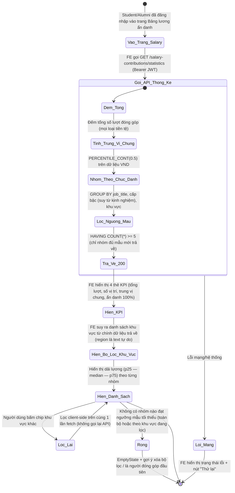
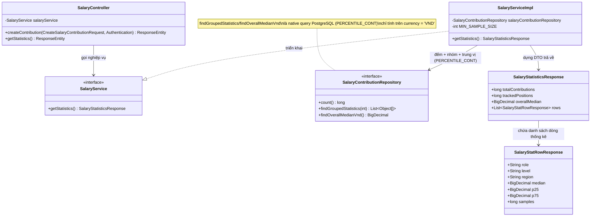

# ĐẶC TẢ YÊU CẦU & THIẾT KẾ CHI TIẾT: UC53 - XEM THỐNG KÊ LƯƠNG (VIEW SALARY STATISTICS)

## PHẦN 1: ĐẶC TẢ NGHIỆP VỤ (REPORT 3)

### 2.2.3 Business Workflow (Luồng nghiệp vụ)



#### Mô tả chi tiết luồng xử lý bằng chữ (Business Step Description):
* **Bước 1 - Vào trang**: Student hoặc Alumni đã đăng nhập vào `/app/salary` (Guest bị `ProtectedRoute` chuyển hướng `/login`). Trang tự động gọi `GET /salary-contributions/statistics` (Bearer JWT) qua hook `useSalaryStatistics`.
* **Bước 2 - Tính toán phía Server**: Server (`SalaryServiceImpl.getStatistics`):
  * Đếm tổng số lượt đóng góp đã ghi nhận (`totalContributions`, mọi loại tiền tệ — chỉ mang tính tham khảo quy mô cộng đồng).
  * Tính trung vị chung (`overallMedian`) trên **toàn bộ dữ liệu VND** bằng `PERCENTILE_CONT(0.5)` — `null` nếu chưa có bản ghi VND nào.
  * Nhóm dữ liệu VND theo **chức danh (`job_title`) + cấp bậc (suy từ `years_experience`: <2 năm = Junior, 2–5 = Mid, >5 = Senior) + khu vực** (chuẩn hóa: bỏ trống → "Chưa xác định"); tính `p25`/`median`/`p75` bằng `PERCENTILE_CONT`, quy đổi sang Triệu VNĐ (chia 1.000.000, làm tròn 1 chữ số thập phân).
  * **Chỉ trả về nhóm đạt tối thiểu 5 mẫu** (`HAVING COUNT(*) >= 5`) — bảo vệ ẩn danh, tránh nhóm quá nhỏ có thể suy luận ra danh tính 1-2 cá nhân cụ thể.
  * `trackedPositions` = số nhóm đủ điều kiện hiển thị (chính là `rows.size()`).
* **Bước 3 - Hiển thị phía Client**: 4 thẻ KPI đầu trang (tổng lượt khảo sát, số vị trí theo dõi, trung vị chung, "100% ẩn danh" — cố định, không phải số liệu đo được). Danh sách chip lọc khu vực **suy ra động từ chính dữ liệu trả về** (vì `region` là text tự do lúc đóng góp ở UC50, không phải danh mục cố định) — tránh chip lọc "chết" không khớp dữ liệu thật. Mỗi dòng hiển thị dải lương (thanh ngang p25→p75, mốc vàng ở median).
* **Bước 4 - Lọc theo khu vực**: Bấm chip khu vực chỉ lọc **client-side** trên tập dữ liệu đã tải (không gọi lại API) — vì toàn bộ thống kê được tải 1 lần (`staleTime` 2 phút).
* **Bước 5 - Trạng thái đặc biệt**: Đang tải → skeleton khung xương; lỗi mạng/hệ thống → banner lỗi + nút "Thử lại" (`refetch`); không có nhóm nào đạt ngưỡng (chưa đủ dữ liệu, hoặc khu vực đang lọc chưa có nhóm nào đạt ngưỡng) → `EmptyState` kèm gợi ý xóa bộ lọc.

---

### 3.10 Module Salary Board: Xem thống kê lương

Module 4 (Q&A Forum & Salary Board). UC53 là chức năng **đọc/tổng hợp** dữ liệu mà UC50 (Contribute salary data) đã thu thập — hoàn thiện vòng khép kín Đóng góp → Xem thống kê của Salary Board. Khác UC50 (chỉ Alumin được đóng góp), UC53 **mở cho cả Student và Alumni xem** — vì mục đích là cung cấp thông tin thị trường lương cho cả sinh viên đang định hướng nghề nghiệp lẫn cựu sinh viên.

#### 3.10.1 Xem thống kê lương (View salary statistics)

**Function trigger**:
*   **Navigation path**: `/app/salary` (Bảng lương ẩn danh) — tự động tải khi vào trang, không cần thao tác thêm.
*   **Timing Frequency**: Mỗi lần vào trang (cache 2 phút); tự làm mới sau khi người dùng đóng góp thành công (UC50) trên cùng phiên.

**Function description**:
*   **Actors/Roles**: **Sinh viên (STUDENT)** và **Cựu sinh viên (ALUMNI)** — cả 2 đều xem được (khác UC50 chỉ Alumni đóng góp được). Guest chưa đăng nhập bị `ProtectedRoute` chuyển hướng `/login` trước khi vào trang; gọi thẳng API cũng bị 401.
*   **Purpose**: Cung cấp cái nhìn tổng quan, minh bạch và ẩn danh về mặt bằng lương thực tế theo chức danh/cấp bậc/khu vực, giúp Student định hướng nghề nghiệp và Alumni tham khảo khi thương lượng lương.
*   **Interface**:
    *   **4 thẻ KPI**: Tổng lượt khảo sát, Số vị trí theo dõi, Trung vị chung (Triệu VNĐ), Bảo mật ẩn danh (100%, cố định).
    *   **Chip lọc khu vực**: sinh động theo dữ liệu thật, mặc định "Tất cả khu vực".
    *   **Danh sách dải lương**: mỗi dòng gồm chức danh + cấp bậc + khu vực + số mẫu, thanh ngang trực quan hóa p25/median/p75.
    *   **Trạng thái**: skeleton khi tải, banner lỗi + nút "Thử lại" khi thất bại, `EmptyState` khi không có dữ liệu đạt ngưỡng.

**Data processing**:
1.  Client gọi `GET /salary-contributions/statistics` (Bearer JWT), không có query param (lọc khu vực xử lý client-side).
2.  Server (`SalaryServiceImpl.getStatistics`): đếm tổng, tính trung vị chung (VND), nhóm + lọc ngưỡng mẫu tối thiểu, trả `SalaryStatisticsResponse`.
3.  Server trả HTTP 200 `ApiResponse<SalaryStatisticsResponse>`.
4.  Client cache 2 phút (`useQuery` staleTime), hiển thị KPI + danh sách; lọc khu vực chỉ thao tác trên state cục bộ.

**Screen layout**:
*   *Figure 1: 4 thẻ KPI đầu trang Bảng lương.*
*   *Figure 2: Chip lọc khu vực (sinh động theo dữ liệu) + danh sách dải lương theo nhóm.*
*   *Figure 3: Trạng thái rỗng / lỗi / đang tải.*

**Function details**:
*   **Data**:
    *   Tham số đầu vào: không có (không query param).
    *   Trả về: `SalaryStatisticsResponse` — `totalContributions` (long), `trackedPositions` (long), `overallMedian` (BigDecimal, nullable), `rows` (List, mỗi phần tử: `role`, `level`, `region`, `median`, `p25`, `p75`, `samples`).
*   **Validation**: Không có (chỉ đọc, không nhận input từ Client).
*   **Business rules**: Xem mục 5.1 (BR-VS-01 → BR-VS-06).
*   **Error Handling**:
    *   Guest chưa đăng nhập → 401, chặn bởi `ProtectedRoute` (FE) và Spring Security (BE) (MSG-VS-01).
    *   Lỗi mạng/hệ thống khi gọi API → banner lỗi + nút "Thử lại" (MSG-VS-02).
*   **Normal case**: Student/Alumni vào trang, thấy KPI + danh sách dải lương theo nhóm đạt đủ mẫu; lọc khu vực mượt, không cần gọi lại API.
*   **Abnormal case**: Guest → 401/chuyển hướng login; lỗi hệ thống → banner + thử lại; chưa đủ dữ liệu (toàn bộ hoặc theo khu vực đang lọc) → `EmptyState`.

---

### 5. Requirement Appendix (Phụ lục Yêu cầu)

#### 5.1 Business Rules (Quy tắc Nghiệp vụ)

| ID | Định nghĩa Quy tắc (Rule Definition) |
| :--- | :--- |
| BR-VS-01 | Chỉ tính thống kê (nhóm, trung vị chung) trên các bản ghi có `currency = 'VND'` — không quy đổi ngoại tệ (ngoài phạm vi UC53); bản ghi ngoại tệ khác vẫn được tính vào `totalContributions` nhưng không xuất hiện trong `rows`/`overallMedian`. |
| BR-VS-02 | Một nhóm (chức danh + cấp bậc + khu vực) **chỉ hiển thị khi đạt tối thiểu 5 mẫu** (`MIN_SAMPLE_SIZE`) — bảo vệ ẩn danh, tránh nhóm quá nhỏ có thể suy luận danh tính 1-2 cá nhân cụ thể. `totalContributions` KHÔNG áp dụng ngưỡng này (đếm tất cả). |
| BR-VS-03 | Cấp bậc (`level`) suy ra từ `years_experience` trung bình mỗi bản ghi: `null` hoặc < 2 năm → "Junior"; 2–5 năm → "Mid"; > 5 năm → "Senior". Không phải trường nhập trực tiếp (UC50 không có field `level`). |
| BR-VS-04 | Khu vực (`region`) rỗng/không nhập ở UC50 được nhóm chung vào "Chưa xác định". `region` là text tự do (không phải danh mục cố định) — bộ lọc khu vực ở FE **suy ra động** từ chính dữ liệu trả về, không dùng danh sách khu vực cố định. |
| BR-VS-07 | `job_title` (text tự do khi đóng góp ở UC50) được nhóm **không phân biệt hoa/thường + bỏ khoảng trắng thừa** (`LOWER(TRIM(job_title))`) — tránh tách nhầm cùng 1 vị trí thực tế thành nhiều nhóm nhỏ (VD "Backend Developer" và "backend developer" tính chung 1 nhóm). Giá trị hiển thị lấy đại diện qua `MIN(job_title)` (giữ nguyên hoa/thường của 1 bản ghi bất kỳ trong nhóm). |
| BR-VS-05 | `p25`/`median`/`p75` tính bằng `PERCENTILE_CONT` (nội suy liên tục, chuẩn thống kê PostgreSQL), quy đổi sang Triệu VNĐ (chia 1.000.000), làm tròn 1 chữ số thập phân. |
| BR-VS-06 | Chức năng yêu cầu đăng nhập (JWT), mở cho **cả STUDENT và ALUMNI** (không hạn chế thêm theo vai trò ở tầng Backend) — khác UC50 chỉ ALUMNI đóng góp được. Guest bị chặn: FE (`ProtectedRoute` → redirect `/login`) và BE (401, endpoint không nằm `PUBLIC_GET`). |

#### 5.2 Common Requirements (Yêu cầu Chung)
*   Mọi thông điệp lỗi hiển thị cho người dùng đều bằng **Tiếng Việt**.
*   Không tạo migration mới — UC53 chỉ đọc dữ liệu từ bảng `salary_contributions`/`industries` đã tạo ở V13 (UC50), không đổi schema.
*   Dữ liệu thống kê cache 2 phút phía Client (`staleTime`); tự làm mới (`refetch`) ngay sau khi người dùng đóng góp thành công (UC50) trên cùng phiên làm việc, để phản ánh đóng góp mới nhất mà không cần tải lại trang.
*   Việc lọc theo khu vực xử lý hoàn toàn **client-side** trên dữ liệu đã tải 1 lần — không thêm round-trip API cho mỗi lần đổi chip lọc.

#### 5.3 Application Messages List (Danh sách Thông điệp Ứng dụng)

| # | Mã thông điệp | Loại thông điệp | Ngữ cảnh | Nội dung hiển thị | HTTP |
| :--- | :--- | :--- | :--- | :--- | :--- |
| 1 | MSG-VS-01 | Chuyển hướng / Chặn bởi Spring Security | Guest chưa đăng nhập | Bạn chưa đăng nhập hoặc phiên làm việc đã hết hạn. | 401 |
| 2 | MSG-VS-02 | Banner lỗi + nút Thử lại | Lỗi mạng/hệ thống khi tải thống kê | Không tải được thống kê lương / Đã có lỗi hệ thống xảy ra. Vui lòng thử lại. | — |
| 3 | MSG-VS-03 | EmptyState | Chưa có nhóm nào đạt đủ mẫu tối thiểu | Chưa có dữ liệu lương cho khu vực này | 200 (rỗng) |

---

## PHẦN 2: THIẾT KẾ CHI TIẾT (REPORT 4)

### 3. Detail Design (Thiết kế chi tiết)

#### 3.1 Chức năng Xem thống kê lương (View salary statistics)

##### 3.1.1 Class Diagram (Sơ đồ Lớp)



###### Mô tả chi tiết cấu trúc các lớp (Class Design Description):
* **Lớp Controller (`SalaryController`)**: Bổ sung `GET /api/v1/salary-contributions/statistics` — yêu cầu JWT (không nằm `PUBLIC_GET`), không cần `Authentication` param vì không phân biệt vai trò/chủ sở hữu, gọi `salaryService.getStatistics()`, trả HTTP 200.
* **Lớp Service (`SalaryService`, `SalaryServiceImpl`)**: `getStatistics()`: gọi `count()` (tổng lượt), `findOverallMedianVnd()` (trung vị chung), `findGroupedStatistics(MIN_SAMPLE_SIZE)` (danh sách nhóm đạt ngưỡng) — map từng `Object[]` sang `SalaryStatRowResponse`, dựng `SalaryStatisticsResponse` (với `trackedPositions = rows.size()`).
* **Lớp Repository (`SalaryContributionRepository`)**: 2 native query mới — `findGroupedStatistics` (GROUP BY chức danh + cấp bậc suy từ kinh nghiệm + khu vực, `PERCENTILE_CONT` cho p25/median/p75, `HAVING COUNT(*) >= :minSamples`) và `findOverallMedianVnd` (trung vị chung, không nhóm). Cả 2 chỉ lọc `currency = 'VND'`. Tái dùng `count()` có sẵn từ `JpaRepository`.
* **Lớp DTO (`SalaryStatisticsResponse`, `SalaryStatRowResponse`)**: Mới tạo hoàn toàn — không đụng entity/DTO đã có của UC50.

##### 3.1.2 Sequence Diagram (Sơ đồ Tuần tự)

```mermaid
sequenceDiagram
    autonumber
    actor Client as Frontend / Client
    participant Ctrl as SalaryController
    participant Service as SalaryServiceImpl
    participant Repo as SalaryContributionRepository
    participant DB as PostgreSQL

    Note over Client, Ctrl: Guest chưa đăng nhập bị Spring Security (BE) / ProtectedRoute (FE) chặn 401 trước Controller
    Client->>Ctrl: HTTP GET /salary-contributions/statistics (Bearer JWT)
    Ctrl->>Service: getStatistics()

    Service->>Repo: count()
    Repo->>DB: SELECT COUNT(*) FROM salary_contributions
    DB-->>Repo: totalContributions
    Repo-->>Service: totalContributions

    Service->>Repo: findOverallMedianVnd()
    Repo->>DB: SELECT PERCENTILE_CONT(0.5) ... WHERE currency='VND'
    DB-->>Repo: overallMedian (hoặc NULL nếu chưa có dữ liệu VND)
    Repo-->>Service: overallMedian

    Service->>Repo: findGroupedStatistics(minSamples=5)
    Repo->>DB: SELECT ... GROUP BY job_title, level, region HAVING COUNT(*) >= 5
    DB-->>Repo: List<Object[]> (mỗi nhóm đạt ngưỡng)
    Repo-->>Service: rawRows

    Note over Service: Map từng Object[] -> SalaryStatRowResponse; trackedPositions = rows.size()
    Service-->>Ctrl: SalaryStatisticsResponse
    Ctrl-->>Client: HTTP 200 OK (ApiResponse "Lấy thống kê lương thành công")
    Note over Client: useQuery cache 2 phút; hiển thị KPI + danh sách; lọc khu vực client-side
```

###### Mô tả chi tiết luồng xử lý bằng chữ (Sequence Flow Description):
1.  **Luồng thành công**: Client gọi `GET /salary-contributions/statistics`. Service tuần tự: đếm tổng, tính trung vị chung (VND), lấy danh sách nhóm đạt ngưỡng mẫu tối thiểu, dựng DTO trả về. Trả HTTP 200.
2.  **Luồng Guest chưa đăng nhập**: FE `ProtectedRoute` chuyển hướng `/login` trước khi vào trang; nếu gọi thẳng API vẫn bị Spring Security chặn 401 trước khi tới Controller.
3.  **Luồng chưa đủ dữ liệu**: Nếu chưa có nhóm nào đạt 5 mẫu, `rows` rỗng (`trackedPositions = 0`), `overallMedian` có thể `null` nếu chưa có bản ghi VND nào — FE hiển thị `EmptyState`, không phải lỗi.
4.  **Luồng lỗi hệ thống**: Lỗi kết nối DB hoặc exception khác → FE bắt lỗi qua `isError`/`error` của `useQuery`, hiển thị banner + nút "Thử lại" (`refetch`).

### 4. Kết quả kiểm thử thực tế
* ✅ `mvn -q -o compile` (Backend) — BUILD SUCCESS.
* ✅ `npm run build` (`tsc -b && vite build`, Frontend) — PASS.
* ⏳ **Chưa verify trực tiếp trên DB thật** trong phiên này (không kết nối được PostgreSQL local — sai mật khẩu `postgres` mặc định) — cú pháp `PERCENTILE_CONT ... WITHIN GROUP` là hàm chuẩn PostgreSQL, đã dùng đúng cấu trúc, nhưng cần chạy thử tay qua Postman (mục 5.12–5.13) sau khi restart Backend để xác nhận số liệu tính đúng.
