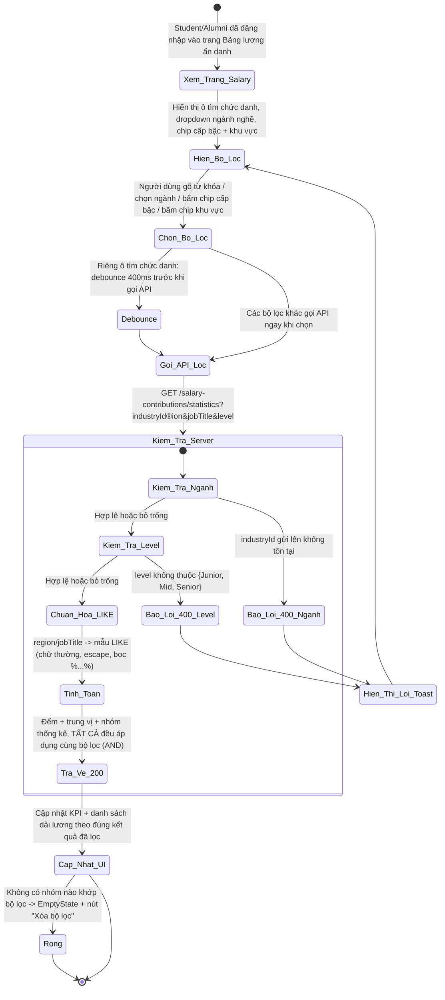
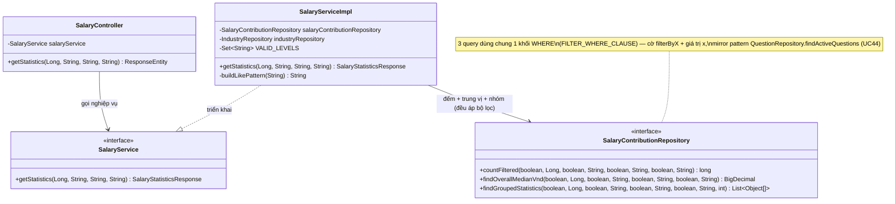

# ĐẶC TẢ YÊU CẦU & THIẾT KẾ CHI TIẾT: UC54 - LỌC DỮ LIỆU LƯƠNG (FILTER SALARY DATA)

## PHẦN 1: ĐẶC TẢ NGHIỆP VỤ (REPORT 3)

### 2.2.3 Business Workflow (Luồng nghiệp vụ)



#### Mô tả chi tiết luồng xử lý bằng chữ (Business Step Description):
* **Bước 1 - Hiển thị bộ lọc**: Trên trang Bảng lương ẩn danh, dưới 4 thẻ KPI là khu vực bộ lọc: ô tìm kiếm chức danh (text, debounce 400ms giống UC44), dropdown ngành nghề (tái dùng `useIndustries`, UC50), chip cấp bậc (Junior/Mid/Senior, chọn 1 hoặc bỏ chọn), chip khu vực (suy ra động từ dữ liệu KHÔNG lọc gì — gọi riêng 1 query nền để chip khu vực luôn đủ tùy chọn dù đang lọc theo tiêu chí khác).
* **Bước 2 - Chọn bộ lọc**: Người dùng có thể kết hợp nhiều bộ lọc cùng lúc (VD: ngành CNTT + khu vực TP.HCM + cấp bậc Senior) — các bộ lọc áp dụng đồng thời theo quan hệ **AND**.
* **Bước 3 - Gọi & Kiểm tra phía Server**: Client gọi `GET /salary-contributions/statistics` kèm query param tương ứng bộ lọc đang chọn (bỏ trống param nào thì không lọc theo tiêu chí đó). Server (`SalaryServiceImpl.getStatistics`):
  * Nếu có `industryId`: kiểm tra tồn tại — không tồn tại → 400.
  * Nếu có `level`: kiểm tra thuộc {Junior, Mid, Senior} — sai → 400.
  * Chuẩn hóa `region`/`jobTitle` thành mẫu LIKE an toàn (chữ thường, escape ký tự đặc biệt, bọc `%...%`) — tái dùng cách làm của UC44 (Search questions).
  * Áp dụng TẤT CẢ điều kiện lọc đang bật (quan hệ AND) vào cả 3 phép tính: tổng số lượt (`totalContributions`, mọi loại tiền tệ), trung vị chung (`overallMedian`, chỉ VND), và danh sách nhóm thống kê (`rows`, chỉ VND, vẫn áp dụng ngưỡng tối thiểu 5 mẫu/nhóm — BR-VS-02 không đổi).
* **Bước 4 - Cập nhật giao diện**: KPI + danh sách dải lương cập nhật theo đúng kết quả đã lọc. Không có nhóm nào khớp → `EmptyState` kèm nút "Xóa bộ lọc" (chỉ hiện khi đang có ít nhất 1 bộ lọc bật).

---

### 3.13 Module Salary Board: Lọc dữ liệu lương

Module 4 (Q&A Forum & Salary Board). UC54 mở rộng UC53 (View salary statistics) bằng khả năng **lọc dữ liệu ở tầng Backend** theo 4 chiều: ngành nghề, khu vực, chức danh (từ khóa), cấp bậc — thay vì chỉ lọc khu vực phía Client như bản UC53 gốc. Cùng nhóm quyền xem với UC53 (Student + Alumni).

#### 3.13.1 Lọc dữ liệu lương (Filter salary data)

**Function trigger**: `/app/salary` → khu vực bộ lọc dưới 4 thẻ KPI → chọn/gõ 1 hoặc nhiều tiêu chí.
**Function description**:
*   **Actors/Roles**: Sinh viên (STUDENT) và Cựu sinh viên (ALUMNI) — giống hệt quyền xem thống kê (UC53); Guest bị chặn 401/redirect login.
*   **Purpose**: Giúp người xem thu hẹp phạm vi thống kê theo đúng vị trí/ngành/khu vực/kinh nghiệm họ quan tâm, thay vì phải lướt toàn bộ danh sách.
*   **Interface**: Ô tìm chức danh (icon kính lúp, nút xóa khi có nội dung), dropdown ngành nghề (`EntitySelectField`), chip cấp bậc, chip khu vực, nút "Xóa bộ lọc" (chỉ hiện khi đang lọc).

**Data processing**:
1.  Client gọi `GET /salary-contributions/statistics?industryId=&region=&jobTitle=&level=` (Bearer JWT) — chỉ gửi param của bộ lọc đang bật.
2.  Server: validate `industryId`/`level` nếu có (400 nếu sai), chuẩn hóa `region`/`jobTitle` thành mẫu LIKE, áp dụng đồng thời (AND) vào 3 query: đếm tổng, trung vị VND, nhóm thống kê VND (vẫn áp ngưỡng 5 mẫu/nhóm).
3.  Server trả HTTP 200 `ApiResponse<SalaryStatisticsResponse>` — cùng shape với UC53, chỉ khác giá trị đã được lọc.
4.  Client cập nhật UI theo kết quả mới; mỗi tổ hợp bộ lọc là 1 cache riêng (React Query `queryKey` gồm object filter) — đổi qua lại giữa các bộ lọc đã xem không cần gọi lại API trong 2 phút.

**Function details**:
*   **Data**:
    *   Tham số đầu vào (query param, đều tùy chọn): `industryId` (Long), `region` (String), `jobTitle` (String), `level` (String: "Junior"/"Mid"/"Senior").
    *   Trả về: `SalaryStatisticsResponse` — giống hệt UC53, giá trị đã lọc theo tiêu chí gửi lên.
*   **Validation**: `industryId` phải tồn tại trong bảng `industries`; `level` phải thuộc {Junior, Mid, Senior}; `region`/`jobTitle` không giới hạn định dạng (khớp substring).
*   **Business rules**: Xem mục 5.1 (BR-FS-01 → BR-FS-06).
*   **Error Handling**:
    *   `industryId` không tồn tại → 400 (MSG-FS-01).
    *   `level` không hợp lệ → 400 (MSG-FS-02).
    *   Guest chưa đăng nhập → 401 (MSG-FS-03).
*   **Normal case**: Chọn 1 hoặc nhiều bộ lọc, hệ thống trả đúng thống kê khớp TẤT CẢ tiêu chí (AND), UI cập nhật mượt.
*   **Abnormal case**: `industryId`/`level` sai → 400; Guest → 401; không có nhóm nào khớp → `EmptyState`, không phải lỗi.

---

### 5. Requirement Appendix (Phụ lục Yêu cầu)

#### 5.1 Business Rules (Quy tắc Nghiệp vụ)

| ID | Định nghĩa Quy tắc (Rule Definition) |
| :--- | :--- |
| BR-FS-01 | Các bộ lọc (`industryId`, `region`, `jobTitle`, `level`) áp dụng theo quan hệ **AND** — chọn nhiều tiêu chí thì kết quả phải khớp TẤT CẢ, không phải OR. |
| BR-FS-02 | `region`/`jobTitle` khớp theo kiểu **substring, không phân biệt hoa/thường** (LIKE `%...%`, đã escape ký tự đặc biệt) — không cần gõ chính xác toàn bộ. |
| BR-FS-03 | `level` chỉ chấp nhận đúng 3 giá trị: "Junior" (< 2 năm kinh nghiệm hoặc để trống), "Mid" (2-5 năm), "Senior" (> 5 năm) — khớp đúng cách suy cấp bậc đã có từ UC53 (BR-VS-03). Giá trị khác → 400. |
| BR-FS-04 | Khi lọc theo `region` bằng đúng nhãn **"Chưa xác định"** (nhãn hiển thị cho khu vực bỏ trống, do chính API sinh ra), hệ thống hiểu là lọc các bản ghi có khu vực trống/null — không so khớp text theo nghĩa đen. |
| BR-FS-05 | Bộ lọc **không thay đổi** ngưỡng bảo vệ ẩn danh đã có từ UC53 (BR-VS-02) — một nhóm vẫn chỉ hiển thị khi đạt tối thiểu 5 mẫu **sau khi đã áp dụng bộ lọc**. |
| BR-FS-06 | Bộ lọc áp dụng đồng thời lên cả `totalContributions` (mọi loại tiền tệ), `overallMedian` và `rows` (chỉ VND) — khác với hành vi gốc của UC53 (`totalContributions` trước đây luôn là số toàn hệ thống, không đổi theo bộ lọc). |

#### 5.2 Common Requirements (Yêu cầu Chung)
*   Mọi thông điệp lỗi hiển thị cho người dùng đều bằng **Tiếng Việt**.
*   Không tạo migration mới — UC54 chỉ thêm điều kiện `WHERE` vào các query đọc đã có từ UC53, không đổi schema.
*   Ô tìm chức danh debounce 400ms trước khi gọi API (cùng cơ chế UC44 - Search questions) — tránh gửi request dồn dập khi đang gõ.
*   Chip khu vực lấy từ 1 query **KHÔNG lọc gì** (gọi song song với query đang hiển thị) — đảm bảo danh sách khu vực luôn đầy đủ, không bị thu hẹp dần khi người dùng đã chọn sẵn 1 bộ lọc khác (VD đã lọc theo ngành thì vẫn thấy đủ mọi khu vực để chọn tiếp, không chỉ những khu vực có trong tập đã lọc theo ngành đó).
*   Mỗi tổ hợp bộ lọc là 1 khóa cache riêng (React Query) — đổi qua lại giữa các bộ lọc đã xem trong 2 phút không cần gọi lại API.

#### 5.3 Application Messages List (Danh sách Thông điệp Ứng dụng)

| # | Mã thông điệp | Loại thông điệp | Ngữ cảnh | Nội dung hiển thị | HTTP |
| :--- | :--- | :--- | :--- | :--- | :--- |
| 1 | MSG-FS-01 | Toast lỗi | industryId không tồn tại | Ngành nghề không tồn tại | 400 |
| 2 | MSG-FS-02 | Toast lỗi | level không hợp lệ | Cấp bậc không hợp lệ (chỉ chấp nhận Junior/Mid/Senior) | 400 |
| 3 | MSG-FS-03 | Chặn bởi Spring Security / ProtectedRoute | Guest chưa đăng nhập | Bạn chưa đăng nhập hoặc phiên làm việc đã hết hạn. | 401 |
| 4 | MSG-FS-04 | EmptyState | Không có nhóm nào khớp bộ lọc | Không có dữ liệu lương khớp bộ lọc này | 200 (rỗng) |

---

## PHẦN 2: THIẾT KẾ CHI TIẾT (REPORT 4)

### 3. Detail Design (Thiết kế chi tiết)

#### 3.1 Chức năng Lọc dữ liệu lương (Filter salary data)

##### 3.1.1 Class Diagram (Sơ đồ Lớp)



###### Mô tả chi tiết cấu trúc các lớp (Class Design Description):
* **Lớp Controller (`SalaryController`)**: `GET /api/v1/salary-contributions/statistics` bổ sung 4 `@RequestParam(required = false)`: `industryId`, `region`, `jobTitle`, `level` — truyền thẳng xuống `salaryService.getStatistics`.
* **Lớp Service (`SalaryServiceImpl`)**: `getStatistics` bổ sung: validate `industryId` tồn tại (400), validate `level` thuộc `VALID_LEVELS` (400), chuẩn hóa `region`/`jobTitle` qua `buildLikePattern` (helper mới, sao chép cách làm `QuestionServiceImpl.buildLikePattern` — chữ thường, escape, bọc `%...%`), rồi truyền các cờ `filterByX` + giá trị tương ứng vào cả 3 method Repository.
* **Lớp Repository (`SalaryContributionRepository`)**: 3 method thống kê (`countFiltered` mới, `findOverallMedianVnd`, `findGroupedStatistics` sửa lại) đều nhận thêm 8 tham số lọc (4 cặp `filterByX`/`x`) và dùng chung 1 hằng số `FILTER_WHERE_CLAUSE` (Java text block, nối vào từng câu native SQL) — tránh lặp lại khối điều kiện 3 lần. Quy ước cờ `filterByX = false` thì bỏ qua điều kiện, mirror pattern `QuestionRepository.findActiveQuestions` (UC44) thay vì so sánh `:param IS NULL` trực tiếp.

##### 3.1.2 Sequence Diagram (Sơ đồ Tuần tự)

```mermaid
sequenceDiagram
    autonumber
    actor Client as Frontend / Client
    participant Ctrl as SalaryController
    participant Service as SalaryServiceImpl
    participant IndRepo as IndustryRepository
    participant SRepo as SalaryContributionRepository
    participant DB as PostgreSQL

    Note over Client, Ctrl: Guest chưa đăng nhập bị Spring Security (BE) / ProtectedRoute (FE) chặn 401 trước Controller
    Client->>Ctrl: HTTP GET /salary-contributions/statistics?industryId=1&level=Mid (Bearer JWT)
    Ctrl->>Service: getStatistics(1, null, null, "Mid")

    alt Trường hợp 1: industryId không tồn tại
        Service->>IndRepo: existsById(industryId)
        IndRepo-->>Service: false
        Service-->>Ctrl: BadRequestException("Ngành nghề không tồn tại") -> HTTP 400
    else Trường hợp 2: level không hợp lệ
        Note over Service: level không thuộc {Junior, Mid, Senior}
        Service-->>Ctrl: BadRequestException("Cấp bậc không hợp lệ...") -> HTTP 400
    else Trường hợp 3: Hợp lệ (Thành công)
        Service->>IndRepo: existsById(industryId) -> true
        Note over Service: buildLikePattern() cho region/jobTitle nếu có; dựng cờ filterByX
        Service->>SRepo: countFiltered(true, 1, false, null, false, null, true, "Mid")
        SRepo->>DB: SELECT COUNT(*) WHERE industry_id=1 AND level='Mid'
        DB-->>SRepo: totalContributions
        Service->>SRepo: findOverallMedianVnd(true, 1, false, null, false, null, true, "Mid")
        SRepo->>DB: SELECT PERCENTILE_CONT(0.5) ... WHERE currency='VND' AND industry_id=1 AND level='Mid'
        DB-->>SRepo: overallMedian
        Service->>SRepo: findGroupedStatistics(true, 1, false, null, false, null, true, "Mid", 5)
        SRepo->>DB: SELECT ... GROUP BY ... HAVING COUNT(*) >= 5 (cùng điều kiện lọc)
        DB-->>SRepo: List<Object[]>
        Service-->>Ctrl: SalaryStatisticsResponse (đã lọc)
        Ctrl-->>Client: HTTP 200 OK
        Note over Client: cache theo queryKey ['salary-statistics', {industryId:1, level:'Mid'}]
    end
```

###### Mô tả chi tiết luồng xử lý bằng chữ (Sequence Flow Description):
1.  **Luồng thành công**: Client gửi query param cho bộ lọc đang bật. Service validate `industryId`/`level` nếu có, chuẩn hóa `region`/`jobTitle`, gọi 3 method Repository với cùng bộ cờ lọc, dựng DTO trả về. Trả HTTP 200.
2.  **Luồng lỗi `industryId` không tồn tại (400)**: Kiểm tra qua `industryRepository.existsById` trước khi chạm tới Repository thống kê.
3.  **Luồng lỗi `level` không hợp lệ (400)**: So khớp với `VALID_LEVELS = {"Junior", "Mid", "Senior"}`, giá trị khác (VD "Expert") bị từ chối ngay tại Service, không chạm DB.
4.  **Luồng không có bộ lọc**: Mọi query param bỏ trống → hành vi giống hệt UC53 gốc (xem toàn bộ).

### 4. Kết quả kiểm thử thực tế
* ✅ `mvn -q -o compile` (Backend) — BUILD SUCCESS.
* ✅ `npm run build` (`tsc -b && vite build`, Frontend) — PASS.
* ⏳ Chưa test tay qua UI/Postman trong phiên này — cần user restart Backend rồi test: lọc theo từng tiêu chí riêng lẻ, kết hợp nhiều tiêu chí (kiểm tra đúng AND), `industryId`/`level` sai (kỳ vọng 400), không có dữ liệu khớp (kỳ vọng EmptyState không phải lỗi).
