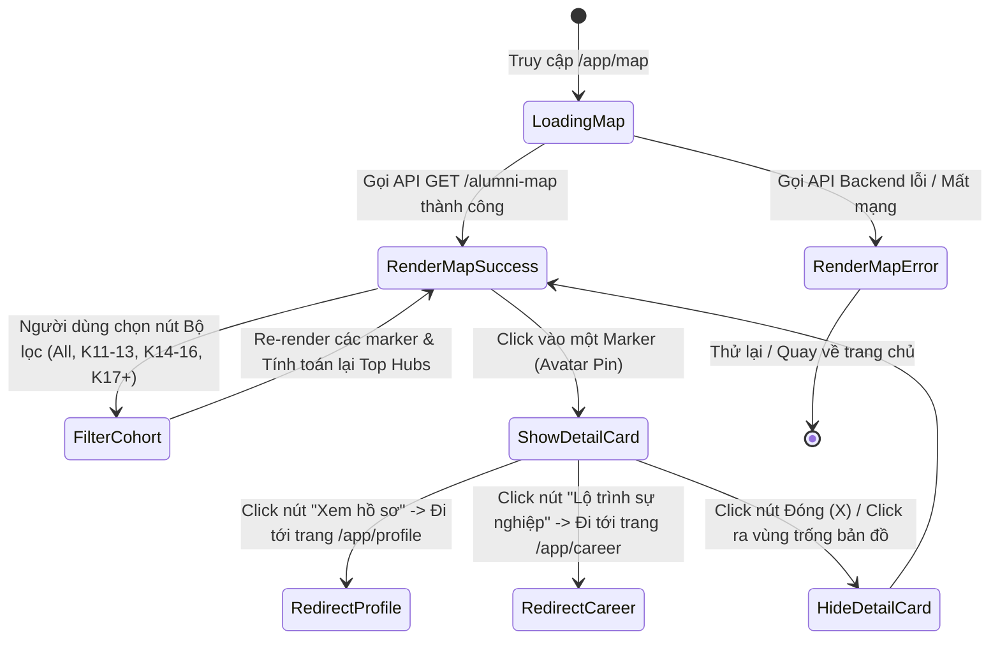
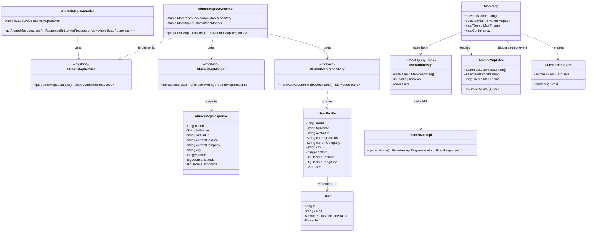
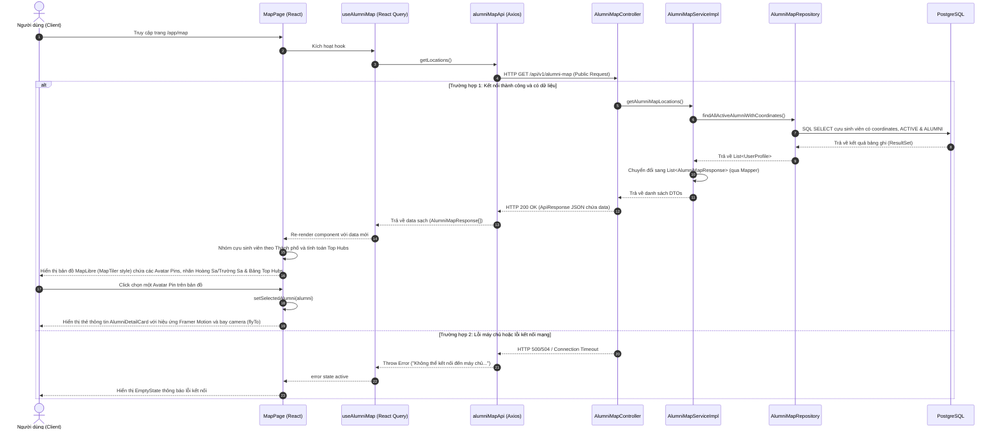

# ĐẶC TẢ YÊU CẦU & THIẾT KẾ CHI TIẾT: UC55 - XEM HỒ SƠ QUA BẢN ĐỒ

## PHẦN 1: ĐẶC TẢ NGHIỆP VỤ (REPORT 3)

### 2.2.3 Business Workflow (Luồng nghiệp vụ)

Sơ đồ trạng thái nghiệp vụ (State Diagram) của chức năng Bản đồ cựu sinh viên:

#### Mô tả chi tiết luồng xử lý bằng chữ (Business Step Description):
* **Bước 1 - Khởi đầu**: Khi người dùng (Sinh viên/Cựu sinh viên) click vào mục **"Alumni Map"** trên thanh điều hướng Navbar. Hệ thống chuyển hướng sang đường dẫn `/app/map` và kích hoạt luồng fetch dữ liệu từ API `/api/v1/alumni-map`.
* **Bước 2 - Kết xuất bản đồ (Render)**:
  * Nếu thành công: Bản đồ MapLibre GL JS được khởi tạo, hiển thị các marker cựu sinh viên tương ứng dưới dạng **Avatar Pin** trên nền bản đồ **MapTiler** (hoặc CARTO/ESRI fallback). Đồng thời, hệ thống thống kê top 5 thành phố tập trung đông cựu sinh viên nhất (Top Hubs) ở bảng bên phải.
  * Nếu thất bại (chưa đăng nhập/lỗi token): Trả về lỗi 403/401 và hiển thị màn hình báo lỗi trống.
* **Bước 3 - Tương tác bộ lọc, Chủ đề & Marker**:
  * Người dùng có thể lọc danh sách theo khóa học (Cohort). Khi chọn bộ lọc, bản đồ tự động cập nhật marker và tính lại Top Hubs cục bộ.
  * Người dùng có thể thay đổi các chủ đề bản đồ (Đường phố, Tối giản, Đêm tối, Hiện đại, Pastel, Vệ tinh) thông qua bộ chọn nổi góc dưới bên trái.
  * Khi click vào một Avatar Pin, hệ thống bật sáng viền marker và mở pop-up chi tiết tóm tắt của cựu sinh viên đó ở góc dưới.
* **Bước 4 - Điều hướng & Biển đảo**:
  * Bản đồ hiển thị đầy đủ và rõ ràng Quần đảo Hoàng Sa và Trường Sa bằng lớp phủ GeoJSON để khẳng định chủ quyền biển đảo Việt Nam.
  * Người dùng có thể click **"Xem hồ sơ"** hoặc **"Lộ trình sự nghiệp"** để đi đến các trang tương ứng.

---

### 3.2 Module Bản Đồ (3.2 Alumni Map Module)
Module hỗ trợ hiển thị phân bố địa lý mạng lưới cựu sinh viên FPT trên bản đồ trực quan.

#### 3.2.1 Xem hồ sơ qua bản đồ (UC55)

**Function trigger**:
*   **Navigation path**: Navbar -> "Alumni Map" -> `/app/map`
*   **Timing Frequency**: On screen mount (Mỗi khi màn hình được render).

*   **Actors/Roles**: Tất cả mọi người (bao gồm cả khách vãng lai GUEST chưa đăng nhập và người dùng đã xác thực).
*   **Purpose**: Hiển thị phân bố vị trí địa lý của mạng lưới cựu sinh viên FPT và xem thông tin tóm tắt nghề nghiệp của họ để kết nối.
*   **Interface**:
    *   *Bản đồ chính*: Hiển thị bản đồ nền, các nút điều hướng zoom (+/-) và các marker Avatar đại diện cho từng cựu sinh viên có thông tin tọa độ.
    *   *Bộ lọc*: Các nút tròn bộ lọc khóa học (All cohorts, K11-K13, K14-K16, K17+).
    *   *Thẻ chi tiết (Detail Card)*: Xuất hiện khi click vào marker. Hiển thị Avatar, Họ tên, Vị trí làm việc, Tên công ty, Thành phố và các nút điều hướng.
    *   *Bảng Top Hubs*: Nằm ở sidebar bên phải, liệt kê danh sách top 5 thành phố có nhiều cựu sinh viên nhất xếp hạng giảm dần.
    *   *Trạng thái tải (Loading)*: Shimmer skeleton màu kem ấm trôi nổi khi đang tải dữ liệu từ API.

**Data processing**:
1. Client gửi HTTP GET request tới endpoint công khai `GET /api/v1/alumni-map`.
2. Backend tiếp nhận yêu cầu công khai không yêu cầu token xác thực.
3. Backend truy vấn cơ sở dữ liệu lấy danh sách hồ sơ có vĩ độ/kinh độ, có tài khoản hoạt động (`ACTIVE`) và có vai trò `ALUMNI`.
4. Trả dữ liệu JSON về client. Client lọc dữ liệu theo bộ lọc cohort đã chọn và vẽ marker lên bản đồ nền MapTiler Style (hoặc CARTO/ESRI raster tiles làm fallback tự động nếu thiếu API Key). Lớp phủ địa lý về Hoàng Sa/Trường Sa cũng được tự động vẽ lên trên bản đồ nền bằng GeoJSON cục bộ.

**Screen layout**:
*   *Layout dạng Grid*: 2 cột trên màn hình Desktop (Bản đồ chiếm 8 phần bên trái, bảng Top Hubs chiếm 4 phần bên phải). Trên màn hình Mobile tự động chuyển thành 1 cột xếp chồng dọc.

**Function details**:
*   **Data (Dữ liệu tham gia)**:
    *   `userId` (Khóa chính)
    *   `fullName` (Họ và tên cựu sinh viên)
    *   `avatarUrl` (Link ảnh đại diện)
    *   `currentPosition` (Chức danh công việc hiện tại)
    *   `currentCompany` (Công ty hiện tại)
    *   `city` (Thành phố đang làm việc)
    *   `cohort` (Khóa học của cựu sinh viên)
    *   `latitude` (Vĩ độ địa lý)
    *   `longitude` (Kinh độ địa lý)
*   **Validation**: Không có dữ liệu đầu vào cần người dùng nhập liệu, chỉ có các tham số bộ lọc an toàn.
*   **Business rules**:
    *   Chỉ hiển thị các tài khoản ở trạng thái hoạt động bình thường (`ACTIVE`). Không hiển thị tài khoản bị khóa (`LOCKED`), chưa kích hoạt (`PENDING`) hoặc chờ phê duyệt (`WAITING_APPROVAL`).
    *   Chỉ hiển thị tài khoản có vai trò là cựu sinh viên (`ALUMNI`).
    *   Không để lộ các thông tin riêng tư nhạy cảm như Email, Số điện thoại, Địa chỉ chi tiết (chỉ hiển thị Thành phố/Khu vực chung).
*   **Error Handling**: Trả về màn hình trống nếu database chưa có dữ liệu cựu sinh viên nào có tọa độ.
*   **Normal case**: Lấy danh sách vị trí thành công (HTTP 200 OK), vẽ marker đầy đủ lên bản đồ.
*   **Abnormal case**: Lỗi kết nối mạng hoặc lỗi server trả về mã HTTP 500/504, hiển thị component `EmptyState` báo lỗi.

---

### 5. Requirement Appendix (Phụ lục Yêu cầu)

#### 5.1 Business Rules (Quy tắc Nghiệp vụ)

| ID | Định nghĩa Quy tắc (Rule Definition) |
| :--- | :--- |
| BR-MAP-01 | Chỉ hiển thị các cựu sinh viên có tài khoản `ACTIVE` và vai trò `ALUMNI` trên bản đồ. |
| BR-MAP-02 | Các tọa độ địa lý (vĩ độ, kinh độ) của Alumni phải hợp lệ (khác null). |
| BR-MAP-03 | Không trả về và hiển thị các trường thông tin nhạy cảm của cựu sinh viên (email, số điện thoại, địa chỉ chi tiết) trên API và UI bản đồ. |
| BR-MAP-04 | Bản đồ phải hỗ trợ cơ chế dự phòng (fallback) tự động sang CARTO raster tiles (hoặc ESRI World Imagery đối với Vệ tinh) khi thiếu khóa MapTiler API Key để hệ thống không bị crash. |
| BR-MAP-05 | Luôn hiển thị nhãn và marker tròn Quần đảo Hoàng Sa và Quần đảo Trường Sa thuộc chủ quyền Việt Nam trên tất cả các style bản đồ nền. |

#### 5.3 Application Messages List (Danh sách Thông điệp)

| # | Mã thông điệp | Loại thông điệp | Ngữ cảnh | Nội dung hiển thị |
| :--- | :--- | :--- | :--- | :--- |
| 1 | MSG-MAP-01 | In line (EmptyState) | Không có kết quả lọc theo cohort | Không tìm thấy cựu sinh viên nào thuộc niên khóa này có tọa độ địa lý. |
| 2 | MSG-MAP-02 | In line (EmptyState) | Lỗi kết nối mạng/Không gọi được API | Không thể kết nối đến máy chủ để lấy dữ liệu vị trí. |
| 3 | MSG-MAP-03 | Toast / Alert | Token hết hạn / Không hợp lệ | Phiên đăng nhập hết hạn. Vui lòng đăng nhập lại. |

---

## PHẦN 2: THIẾT KẾ CHI TIẾT (REPORT 4)

### 3. Detail Design (Thiết kế chi tiết)

#### 3.1 Xem hồ sơ qua bản đồ (UC55)

##### 3.1.1 Class Diagram (Sơ đồ Lớp)

Sơ đồ lớp thực tế tham gia triển khai tính năng:

##### 3.1.2 Sequence Diagram (Sơ đồ Tuần tự)

Sơ đồ tuần tự tương tác hệ thống của UC55:

