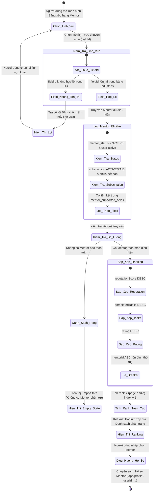
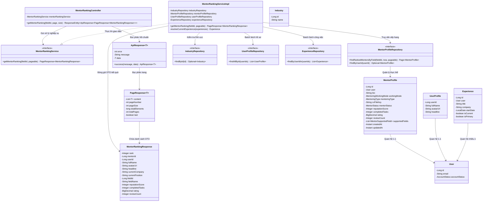
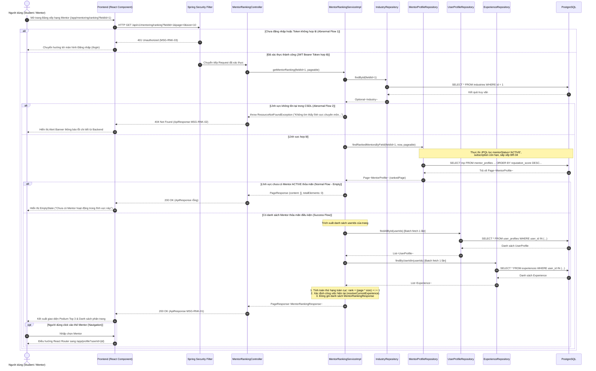

# ĐẶC TẢ YÊU CẦU & THIẾT KẾ CHI TIẾT: UC97 - XEM BẢNG XẾP HẠNG MENTOR

---

## PHẦN 1: ĐẶC TẢ NGHIỆP VỤ (REPORT 3)

### 2.2.3 Business Workflow (Luồng nghiệp vụ)

Chức năng **UC97 — Xem bảng xếp hạng Mentor (View Mentor Ranking)** cho phép người học (Student) và cựu sinh viên (Alumni) tra cứu danh sách các Mentor tiêu biểu được xếp hạng độc lập theo từng lĩnh vực chuyên môn (Industry / Field). Thứ hạng được hệ thống tính toán tự động dựa trên thuật toán xếp hạng uy tín (Deterministic Ranking Algorithm) kết hợp với các tiêu chí lọc tư cách hoạt động (Mentor Eligibility & Subscription Active).

#### Mô tả chi tiết luồng xử lý bằng chữ (Business Step Description):
* **Bước 1 - Khởi đầu (Trigger)**: Người dùng (Sinh viên hoặc Cựu sinh viên) truy cập vào Bảng xếp hạng Mentor qua đường dẫn `/app/mentoring/ranking` hoặc nhấp vào nút "Bảng xếp hạng Mentor" tại trang chủ Cố vấn.
* **Bước 2 - Tải danh mục lĩnh vực & Chọn mặc định**: Hệ thống tải danh mục các ngành nghề chuẩn (`industries`). Nếu URL chưa có tham số `fieldId`, hệ thống tự động chọn ngành nghề đầu tiên làm mặc định.
* **Bước 3 - Gửi yêu cầu truy vấn xếp hạng**: Frontend gửi yêu cầu `GET /api/v1/mentoring/ranking?fieldId={fieldId}&page={page}&size={size}` kèm Bearer JWT Token.
* **Bước 4 - Xác thực lĩnh vực chuyên môn (Field Validation)**: Backend kiểm tra `fieldId` trong bảng `industries`. Nếu không tìm thấy, trả về lỗi HTTP 404 (`MSG-RNK-02`).
* **Bước 5 - Lọc Mentor đủ điều kiện (Eligibility Filtering)**: Backend thực thi truy vấn JPA lọc các hồ sơ thỏa mãn toàn bộ 4 điều kiện:
  1. `mentor_profiles.mentor_status = 'ACTIVE'`: Đã hoàn thiện hồ sơ, CV, tài khoản ngân hàng và chấp nhận điều khoản.
  2. `users.account_status = 'ACTIVE'`: Tài khoản hoạt động bình thường, không bị khóa.
  3. Thuộc lĩnh vực được chỉ định thông qua `mentor_supported_fields`.
  4. Có gói đăng ký `mentor_subscriptions` trạng thái `ACTIVE` hoặc `PAID` và thời điểm hết hạn `end_date > CURRENT_TIMESTAMP`.
* **Bước 6 - Sắp xếp theo thuật toán xếp hạng (Ranking Algorithm)**:
  1. `reputationScore DESC` (Điểm uy tín cao hơn đứng trước).
  2. `completedTasks DESC` (Số nhiệm vụ hoàn thành nhiều hơn đứng trước).
  3. `rating DESC` (Đánh giá trung bình cao hơn đứng trước).
  4. `id ASC` (Khóa chính hồ sơ nhỏ hơn đứng trước làm tie-breaker ổn định).
* **Bước 7 - Tính toán thứ hạng toàn cục & Batch Fetching**:
  - Thứ hạng được tính liên tục theo phân trang: $\text{rank} = (\text{page} \times \text{size}) + \text{index} + 1$.
  - Tầng Service tải trước hàng loạt hồ sơ `UserProfile` và kinh nghiệm `Experience` của toàn bộ Mentor trong trang chỉ bằng 2 truy vấn SQL đơn lẻ nhằm triệt tiêu hoàn toàn lỗi N+1 query.
* **Bước 8 - Kết xuất giao diện (UI Rendering)**:
  - Nếu danh sách rỗng: Hiển thị `EmptyState` thân thiện kèm thông báo lĩnh vực chưa có cố vấn đang hoạt động.
  - Nếu có dữ liệu: Hiển thị Podium Top 3 vinh danh (#1 Quán quân ở trung tâm, #2 Bạc bên trái, #3 Đồng bên phải) nếu ở trang 0, kèm danh sách chi tiết các thẻ Mentor bên dưới và bộ phân trang `Pagination`.
* **Bước 9 - Điều hướng hồ sơ cá nhân**: Khi người dùng click vào Mentor, hệ thống sử dụng React Router điều hướng đến hồ sơ cá nhân `/app/profile?userId=${userId}`.

---

### 3.2 Mentorship Module (Cố vấn nghề nghiệp)

Module Mentorship trong hệ sinh thái AlumNect kết nối sinh viên và cựu sinh viên, tạo môi trường chia sẻ tri thức và định hướng sự nghiệp minh bạch, bền vững.

#### 3.2.1 Xem bảng xếp hạng Mentor theo lĩnh vực (UC97)

**Function trigger**:
* **Navigation path**:
  - Trang chủ Cố vấn -> Nút "Bảng xếp hạng Mentor" -> `/app/mentoring/ranking`
  - Hoặc truy cập trực tiếp kèm tham số: `/app/mentoring/ranking?fieldId=1`
* **Timing Frequency**: On demand (bất cứ khi nào người dùng muốn tra cứu cố vấn xuất sắc) và On screen mount.

**Function description**:
* **Actors/Roles**:
  - **Student**: Sinh viên muốn tìm kiếm Mentor uy tín hàng đầu trong ngành để học hỏi.
  - **Mentor / Alumni**: Cựu sinh viên muốn theo dõi vị trí xếp hạng và điểm uy tín của bản thân cũng như đồng nghiệp.
* **Purpose**: Cung cấp cái nhìn trực quan, minh bạch và chính xác về thứ tự uy tín của các Mentor trong từng lĩnh vực đào tạo; tạo động lực nâng cao chất lượng hướng dẫn và hỗ trợ sinh viên dễ dàng chọn lựa người đồng hành phù hợp nhất.
* **Interface**:
  - **Header Banner**: Tiêu đề "Bảng Xếp Hạng Cố Vấn FPT", huy hiệu vinh danh, mô tả cơ chế chấm điểm.
  - **Field Selector**: Thanh chọn tab cuộn ngang mềm mại hiển thị danh sách 11 ngành nghề chuẩn đối chiếu với FPTU.
  - **Podium Showcase (Top 3)**: Khối vinh danh 3 Mentor xuất sắc nhất (hiển thị khi ở trang 0).
  - **Ranking List**: Danh sách thẻ Mentor hiển thị Rank, Avatar, Họ tên, Chức vụ/Công ty hiện tại, Điểm uy tín, Số nhiệm vụ hoàn thành, Đánh giá sao.
  - **Pagination Controls**: Bộ chuyển trang thông minh, giữ nguyên thứ hạng toàn cục.
  - **Các trạng thái**:
    - *Loading State*: Shimmer Skeleton kem ấm mô phỏng trước Podium và các dòng thẻ.
    - *Empty State*: Component `EmptyState` với hình pastel và thông báo thân thiện.
    - *Error State*: Alert Banner hiển thị nguyên nhân lỗi từ `error.message`.

**Data processing**:
1. Tiếp nhận tham số `fieldId`, `page`, `size` từ Controller.
2. Kiểm tra sự tồn tại của `fieldId` qua `IndustryRepository`. Nếu không tồn tại: ném `ResourceNotFoundException`.
3. Thực thi câu lệnh truy vấn JPA phân trang `findRankedMentorsByField(fieldId, now, pageable)` lọc Mentor `ACTIVE`, tài khoản active, subscription còn hạn, sắp xếp theo BR-04.
4. Lấy danh sách `userIds` của trang hiện tại, batch fetch dữ liệu từ `UserProfileRepository` và `ExperienceRepository`.
5. Tính toán thứ hạng toàn cục `rank = (page * size) + index + 1` cho từng Mentor.
6. Đóng gói kết quả vào `PageResponse<MentorRankingResponse>` và phản hồi về Client qua `ApiResponse`.

**Screen layout**:
* Desktop (lg): Bố cục lưới thoáng đãng gồm Hero Banner, thanh chọn lĩnh vực dạng pill tabs, khối Podium Top 3 trải rộng 3 cột, danh sách thẻ Mentor bên dưới và bộ phân trang căn giữa.
* Mobile / Tablet: Tự động co giãn thành danh sách 1 cột liền mạch, thanh chọn tab vuốt chạm cảm ứng mượt mà.

**Function details**:
* **Data**:
  - `rank`: Thứ hạng (1, 2, 3...).
  - `mentorId`: Khóa chính hồ sơ Mentor (`mentor_profiles.id`).
  - `userId`: ID tài khoản người dùng (`users.id`).
  - `fullName`: Họ và tên hiển thị của Mentor.
  - `avatarUrl`: Đường dẫn ảnh đại diện.
  - `headline`: Dòng giới thiệu tiêu đề ngắn.
  - `currentCompany`: Công ty công tác hiện tại.
  - `currentPosition`: Chức danh / vị trí công tác hiện tại.
  - `fieldId`: ID lĩnh vực chuyên môn (`industries.id`).
  - `fieldName`: Tên lĩnh vực chuyên môn (`industries.name`).
  - `reputationScore`: Điểm uy tín tổng hợp của Mentor.
  - `completedTasks`: Tổng số buổi/nhiệm vụ cố vấn đã hoàn tất thành công.
  - `rating`: Điểm đánh giá trung bình (thang điểm 5.0).
  - `reviewCount`: Tổng số lượng đánh giá nhận được.
* **Validation**:
  - `fieldId` bắt buộc phải là số nguyên dương và có tồn tại trong bảng `industries`.
  - `page >= 0` (mặc định 0), `size` nằm trong khoảng từ 1 đến 50 (mặc định 10).
* **Business rules**:
  - Tuân thủ nghiêm ngặt các quy tắc BR-01 đến BR-07 (mục 5.1).
* **Error Handling**:
  - Không truyền Access Token: HTTP 401 Unauthorized (`MSG-RNK-03`).
  - `fieldId` không tồn tại: HTTP 404 Not Found (`MSG-RNK-02`).
  - Lỗi máy chủ cơ sở dữ liệu: HTTP 500 Internal Server Error (`MSG-RNK-04`).
* **Normal case**: Người dùng nhận HTTP 200 OK kèm payload `ApiResponse<PageResponse<MentorRankingResponse>>` với `error: 0`, giao diện hiển thị danh sách thứ hạng chính xác.
* **Abnormal case**: Lĩnh vực chưa có Mentor nào hoạt động, hệ thống trả về mảng rỗng hợp lệ kèm `totalElements = 0`, Frontend hiển thị giao diện EmptyState mà không báo lỗi.

---

### 5. Requirement Appendix (Phụ lục Yêu cầu)

#### 5.1 Business Rules (Quy tắc Nghiệp vụ)

| ID | Định nghĩa Quy tắc (Rule Definition) |
| :--- | :--- |
| **BR-01** | **Ranking theo từng lĩnh vực riêng biệt**: Bảng xếp hạng Mentor được tính toán hoàn toàn độc lập cho từng Mentor Field (`industries.id`). Tuyệt đối không tồn tại một bảng xếp hạng chung gộp tất cả Mentor thuộc mọi lĩnh vực với nhau. |
| **BR-02** | **Điều kiện Mentor đủ tư cách xếp hạng (Eligibility)**: Một Mentor chỉ được xuất hiện trong bảng xếp hạng khi đồng thời thỏa mãn: (1) `mentor_profiles.mentor_status = 'ACTIVE'`; (2) `users.account_status = 'ACTIVE'`; (3) Hồ sơ có liên kết với lĩnh vực được chọn trong `mentor_supported_fields`; (4) Gói Mentor Subscription đang có hiệu lực. |
| **BR-03** | **Chỉ số hiển thị tối thiểu**: Mỗi mục trong bảng xếp hạng bắt buộc phải có đầy đủ: Thứ hạng (`rank`), `mentorId`, `userId`, Họ tên (`fullName`), Ảnh đại diện (`avatarUrl`), Lĩnh vực (`fieldName`), Điểm uy tín (`reputationScore`), Số tác vụ hoàn thành (`completedTasks`). |
| **BR-04** | **Thuật toán sắp xếp thứ hạng (Deterministic Ranking Algorithm)**: Sắp xếp theo thứ tự ưu tiên xác định: (1) `reputationScore DESC`; (2) `completedTasks DESC`; (3) `rating DESC`; (4) `id ASC` (tie-breaker ổn định tuyệt đối, đảm bảo cùng một tập dữ liệu luôn trả về cùng một thứ tự xếp hạng). |
| **BR-05** | **Tính toán thứ hạng toàn cục qua phân trang**: Thứ hạng `rank` phải được tính trên toàn bộ tập dữ liệu phù hợp của lĩnh vực trước khi phân trang theo công thức: $\text{rank} = (\text{page} \times \text{size}) + \text{index} + 1$. Tuyệt đối không reset thứ hạng về 1 khi chuyển sang trang tiếp theo. |
| **BR-06** | **Xử lý thời hạn Subscription**: Mentor có subscription hết hạn (`endDate <= CURRENT_TIMESTAMP`) hoặc bị hủy không được xuất hiện trong bảng xếp hạng và không được tính vào `totalElements`. |
| **BR-07** | **Không làm biến đổi dữ liệu (Read-only API)**: Chức năng UC97 là API truy vấn đọc thuần túy, tuyệt đối không cập nhật điểm uy tín, không tăng view count, không sửa hồ sơ hay tự gia hạn gói khi người dùng mở bảng xếp hạng. |

#### 5.1.1 Quy chế & Công thức tính điểm uy tín Mentor (Reputation Scoring Specification)

$$\mathbf{Reputation\ Score} = (\text{Base} + S_{\text{reviews}} + S_{\text{bonus}}) - S_{\text{penalty}}$$

##### 1. Điểm nền tảng hồ sơ & Xác thực ($S_{\text{base}}$):
* **Xác thực cựu sinh viên (Alumni Verification):** Hồ sơ cựu sinh viên được Nhà trường / Hệ thống duyệt thành công: **+50 điểm khởi đầu**.
* **Đầy đủ hồ sơ năng lực:** Cập nhật đầy đủ chức danh, công ty hiện tại, CV và liên kết nghề nghiệp (LinkedIn/GitHub): **+10 điểm**.

##### 2. Điểm chất lượng từ đánh giá của học viên ($S_{\text{reviews}}$):
Học viên sau khi kết nối và nhận tư vấn sẽ chấm điểm Mentor từ **1 đến 5 sao**:
* **5 sao (Xuất sắc & Tận tâm):** **+10 điểm**
* **4 sao (Hài lòng & Tốt):** **+5 điểm**
* **3 sao (Bình thường):** **+0 điểm**
* **2 sao (Chưa tốt / Qua loa):** **-10 điểm**
* **1 sao (Rất tệ / Thái độ không tốt):** **-25 điểm**
* *Điểm đánh giá trung bình `rating` được cập nhật tự động theo công thức trung bình cộng của toàn bộ `review_count`.*

##### 3. Điểm thưởng tính chuyên nghiệp ($S_{\text{bonus}}$):
* **Tỷ lệ phản hồi nhanh (Response Rate):** Phản hồi tin nhắn thắc mắc của sinh viên trong vòng 24 giờ: **+2 điểm / lượt**.
* **Chuỗi đánh giá tích cực (Streak):** Đạt 5 lượt đánh giá liên tiếp 4–5 sao mà không có bất kỳ phản hồi tiêu cực nào: **+20 điểm thưởng**.

##### 4. Điểm phạt vi phạm ($S_{\text{penalty}}$):
* **Bị sinh viên báo cáo (Report) vi phạm:** Bị phản ánh về thái độ ứng xử hoặc nội dung không phù hợp và được Quản trị viên (Admin) phê duyệt: **-50 điểm / lần**.

##### 5. Quy tắc ràng buộc & Giới hạn an toàn:
* **Giới hạn cận dưới:** Điểm uy tín luôn thỏa mãn ràng buộc cơ sở dữ liệu `reputation_score >= 0` (điểm trừ không làm âm tổng điểm).
* **Chống gian lận (Anti-Spam):** Mỗi sinh viên chỉ được gửi đánh giá cho cùng 1 Mentor tối đa 1 lần trong vòng 7 ngày để tránh hành vi tạo tài khoản ảo cày điểm.
* **Chỉ số Completed Tasks:** Trường `completed_tasks` được ghi nhận theo **tổng số lượt tư vấn có đánh giá từ học viên** (`review_count` hợp lệ).

#### 5.2 Common Requirements (Yêu cầu Chung)
* Giao diện tuân thủ bảng màu Pastel Premium, các thẻ trắng mềm (`rounded-3xl`), font chữ `Plus Jakarta Sans` / `Sora`.
* Dữ liệu phân trang chuẩn qua Spring Data `PageResponse`.
* Ảnh đại diện tự động fallback sang chữ cái initials trên nền pastel ngẫu nhiên khi bị lỗi đường dẫn.
* Mọi hành động điều hướng trong ứng dụng sử dụng React Router, không tải lại toàn trang.
* Toàn bộ mã nguồn Java có chú thích Tiếng Việt chi tiết; tên hàm, biến và class viết bằng Tiếng Anh.

#### 5.3 Application Messages List (Danh sách Thông điệp Ứng dụng)

| # | Mã thông điệp (Message code) | Loại thông điệp (Message Type) | Ngữ cảnh (Context) | Nội dung hiển thị (Content) | HTTP Status |
| :---: | :--- | :--- | :--- | :--- | :---: |
| 1 | **MSG-RNK-01** | Toast / Inline | Lấy bảng xếp hạng Mentor thành công | Lấy bảng xếp hạng Mentor thành công | 200 OK |
| 2 | **MSG-RNK-02** | Alert Banner | `fieldId` không tồn tại trong hệ thống | Không tìm thấy lĩnh vực chuyên môn với ID: {fieldId} | 404 Not Found |
| 3 | **MSG-RNK-03** | Modal / Redirect | Người dùng chưa đăng nhập hoặc token hết hạn | Full authentication is required to access this resource | 401 Unauthorized |
| 4 | **MSG-RNK-04** | Alert Banner | Lỗi hệ thống cơ sở dữ liệu không phản hồi | Đã có lỗi xảy ra trong quá trình xử lý. Vui lòng thử lại sau. | 500 Internal Server Error |

---

## PHẦN 2: THIẾT KẾ CHI TIẾT (REPORT 4)

### 3. Detail Design (Thiết kế chi tiết)

#### 3.1 Xem bảng xếp hạng Mentor theo lĩnh vực (UC97)

##### 3.1.1 Class Diagram (Sơ đồ Lớp)

###### Mô tả chi tiết vai trò của từng lớp trong Class Diagram:
* **`MentorRankingController`**: Điểm tiếp nhận yêu cầu RESTful API từ Client tại đường dẫn `/api/v1/mentoring/ranking` và `/api/v1/mentors/ranking`. Có nhiệm vụ chuẩn hóa các tham số đầu vào (`fieldId`, `page`, `size`), gọi `MentorRankingService` và đóng gói kết quả vào đối tượng phản hồi chuẩn `ResponseEntity<ApiResponse<PageResponse<MentorRankingResponse>>>`.
* **`MentorRankingService` & `MentorRankingServiceImpl`**: Lớp xử lý trung tâm của nghiệp vụ xếp hạng. Chịu trách nhiệm kiểm tra tính hợp lệ của `fieldId`, thực thi truy vấn JPA có phân trang, batch fetch dữ liệu `UserProfile` và `Experience` để loại bỏ N+1 query, tính toán thứ hạng toàn cục (`rank`), và ánh xạ sang DTO trả về.
* **`MentorProfileRepository`**: Interface Spring Data JPA định nghĩa câu truy vấn JPQL `findRankedMentorsByField` tối ưu hóa, trực tiếp lọc trạng thái Mentor `ACTIVE`, tài khoản active, subscription chưa hết hạn và sắp xếp theo 4 bậc của thuật toán xếp hạng.
* **`IndustryRepository`**: Interface truy vấn danh mục ngành nghề, phục vụ kiểm tra sự tồn tại của `fieldId`.
* **`UserProfileRepository` & `ExperienceRepository`**: Các repository truy vấn dữ liệu hồ sơ cá nhân và lịch sử kinh nghiệm làm việc để làm giàu thông tin cho thẻ xếp hạng của Mentor.
* **`MentorRankingResponse`**: DTO chuyển giao dữ liệu an toàn ra bên ngoài, chỉ chứa các thông tin công khai cần thiết cho việc hiển thị bảng xếp hạng mà không làm lộ các dữ liệu nhạy cảm (như tài khoản ngân hàng hay file CV).

---

##### 3.1.2 Sequence Diagram (Sơ đồ Tuần tự)

Sơ đồ tuần tự dưới đây tích hợp đầy đủ cả luồng thành công và toàn bộ các luồng ngoại lệ/lỗi trong một sơ đồ duy nhất thông qua các khối điều kiện `alt / else`.

###### Mô tả chi tiết từng luồng xử lý trong Sequence Diagram:
1. **Luồng xác thực bảo mật (Bắt đầu -> Bước 2)**:
   - Client gửi yêu cầu HTTP GET kèm Authorization Bearer token.
   - Nếu token thiếu hoặc không hợp lệ: `Spring Security Filter` lập tức chặn và trả về mã `401 Unauthorized`. Frontend bắt lỗi này và kích hoạt chuyển hướng người dùng đến trang đăng nhập.
2. **Luồng kiểm tra lĩnh vực chuyên môn (Bước 4 -> Bước 10)**:
   - `MentorRankingServiceImpl` truy vấn `IndustryRepository` để xác thực `fieldId`.
   - Nếu không tìm thấy bản ghi tương ứng trong bảng `industries`: Ném ngoại lệ `ResourceNotFoundException`. `GlobalExceptionHandler` bắt ngoại lệ này, chuyển đổi thành mã `404 Not Found` kèm thông điệp tiếng Việt cụ thể (`MSG-RNK-02`) gửi về Client. Frontend kết xuất Alert Banner hiển thị thông báo lỗi.
3. **Luồng truy vấn và xử lý danh sách rỗng (Bước 11 -> Bước 16)**:
   - Nếu lĩnh vực tồn tại nhưng hiện chưa có Mentor nào đạt trạng thái `ACTIVE` hoặc có gói subscription còn hạn: Repository trả về `Page` rỗng. Service đóng gói thành `PageResponse` với `content: []` và `totalElements: 0`. Controller phản hồi mã `200 OK`. Frontend phát hiện mảng rỗng và render component `<EmptyState>`.
4. **Luồng xử lý thành công (Bước 17 -> Bước 27)**:
   - Khi có dữ liệu Mentor: Service trích xuất toàn bộ `userIds` trong trang, thực hiện 2 cuộc gọi batch fetch đến `UserProfileRepository` và `ExperienceRepository`.
   - Service duyệt qua từng phần tử, gán thứ hạng toàn cục `rank = (pageNumber * pageSize) + index + 1`, ánh xạ chức danh/công ty hiện tại và đóng gói `MentorRankingResponse`.
   - Controller trả về mã `200 OK` kèm toàn bộ dữ liệu phân trang. Frontend kết xuất Podium Top 3 (nếu ở trang đầu) và danh sách thẻ xếp hạng chi tiết.
5. **Luồng điều hướng chi tiết (Bước 28 -> Bước 29)**:
   - Khi người dùng nhấp vào Mentor, Frontend sử dụng React Router điều hướng nội bộ đến trang hồ sơ cá nhân `/app/profile?userId=${userId}` mà không làm tải lại toàn trang.

---
*Tài liệu đặc tả SRS được cập nhật tự động và phản ánh chính xác 100% mã nguồn thực tế của UC97 theo quy chuẩn TemplateSRS.md.*
