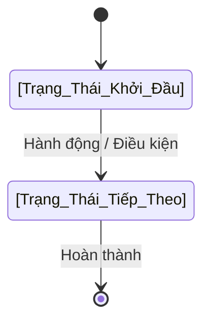
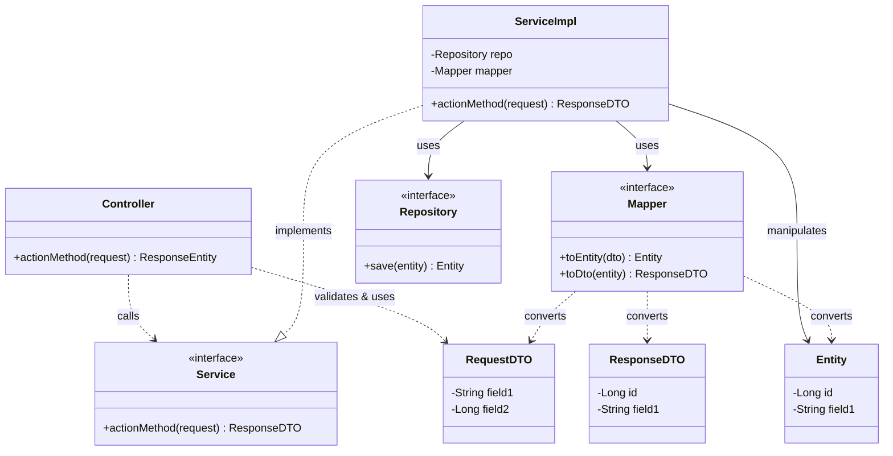
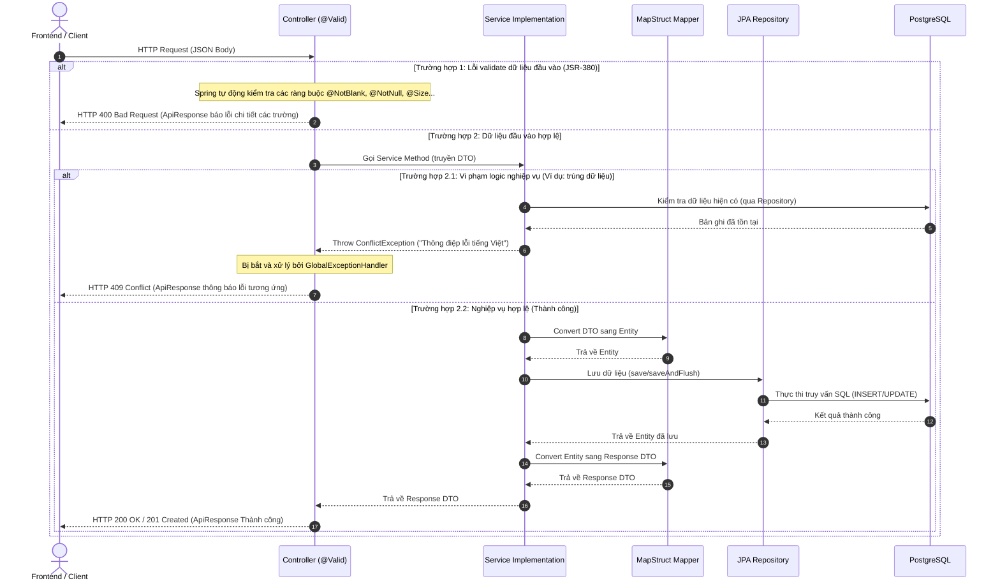

# ĐẶC TẢ YÊU CẦU & THIẾT KẾ CHI TIẾT: [MÃ UC] - [TÊN TÍNH NĂNG]

## PHẦN 1: ĐẶC TẢ NGHIỆP VỤ (REPORT 3)

### 2.2.3 Business Workflow (Luồng nghiệp vụ)
<!-- 
Mô tả bằng sơ đồ Mermaid (State/Activity Diagram) kết hợp với danh sách các bước xử lý nghiệp vụ thực tế của hệ thống từ đầu tới cuối.
Thay thế sơ đồ và danh sách mẫu dưới đây bằng luồng thực tế của tính năng.
-->

#### Mô tả chi tiết luồng xử lý bằng chữ (Business Step Description):
* **Bước 1 - Khởi đầu**: [Mô tả tác nhân kích hoạt hành động và trạng thái dữ liệu bắt đầu]
* **Bước 2 - Các bước chuyển tiếp**: [Mô tả chi tiết các bước xử lý nghiệp vụ, kiểm tra tính hợp lệ và các bước rẽ nhánh nếu có]
* **Bước 3 - Kết thúc**: [Mô tả kết quả đầu ra, các thông tin thay đổi trong hệ thống và trạng thái kết thúc]

### 3.2 [Tên Module] (Ví dụ: 3.2 Quản Lý Tài Khoản)
Mô tả ngắn gọn về module chứa chức năng này (vai trò, vị trí trong toàn bộ ứng dụng).

#### 3.2.1 [Tên chức năng] (Ví dụ: 3.2.1 Đăng ký tài khoản cựu sinh viên)

**Function trigger**:
*   **Navigation path**: [Ví dụ: /sign-in hoặc Profile Tab -> "Lịch sử thanh toán" -> /billing]
*   **Timing Frequency**: [Ví dụ: On demand (bất cứ khi nào người dùng muốn đăng nhập) hoặc On screen mount]

**Function description**:
*   **Actors/Roles**: [Ví dụ: Citizen, Moderator, Admin]
*   **Purpose**: [Ví dụ: Cho phép người dùng đăng nhập vào hệ thống để sử dụng các tính năng bảo mật]
*   **Interface**:
    *   [Mô tả các thành phần giao diện, các trường nhập liệu (Input Fields), các nút bấm (Buttons) và các trạng thái hiển thị (States: Loading, Empty, Error)]

**Data processing**:
*   [Các bước xử lý dữ liệu chi tiết của luồng (bao gồm redirect, kiểm tra bảng trong DB, gán quyền, sinh token/session...)]

**Screen layout**:
*   [Danh sách các hình ảnh mô tả layout màn hình trên Mobile/Website, ví dụ: Figure 23 Login Screen layout for Mobile]

**Function details**:
*   **Data**: [Các trường thông tin/thuộc tính dữ liệu tham gia, ví dụ: User ID, Full name, Email...]
*   **Validation**: [Quy định kiểm tra dữ liệu đầu vào cụ thể cho các trường]
*   **Business rules**: [Các quy tắc nghiệp vụ áp dụng riêng cho chức năng này]
*   **Error Handling**: [Các mã lỗi hoặc cảnh báo tương ứng khi thông tin sai lệch hoặc lỗi hệ thống]
*   **Normal case**: [Mô tả kịch bản thành công và kết quả trả về]
*   **Abnormal case**: [Mô tả kịch bản thất bại, bị từ chối hoặc lỗi dịch vụ bên thứ ba]

---

### 5. Requirement Appendix (Phụ lục Yêu cầu)
[Cung cấp các quy tắc nghiệp vụ, yêu cầu chung hoặc thông tin yêu cầu bổ sung tại đây]

#### 5.1 Business Rules (Quy tắc Nghiệp vụ)
[Cung cấp các quy tắc nghiệp vụ chung bắt buộc phải tuân theo. Thông tin có thể được trình bày dưới dạng bảng như mẫu bên dưới]

| ID | Định nghĩa Quy tắc (Rule Definition) |
| :--- | :--- |
| BR-01 | Delivery time windows are 15 minutes, beginning on each quarter hour. |
| BR-02 | Deliveries must be completed between 10:00 A.M. and 2:00 P.M. local time, inclusive. |
| BR-03 | All meals in a single order must be delivered to the same location. |
| BR-04 | All meals in a single order must be paid for by using the same payment method. |
| BR-11 | If an order is to be delivered, the patron must pay by payroll deduction. |
| BR-12 | Order price is calculated as the sum of each food item price times the quantity of that food item ordered, plus applicable sales tax, plus a delivery charge if a meal is delivered outside the free delivery zone. |
| BR-24 | Only cafeteria employees who are designated as Menu Managers by the Cafeteria Manager can create, modify, or delete cafeteria menus. |
| BR-33 | Network transmissions that involve financial information or personally identifiable information require 256-bit encryption. |
| BR-86 | Only regular employees can register for payroll deduction for any company purchase. |
| BR-88 | An employee can register for payroll deduction payment of cafeteria meals if no more than 40 percent of his gross pay is currently being deducted for other reasons. |

#### 5.2 Common Requirements (Yêu cầu Chung)
*   The system supports PNG, JPG, and JPEG image formats, MP4 video, with a maximum image size of 100MB.
*   Data presented as lists or tables is paginated (or infinite-scrolled) rather than loaded in full.
*   No more than three font families are displayed on any single page.
*   All create, update, and delete actions are confirmed to the user via inline messages, toasts, or modals; destructive actions require an explicit confirmation modal.
*   All date/time values are displayed in the user's local time zone (Asia/Ho_Chi_Minh by default).
*   The platform aims to be accessible 24/7, with maintenance scheduled during off-peak hours.
*   All client–server communication is encrypted via HTTPS/TLS.

#### 5.3 Application Messages List (Danh sách Thông điệp Ứng dụng)
Bảng kê chi tiết các thông điệp phản hồi từ hệ thống tương ứng với các trường hợp thành công hoặc lỗi dữ liệu:

| # | Mã thông điệp (Message code) | Loại thông điệp (Message Type) | Ngữ cảnh (Context) | Nội dung hiển thị (Content) |
| :--- | :--- | :--- | :--- | :--- |
| 1 | MSG01 | In line | There is not any search result | No search results. |
| 2 | MSG02 | In red, under the text box | Input-required fields are empty | The * field is required. |
| 3 | MSG03 | Toast message | Updating asset(s) information successfully | Update asset(s) successfully. |
| 4 | MSG04 | Toast message | Adding new asset successfully | Add asset successfully. |
| 5 | MSG05 | Toast message | Confirming email of asset hand-over is sent successfully | A confirmation email has been sent to {email_address}. |
| 6 | MSG06 | Toast message | Resetting asset information successfully | Return asset(s) successfully. |
| 7 | MSG07 | Toast message | Deleting asset information successfully | Delete asset(s) successfully. |
| 8 | MSG08 | In red, under the text box | Input value length > max length | Exceed max length of {max_length}. |
| 9 | MSG09 | In line | Username or password is not correct when clicking sign-in | Incorrect username or password. Please check again. |

#### 5.4 Other Requirements (Yêu cầu Khác)
[Cung cấp bất kỳ yêu cầu bổ sung nào khác tại đây...]

---

## PHẦN 2: THIẾT KẾ CHI TIẾT (REPORT 4)

### 3. Detail Design (Thiết kế chi tiết)

#### 3.1 [Tên chức năng] (Ví dụ: 3.1 Đăng ký tài khoản cựu sinh viên)

##### 3.1.1 Class Diagram (Sơ đồ Lớp)
<!-- 
Sử dụng Mermaid Class Diagram mô tả các lớp Backend & Frontend thực tế tham gia vào luồng.
Bắt buộc bao gồm các lớp: Controller, Service, Repository, Entity, DTO, Mapper.
Thay thế cấu trúc mẫu dưới đây bằng các class thực tế của tính năng.
-->

###### Mô tả chi tiết cấu trúc các lớp (Class Design Description):
* **Lớp Controller**: [Ví dụ: `AuthController.java` tiếp nhận yêu cầu từ Client, thực hiện định tuyến và gọi `AuthService` xử lý]
* **Lớp DTO**: [Ví dụ: `RegisterRequest.java` chứa dữ liệu đầu vào và các annotation validation, `AuthResponse.java` chứa dữ liệu trả về sau khi xử lý thành công]
* **Lớp Service**: [Ví dụ: Giao diện `AuthService.java` định nghĩa nghiệp vụ và lớp triển khai `AuthServiceImpl.java` thực hiện logic kiểm duyệt/kiểm tra ràng buộc]
* **Lớp Mapper**: [Ví dụ: Giao diện MapStruct `AuthMapper.java` tự động sinh mã chuyển đổi qua lại giữa DTO và Entity]
* **Lớp Repository & Entity**: [Ví dụ: `UserRepository.java` cung cấp các phương thức truy vấn và `User.java` đại diện cấu trúc bảng `users` trong cơ sở dữ liệu]

##### 3.1.2 Sequence Diagram (Sơ đồ Tuần tự)
<!-- 
Sơ đồ Mermaid Sequence mô tả toàn bộ tương tác từ Client (Frontend) qua Controller, Service, Mapper, Repository, Database và phản hồi ngược lại Client, bao gồm cả các kịch bản thành công và ngoại lệ/lỗi.
-->

###### Mô tả chi tiết luồng xử lý bằng chữ (Sequence Flow Description):
1.  **Luồng 1 - Thành công (Normal Case)**:
    *   **Gửi yêu cầu**: Client gửi yêu cầu đăng ký (POST) chứa thông tin JSON DTO hợp lệ lên Controller.
    *   **Kích hoạt Service**: Sau khi qua bộ kiểm duyệt tự động thành công, Controller gọi Service xử lý.
    *   **Lưu cơ sở dữ liệu**: Service chuyển đổi DTO thành Entity nhờ Mapper, sau đó gọi Repository thực hiện lưu vào DB.
    *   **Trả kết quả**: Dữ liệu lưu thành công, Service chuyển đổi Entity kết quả thành Response DTO gửi về Controller để trả về HTTP 200 OK/201 Created cùng đối tượng ApiResponse thành công cho Client.
2.  **Luồng 2 - Ngoại lệ Validation đầu vào (Validation Error Case)**:
    *   Client gửi dữ liệu thiếu hoặc sai định dạng. Bộ kiểm định JSR-380 phát hiện lỗi, ném `MethodArgumentNotValidException`. `GlobalExceptionHandler` bắt ngoại lệ này và trả về HTTP 400 Bad Request kèm chi tiết lỗi các trường cho Client.
3.  **Luồng 3 - Ngoại lệ Logic nghiệp vụ (Business Error Case)**:
    *   Khi kiểm tra điều kiện nghiệp vụ (ví dụ: trùng email), Service chủ động ném ngoại lệ Runtime tương ứng (ví dụ: `ConflictException`). `GlobalExceptionHandler` bắt ngoại lệ này và định dạng thành ApiResponse lỗi kèm mã HTTP 409 Conflict trả về cho Client.
