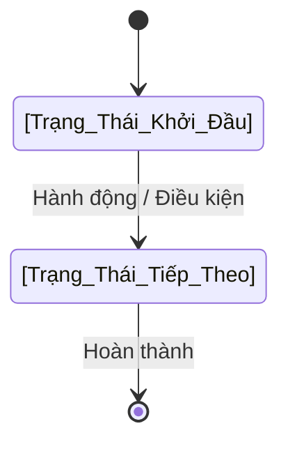
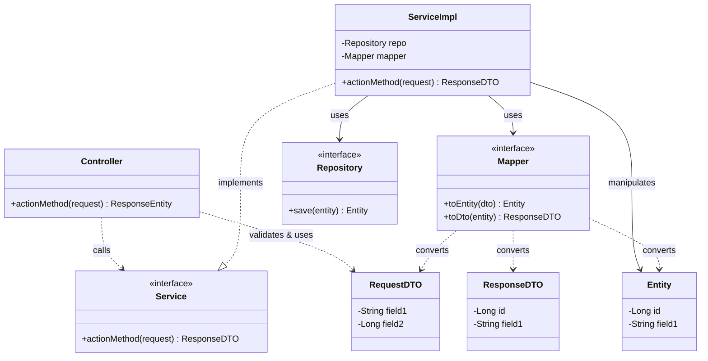
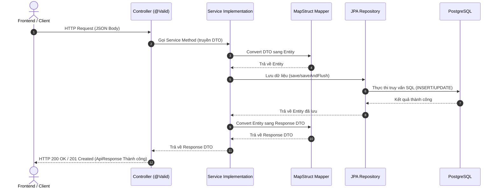
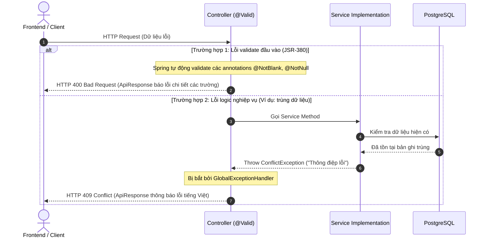

# ĐẶC TẢ YÊU CẦU & THIẾT KẾ CHI TIẾT: [MÃ UC] - [TÊN TÍNH NĂNG]

## PHẦN 1: ĐẶC TẢ NGHIỆP VỤ (REPORT 3)

### 2.2.3 Business Workflow (Luồng nghiệp vụ)
<!-- 
Mô tả bằng sơ đồ Mermaid (State/Activity Diagram) hoặc danh sách các bước xử lý nghiệp vụ thực tế của hệ thống từ đầu tới cuối.
Thay thế sơ đồ mẫu dưới đây bằng luồng thực tế của tính năng.
-->

### 3.2 [Tên Module] (Ví dụ: 3.2 Quản Lý Tài Khoản)
Mô tả ngắn gọn về module chứa chức năng này (vai trò, vị trí trong ứng dụng).

#### 3.2.1 [Tên chức năng] (Ví dụ: 3.2.1 Đăng ký tài khoản cựu sinh viên)
*   **Mục tiêu**: [Mô tả ngắn gọn mục tiêu chức năng mang lại]
*   **Tác nhân**: [Tác nhân thực hiện chính, ví dụ: Guest, Student, Alumni, Admin]
*   **Mô tả**: [Mô tả ngắn gọn luồng hoạt động chính của chức năng]
*   *Lưu ý: Không vẽ giao diện màn hình trong phần này.*

---

### 5. Requirement Appendix (Phụ lục Yêu cầu)

#### 5.1 Business Rules (Quy tắc Nghiệp vụ)
*   **[BR_UC_01] Quy tắc 1**: [Ví dụ: Kiểm tra định dạng và tính duy nhất của Email đăng ký.]
*   **[BR_UC_02] Quy tắc 2**: [Ví dụ: Ràng buộc về minh chứng tốt nghiệp bắt buộc khi đăng ký vai trò ALUMNI.]

#### 5.2 Common Requirement (Yêu cầu chung - nếu có)
*   [Ví dụ: Giới hạn thời gian hết hạn của OTP (5 phút), khóa tài khoản tạm thời nếu nhập sai OTP quá 5 lần...]

#### 5.3 Application Messages List (Danh sách Thông điệp Ứng dụng)
Bảng kê chi tiết các thông điệp phản hồi từ hệ thống tương ứng với các trường hợp thành công hoặc lỗi dữ liệu:

| Mã thông điệp | Loại lỗi | Trường dữ liệu (Field) | Thông điệp hiển thị (Tiếng Việt) | HTTP Status |
| :--- | :--- | :--- | :--- | :--- |
| MSG_SUCCESS | Thành công | Không có | "[Thông báo thành công]" | 200 OK / 201 Created |
| MSG_ERR_VALIDATE | Validate | [tên_trường] | "[Thông báo lỗi validate tiếng Việt đầu vào]" | 400 Bad Request |
| MSG_ERR_DUPLICATE | Trùng lặp | [tên_trường] | "[Thông báo lỗi trùng lặp dữ liệu]" | 409 Conflict |
| MSG_ERR_NOT_FOUND | Không tìm thấy | [tên_trường] | "[Thông báo không tìm thấy bản ghi]" | 404 Not Found |
| MSG_ERR_BUSINESS | Nghiệp vụ | Không có | "[Thông báo lỗi logic nghiệp vụ khác]" | 400 Bad Request |

#### 5.4 Other Requirement (Yêu cầu khác - nếu có)
*   [Ví dụ: Yêu cầu về thời gian phản hồi API < 2 giây, yêu cầu ghi nhận nhật ký (log) các hoạt động phê duyệt...]

---

## PHẦN 2: THIẾT KẾ CHI TIẾT (REPORT 4)

### 3. Detail Design (Thiết kế chi tiết)

#### 3.1 [Tên chức năng] (Ví dụ: 3.1 Đăng ký tài khoản cựu sinh viên)

##### 3.1.1 Class Diagram (Sơ đồ Lớp)
<!-- 
Sử dụng Mermaid Class Diagram mô tả các lớp Backend & Frontend thực tế tham gia vào luồng.
Bắt buộc bao gồm các lớp: Controller, Service, Repository, Entity, DTO, Mapper.
Thay thế cấu trúc mẫu dưới đây bằng các class thực tế của tính năng.
-->

##### 3.1.2 Sequence Diagram 1: Luồng thành công (Success Flow)
<!-- 
Sơ đồ Mermaid Sequence mô tả tương tác từ Client (Frontend) qua Controller, Service, Mapper, Repository, Database và phản hồi ngược lại Client trong kịch bản thành công.
-->

##### 3.1.3 Sequence Diagram 2: Luồng ngoại lệ - [Tên trường hợp lỗi] (Alternative/Exception Flow)
<!-- 
Sơ đồ Mermaid Sequence mô tả các kịch bản ngoại lệ quan trọng như: Lỗi validation đầu vào, Lỗi trùng lặp dữ liệu, lỗi logic nghiệp vụ.
Sao chép thêm các block sequenceDiagram (3.1.4, 3.1.5...) nếu có nhiều luồng lỗi khác nhau.
-->

