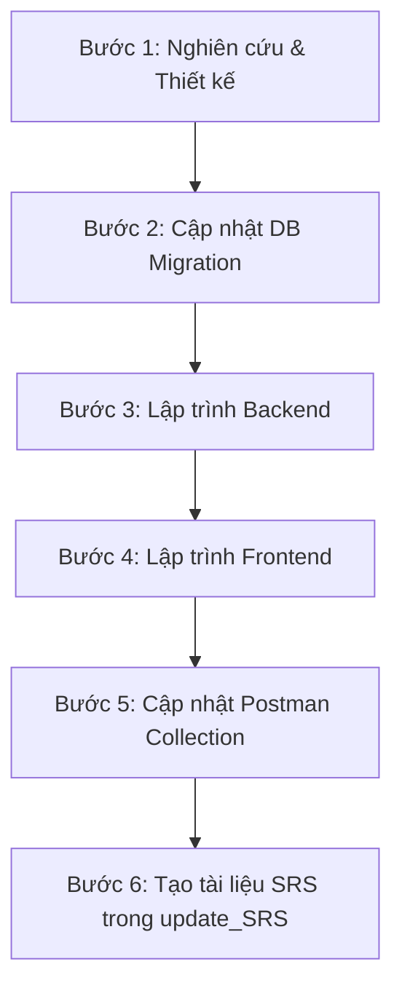

# QUY TRÌNH PHÁT TRIỂN DỰ ÁN & CÁC QUY TẮC MÃ NGUỒN (ALUMNECT)

Tài liệu này định nghĩa chi tiết các nguyên tắc lập trình, chuẩn hóa mã nguồn, quy tắc cập nhật cơ sở dữ liệu, cập nhật Postman, và cấu trúc viết tài liệu SRS cho dự án **AlumNect**. Mọi lập trình viên và AI Assistant tham gia dự án phải tuân thủ nghiêm ngặt các quy tắc này.

---

## 1. NGUYÊN TẮC CỐT LÕI (CORE PRINCIPLES)

1. **Documentation Driven Development (DDD)**: Tài liệu là nguồn gốc duy nhất của sự thật. Không viết mã nếu không có tài liệu mô tả yêu cầu hoặc đặc tả hệ thống tương ứng.
2. **Specification Driven Development (SDD)**: Mọi chức năng phải có Đặc tả yêu cầu phần mềm (SRS), Use Case (UC) chi tiết trước khi tiến hành triển khai.
3. **Design Driven Development**: Sử dụng hệ thống Design Tokens và các kiểu dáng Pastel Premium được quy định trước khi phát triển UI Components.
4. **Strict Directory Structure Adherence**: Việc tạo mới hoặc sửa đổi mã nguồn Backend/Frontend bắt buộc phải tuân thủ chính xác 100% cấu trúc thư mục quy định tại tệp tài liệu [FolderStructure.md]

---

## 2. QUY CHUẨN ĐẶT TÊN & COMMENT TRONG MÃ NGUỒN

### 2.1. Quy chuẩn Ngôn ngữ
*   **Mã nguồn (Source Code)**: Tên class, interface, method, variable, package, folder, file, database table, database column bắt buộc phải viết bằng **Tiếng Anh**.
*   **Chú thích (Comments)**: Tất cả comment giải thích trong code, Javadoc, tài liệu thiết kế bắt buộc phải viết bằng **Tiếng Việt**.

### 2.2. Quy chuẩn Comment trong Backend (Java Spring Boot)
Mỗi class, interface, controller endpoint, service method, JPA entity field, DTO field, Mapper, và Exception Handler đều bắt buộc phải có comment giải thích rõ ràng.

*   **Class/Interface Javadoc**: Giải thích vai trò của lớp hoặc giao diện.
*   **Method Javadoc**: Mô tả chi tiết mục đích của hàm, danh sách các tham số đầu vào (`@param`), và giá trị trả về (`@return`) bằng Tiếng Việt.
    ```java
    /**
     * [Tên chức năng và mô tả ngắn gọn bằng Tiếng Việt]
     * Mô tả chi tiết: [Mô tả chi tiết luồng xử lý hoặc nhiệm vụ của phương thức]
     *
     * @param [tên_tham_số] [Mô tả tham số đầu vào và các điều kiện ràng buộc nếu có]
     * @return [Mô tả kết quả trả về của hàm]
     */
    ```
*   **Entity/DTO Fields**: Viết comment dạng block/line ngay trên thuộc tính để giải thích ý nghĩa nghiệp vụ.
    ```java
    /** Họ và tên của người dùng đăng ký */
    private String fullName;
    ```

### 2.3. Quy chuẩn Comment trong Frontend (React + Vite + TS)
*   **React Components & Custom Hooks**: Comment mô tả chức năng của component, state chính, các props đầu vào và logic xử lý của hooks bằng Tiếng Việt ngay trên định nghĩa hàm.
*   **API & Services**: Giải thích endpoint được gọi, mục đích và dữ liệu trả về mong muốn.

---

## 3. WORKFLOW THỰC THI MỘT USE CASE (UC) CHI TIẾT

Khi nhận được yêu cầu phát triển hoặc chỉnh sửa một Use Case, AI Assistant phải tự động thực thi đầy đủ và tuần tự 6 bước sau:



---

## 4. CHI TIẾT CÁC QUY TẮC KỸ THUẬT

### 4.1. Quy tắc lập trình Backend (Spring Boot Java)
1. **Kiến trúc Layered + Feature**: Code được tổ chức thành các package theo feature (ví dụ: `controller/auth`, `service/auth`, `dao/auth`, `dto/request/auth`, `entity/user`).
2. **Global API Prefix**: Toàn bộ Controller sử dụng `@RestController` và tự động kế thừa tiền tố `/api/v1` (được cấu hình trong `WebMvcConfig`). Các endpoint được định nghĩa cụ thể thông qua `@RequestMapping` (ví dụ: `@RequestMapping("/auth")`).
3. **Phản hồi chuẩn (API Response)**: Tất cả API thành công hay thất bại đều phải trả về đối tượng `ResponseEntity<ApiResponse<T>>`.
    *   Thành công: `error = 0`, kèm thông điệp tiếng Việt và dữ liệu `data`.
        *   Ví dụ: `ApiResponse.success("Đăng ký thành công!", null)`
    *   Thất bại: `error = [mã_lỗi] (thường là HTTP status hoặc -1)`, kèm thông điệp mô tả lỗi chi tiết ở trường `message`.
4. **Validation dữ liệu đầu vào**:
    *   Tất cả DTO Request phải sử dụng JSR-380 validation (`@NotBlank`, `@NotNull`, `@Size`, `@Pattern`, `@Email`) với thông báo lỗi rõ ràng bằng **Tiếng Việt**.
    *   Sử dụng `@Valid @RequestBody` tại Controller để tự động kích hoạt bộ validate.
5. **Xử lý Ngoại lệ (Exception Handling)**:
    *   Ném các Custom Runtime Exceptions tương ứng (ví dụ: `ResourceNotFoundException`, `ConflictException`, `BadRequestException`).
    *   Tất cả exception được bắt tập trung tại `GlobalExceptionHandler.java` để chuyển đổi sang format `ApiResponse` chuẩn. Ràng buộc validate đầu vào từ `MethodArgumentNotValidException` phải được trích xuất thành danh sách Map lỗi chi tiết các trường gửi về Client.
6. **Chuyển đổi DTO <-> Entity**: Sử dụng MapStruct interfaces (ví dụ: `AuthMapper`) kế thừa `componentModel = "spring"` để mapping dữ liệu, hạn chế thủ công get/set.
7. **Quản lý Transaction**: Thêm `@Transactional` trên các service method có ghi/sửa DB để đảm bảo tính toàn vẹn dữ liệu.

### 4.2. Quy tắc lập trình Frontend (React + Vite + TS)
1. **Kiến trúc Feature-Based**:
    *   Các code liên quan đến một module nghiệp vụ được gom nhóm vào `src/features/[feature_name]/`.
    *   Mỗi feature bắt buộc phải có file `index.ts` (barrel file) để export ra các thành phần dùng chung ở ngoài.
    *   Các page chính trong `src/pages/` chỉ import các component và hook từ features để lắp ghép giao diện.
2. **Thiết kế giao diện (UI/UX) theo Design System**:
    *   **Tài liệu tham chiếu**: Áp dụng nghiêm ngặt các quy định tại tài liệu [DesignSystem.md](file:///d:/DOAN/Alumnect/Alumnect/docs/DesignSystem.md) làm chuẩn thiết kế Frontend duy nhất.
    *   **Phong cách**: Tông màu ấm áp, gần gũi và sang trọng (Premium Pastel). Sử dụng các thẻ trắng mềm (`pillowy white cards` qua class `.card-surface`), viền bo tròn lớn (`rounded-3xl`), và chữ màu mực mận chín (`plum` qua các biến `--color-plum-*`) thay cho màu đen/xám thô.
    *   **Bảng màu chuẩn**: Áp dụng đúng các biến Tailwind v4 `@theme` (Ví dụ: nền `--color-ink-900` / `#faf4ec`, bề mặt thẻ `--color-ink-850` / `#ffffff`, chữ tiêu đề `--color-plum-900` / `#322c3f`, chữ body `--color-plum-600` / `#6a6178`, màu thương hiệu tím oải hương `--color-brand-500` / `#7f86ee`, cùng các màu nhấn bổ trợ như cam san hô `--color-coral-500`, xanh mint `--color-mint-500`, xanh trời `--color-sky-500`... đúng vai trò nghiệp vụ).
    *   **Hiệu ứng đặc biệt**: Sử dụng chữ chuyển màu `.text-gradient`, kính mờ `.glass` / `.glass-strong` cho Navbar/Modal, bóng đổ thẻ `.card-surface`, spotlight hover `.spotlight`, và viền mỏng chuyển màu `.ring-gradient`.
    *   **Hoạt ảnh mượt mà (Micro-animations)**: Tích hợp Framer Motion hoặc các class hiệu ứng đã định nghĩa: `float` / `bob` (trôi nổi), `breathe` (vòng sáng nhịp thở), `marquee` (chữ chạy có hover-stop), `sheen` / `hover-sheen` (ánh sáng quét qua nút bấm), và `pop` (hiện modal đàn hồi).
    *   **Quy tắc UX bắt buộc**:
        1. *Điều hướng nhất quán*: Sử dụng cấu trúc AppShell, AdminShell phù hợp, có thanh tab gạch dưới chuyển động khi chọn.
        2. *Trạng thái Empty & Loading*: Dùng component `EmptyState` chuẩn (pastel illustration + CTA). Sử dụng hiệu ứng xương `shimmer skeleton` màu kem ấm thay vì loading spinner.
        3. *Xử lý ảnh lỗi (Broken Images Guard)*: Bắt buộc bọc ảnh trong component `SmartImage` để xử lý shimmer khi load và hiển thị fallback pastel khi lỗi. Avatar bị lỗi tự động hiển thị initials trên nền pastel ngẫu nhiên.
        4. *Accessibility (WCAG-AA)*: Đảm bảo độ tương phản của chữ (body text là `--color-plum-600`) trên nền kem ấm đạt chuẩn, và tôn trọng cấu hình giảm chuyển động `prefers-reduced-motion` của người dùng.
3. **State Management & Call API**:
    *   Quản lý client state toàn cục bằng **Zustand** (để tại `src/store/`).
    *   Thực hiện các cuộc gọi API thông qua Axios client dùng chung (`src/lib/axios.ts`).
    *   Quản lý server state (caching, mutation, loading) bằng **React Query** (hooks được đặt trong `src/features/[feature]/hooks/`).

### 4.3. Quy tắc cập nhật cơ sở dữ liệu (Database Migration)
Khi có sự thay đổi về cấu trúc cơ sở dữ liệu (thêm bảng mới, thêm cột mới, cập nhật kiểu dữ liệu...):
1. **TUYỆT ĐỐI KHÔNG chỉnh sửa trực tiếp hay ghi đè** vào các file migration cũ đã tồn tại (ví dụ: không được sửa đổi file gốc [V1__init_auth_tables.sql]).
2. **Bắt buộc tạo file migration mới cho từng phiên bản update**: Mỗi Use Case hoặc mỗi đợt cập nhật sinh ra các bảng mới hay cột mới phải được tách riêng thành một file SQL mới.
3. **Quy tắc đặt tên file**: `V<Version_Tiếp_Theo>__<mô_tả_ngắn_gọn>.sql` được lưu trữ dưới thư mục `alumnect-backend/src/main/resources/db/migration/`.
    *   *Ví dụ*: Khi phiên bản mới nhất đang có là `V1__init_auth_tables.sql`, nếu Use Case tiếp theo có sinh ra bảng mới hay cột mới, AI bắt buộc phải tạo file `V2__xxx.sql`. Tiếp tục các Use Case sau nữa sẽ là `V3__xxx.sql`, `V4__xxx.sql`, v.v.
4. **Quy ước viết câu lệnh SQL (Đồng bộ tuyệt đối với phong cách của V1)**:
    *   Tất cả từ khóa SQL phải viết **IN HOA** (ví dụ: `CREATE TABLE`, `ALTER TABLE`, `BIGINT`, `NOT NULL`, `DEFAULT`, `REFERENCES`, `ON DELETE CASCADE`, `CREATE INDEX`).
    *   Tên bảng và tên cột viết bằng chữ **thường**, phân cách bằng dấu gạch dưới (snake_case).
    *   Tất cả các khóa chính phải tự động tăng sử dụng kiểu: `BIGINT GENERATED ALWAYS AS IDENTITY PRIMARY KEY`.
    *   Các cột thời gian sử dụng kiểu: `TIMESTAMPTZ NOT NULL DEFAULT now()`.
    *   Các cột trạng thái/loại enum ánh xạ dạng chuỗi sử dụng `VARCHAR(20)` hoặc `VARCHAR(50)` kết hợp với ràng buộc `CONSTRAINT ck_... CHECK (... IN (...))`.
    *   Tất cả khóa ngoại phải được định nghĩa bằng câu lệnh `ALTER TABLE ADD CONSTRAINT` riêng biệt đặt ở cuối file SQL (sau khi tất cả các bảng liên quan đã được khởi tạo xong).
    *   Tự động tạo `INDEX` cho toàn bộ các cột khóa ngoại hoặc các cột thường xuyên được truy vấn lọc (ví dụ: `CREATE INDEX idx_user_profiles_major_id ON user_profiles (major_id);`).

### 4.4. Quy tắc cập nhật Postman Collection
Sau khi hoàn thành hoặc cập nhật các API:
1. Tìm tệp tin `postman_collection.json` ở thư mục gốc của dự án.
2. Thêm hoặc cập nhật các API request tương ứng vào đúng thư mục nghiệp vụ trong mảng `"item"` (ví dụ: `"01. Authentication & Registration"`, `"02. User Profiles"`, v.v.).
3. **Cấu trúc chi tiết của một Request**:
    *   `name`: Tên chức năng rõ ràng (ví dụ: `Xác minh email STUDENT - Thành công (Kích hoạt ngay)`).
    *   `request.method`: `GET`, `POST`, `PUT`, `DELETE`.
    *   `request.url.raw`: Sử dụng biến môi trường `{{baseUrl}}` (ví dụ: `{{baseUrl}}/api/v1/auth/verify-email`).
    *   `request.header`: Cấu hình đúng `Content-Type: application/json` và Bearer Token nếu API yêu cầu xác thực.
    *   `request.body`: Định nghĩa JSON raw mẫu đầy đủ và chuẩn xác các trường dữ liệu.
    *   `request.description`: Mô tả chi tiết bằng Markdown bao gồm:
        *   Quyền truy cập (Public hay yêu cầu Token).
        *   Mục đích của API.
        *   Mô tả chi tiết các tham số đầu vào.
        *   Mẫu dữ liệu phản hồi mong muốn (cả trường hợp 200 OK và các mã lỗi 400 Bad Request, 409 Conflict, 404 Not Found...).
4. Đảm bảo cấu trúc file JSON hợp lệ, không làm hỏng cú pháp của file.

### 4.5. Quy tắc viết tài liệu SRS & Thiết kế Chi tiết (`docs/update_SRS/`)
Mỗi Use Case khi hoàn thành bắt buộc phải có một tệp tài liệu đặc tả độc lập nằm tại thư mục `docs/update_SRS/` với định dạng tên file: `SRS_UC_[Mã_Use_Case]_[Tên_Tính_Năng].md`.

Nội dung tệp tài liệu phải bao gồm đầy đủ các cấu phần sau đây bằng Tiếng Việt:

```markdown
# ĐẶC TẢ YÊU CẦU & THIẾT KẾ CHI TIẾT: [MÃ UC] - [TÊN TÍNH NĂNG]

## PHẦN 1: ĐẶC TẢ NGHIỆP VỤ (REPORT 3)

### 2.2.3 Business Workflow (Luồng nghiệp vụ)
[Mô tả bằng sơ đồ Mermaid (State/Activity Diagram) hoặc danh sách các bước xử lý nghiệp vụ thực tế của hệ thống từ đầu tới cuối]

### 3.2 Tên Module (Ví dụ: 3.2 Quản Lý Tài Khoản)
Mô tả chung về module chứa chức năng này.

#### 3.2.1 Tên chức năng (Ví dụ: 3.2.1 Đăng ký tài khoản cựu sinh viên)
*   **Mục tiêu**: [Mục tiêu của chức năng]
*   **Tác nhân**: [Tác nhân thực hiện, ví dụ: Guest, Student, Alumni, Admin]
*   **Mô tả**: [Mô tả ngắn gọn chức năng xử lý gì]
*   **Không cần hình ảnh thiết kế màn hình**

### 5. Requirement Appendix (Phụ lục Yêu cầu)

#### 5.1 Business Rules (Quy tắc Nghiệp vụ)
*   [Quy tắc 1: Mô tả các điều kiện kiểm tra, logic ràng buộc dữ liệu. Ví dụ: Email đăng ký cựu sinh viên phải là duy nhất, mã số sinh viên cũ không được trống...]
*   [Quy tắc 2: Logic xử lý trạng thái tài khoản. Ví dụ: Đăng ký vai trò ALUMNI thì trạng thái mặc định là WAITING_APPROVAL, phải gửi kèm minh chứng...]

#### 5.2 Common Requirement (Yêu cầu chung - nếu có)
*   [Mô tả các yêu cầu chung về bảo mật, giới hạn thời gian gửi OTP, giới hạn nhập sai OTP tối đa 5 lần...]

#### 5.3 Application Messages List (Danh sách Thông điệp Ứng dụng)
Bảng kê chi tiết các thông điệp phản hồi từ hệ thống tương ứng với từng trường hợp thành công hoặc lỗi dữ liệu:

| Mã thông điệp | Loại lỗi | Trường dữ liệu (Field) | Thông điệp hiển thị (Tiếng Việt) | HTTP Status |
| :--- | :--- | :--- | :--- | :--- |
| MSG_SUCCESS | Thành công | Không có | "Đăng ký thành công! Vui lòng kiểm tra email để xác nhận." | 200 OK |
| MSG_ERR_01 | Validate | fullName | "Họ và tên không được để trống" | 400 Bad Request |
| MSG_ERR_02 | Trùng lặp | email | "Email này đã được đăng ký trên hệ thống." | 409 Conflict |
| MSG_ERR_03 | Nghiệp vụ | studentCode | "Mã số sinh viên là bắt buộc khi đăng ký với vai trò Cựu sinh viên" | 400 Bad Request |

#### 5.4 Other Requirement (Yêu cầu khác - nếu có)
*   [Các yêu cầu về hiệu năng, ghi log hoặc sao lưu nếu phát sinh]

---

## PHẦN 2: THIẾT KẾ CHI TIẾT (REPORT 4)

### 3. Detail Design (Thiết kế chi tiết)

#### 3.1 Tên chức năng (Ví dụ: 3.1 Đăng ký tài khoản cựu sinh viên)

##### 3.1.1 Class Diagram (Sơ đồ Lớp)
[Sử dụng Mermaid Class Diagram mô tả mối quan hệ giữa các component/class của cả Backend và Frontend tham gia vào luồng. Phải bao gồm các lớp: Controller, Service, Repository, Entity, DTO, Mapper]

```mermaid
classDiagram
    %% Định nghĩa các lớp ở đây
```

##### 3.1.2 Sequence Diagram Name 1: Luồng thành công (Success Flow)
[Sơ đồ Mermaid Sequence mô tả tương tác từ Client (Frontend) qua Controller, Service, Mapper, Repository, Database, MailService và phản hồi ngược lại Client trong kịch bản thành công]

```mermaid
sequenceDiagram
    %% Định nghĩa luồng tương tác thành công ở đây
```

##### 3.1.3 Sequence Diagram Name 2: Luồng thất bại - [Tên trường hợp lỗi] (Alternative/Exception Flow)
[Có thể có nhiều sơ đồ Sequence phụ để mô tả các kịch bản ngoại lệ quan trọng như: Lỗi validation đầu vào, Lỗi trùng lặp email, Nhập sai mã OTP quá 5 lần]

```mermaid
sequenceDiagram
    %% Định nghĩa luồng tương tác lỗi ở đây
```
```

---

## 5. CHỈ THỊ CHO AI ASSISTANT KHI THỰC HIỆN CODE
1. **Không sử dụng placeholder**: Mọi đoạn code được viết phải hoàn chỉnh, có xử lý lỗi, logic nghiệp vụ thực tế, và comment đầy đủ. Không viết các đoạn code kiểu `// TODO: implement this`.
2. **Đồng bộ tuyệt đối**: Khi code xong, lập tức cập nhật tài liệu SRS tương ứng ở `docs/update_SRS/`, cập nhật `postman_collection.json` và DB migrations để luôn duy trì sự nhất quán.
3. **Độ ổn định cao**: Đảm bảo code chạy được ngay, vượt qua kiểm tra compile và lint lỗi của dự án.
